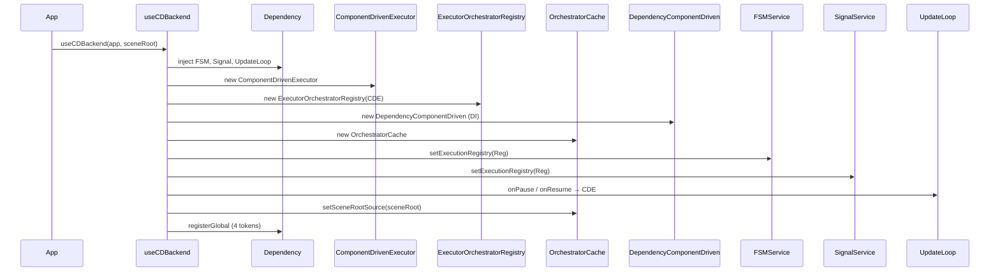

# API: `bootstrap` (`@empr/es-componente`)

Public entry point for component-driven execution-stack wiring. Import from the package barrel.

```typescript
import { useCDBackend } from '@empr/es-componente';
// or
import { useCDBackend } from './bootstrap';
```

| Export (barrel) | Source | Description |
|-----------------|--------|-------------|
| `useCDBackend` | `use-cd-backend.ts` | Wires CD executor, registry, orchestrator cache into `@empr/es` |

**Package role:** Satellite bootstrap for [`@empr/es`](/docs/features). Complements `Empr.init()` — does **not** replace it.

**Alternative stack:** [`@empr/es-sistema`](/docs/api/es-sistema/) `useECSBackend` — **one** execution model per application.

---

## `useCDBackend`

```typescript
function useCDBackend<T extends NodeEntity<any>>(
  app: Empr,
  sceneRootSource: SceneRootSource<T>,
): void
```

Connects the **component-driven runtime** (`ComponentDrivenExecutor`, `ExecutorOrchestratorRegistry`, `OrchestratorCache`) to `FSMService`, `SignalService`, and the game loop pause hooks.

### Prerequisites

| Step | Required |
|------|----------|
| `new Empr()` or `new EmprLienzo(...)` | Yes |
| `app.init()` | Yes — core services from [`@empr/es` bootstrap](/docs/api/es/bootstrap) |
| `sceneRootSource` | Object with `.root` scene entity (`Scene` from lienzo is typical) |
| `useCDBackend(app, scene)` | Before FSM / signals run orchestrator flows |
| TypeScript augmentation | `OrchestratorType` on `ESCoreTypeRegistry` / FSM flows (app `.d.ts`) |
| `InteractionService.setExecutionRegistry` | **App responsibility** — not called inside `useCDBackend` |
| `app.start(ticker)` | After wiring (typical) |

Does not call `init()` or `start()`.

### Parameters

| Param | Type | Description |
|-------|------|-------------|
| `app` | `Empr` | Uses `app.dependency` for inject/register |
| `sceneRootSource` | `SceneRootSource<T>` | `{ root: T }` — bound to `OrchestratorCache` for `getComponent` / `getComponents` |

```typescript
type SceneRootSource<T extends NodeEntity<any>> = { root: T };
```

---

## What the function does



### 1. Resolve `@empr/es` services

```typescript
const fsmService = app.dependency.inject(FSMService);
const signalService = app.dependency.inject(SignalService);
const updateLoop = app.dependency.inject(UpdateLoop);
```

Same instances created in `Empr.registerServices()`.

### 2. Construct CD execution stack

```typescript
const componentDrivenExecutor = new ComponentDrivenExecutor();
const composerRegistry = new ExecutorOrchestratorRegistry(componentDrivenExecutor);
const dependencyComponentDriven = new DependencyComponentDriven();
const orchestratorCache = new OrchestratorCache();
```

| Object | Role |
|--------|------|
| `ComponentDrivenExecutor` | Runs `OrchestratorType` flows ([`features/executor/API_DOC.md``executor`) |
| `ExecutorOrchestratorRegistry` | `ExecutionRegistry` facade for FSM / signals |
| `OrchestratorCache` | Resolves orchestrator classes + scene root |
| `dependencyComponentDriven` | Registered in DI (see note below) |

### 3. Attach registry

```typescript
fsmService.setExecutionRegistry(composerRegistry);
signalService.setExecutionRegistry(composerRegistry);
```

Required before `createFSM`, `SignalService.listen`, or any `create` / `run` on the registry.

Flow type at call sites is `OrchestratorType` (class constructor), not `PipelineFactory`.

### 4. Pause / resume

```typescript
updateLoop.onPause(() => componentDrivenExecutor.pauseAll());
updateLoop.onResume(() => componentDrivenExecutor.resumeAll());
```

Pauses in-flight `ExecutionQueue` runs when the main loop pauses (no global gate on `run` — see executor API doc).

### 5. Scene root

```typescript
orchestratorCache.setSceneRootSource(sceneRootSource);
```

Every `OrchestratorCache.get(ctor)` refreshes `orchestrator.setRootEntity(sceneRootSource.root)`.

### 6. DI registration

```typescript
app.dependency.registerGlobal({ provide: ComponentDrivenExecutor, useFactory: () => componentDrivenExecutor });
app.dependency.registerGlobal({ provide: DependencyComponentDriven, useFactory: () => dependencyComponentDriven });
app.dependency.registerGlobal({ provide: OrchestratorCache, useFactory: () => orchestratorCache });
app.dependency.registerGlobal({ provide: ExecutorOrchestratorRegistry, useFactory: () => composerRegistry });
```

| Token | Used by |
|-------|---------|
| `ComponentDrivenExecutor` | Direct pause/control; optional `inject` |
| `ExecutorOrchestratorRegistry` | `inject` for FSM-adjacent code, **InteractionService** |
| `OrchestratorCache` | `ExecutionQueue.setup` via `Dependency.inject(OrchestratorCache)` |
| `DependencyComponentDriven` | Optional `inject` — **not** the path used by `@Inject` / orchestrators |

### `DependencyComponentDriven` — two instances

| Access | Instance |
|--------|----------|
| `@Inject` + `Orchestrator.getComponent` | `DependencyComponentDriven.instance` (lazy static singleton) |
| `inject(DependencyComponentDriven)` after `useCDBackend` | Separate object from `new DependencyComponentDriven()` in `useCDBackend` |

Component injection **always** uses `.instance`. The DI registration is for apps/tests that resolve the type explicitly; metadata from `@Inject` is stored on `.instance`, not automatically on the DI object.

---

## Typical application sequence

```typescript
import { EmprLienzo, Scene, InteractionService } from '@empr/es-lienzo';
import { useCDBackend, ExecutorOrchestratorRegistry } from '@empr/es-componente';

const app = new EmprLienzo(pixi, parent, gsap);
await app.init();

const scene = app.dependency.inject(Scene);
useCDBackend(app, scene);

const registry = app.dependency.inject(ExecutorOrchestratorRegistry);
app.dependency.inject(InteractionService).setExecutionRegistry(registry);

app.start(rafTicker);
```

Reference: `apps/slot-cd-client/src/app/bootstrap/empr.game.ts`.

### TypeScript setup

```typescript
// empr-es.d.ts
declare module '@empr/es' {
  interface ESCoreTypeRegistry {
    SSFlowAliasType: OrchestratorType<any>;
  }
}
```

See also `apps/slot-cd-client/src/app/types/`.

---

## What is NOT included

| Concern | Where |
|---------|--------|
| Core `Empr` services | `@empr/es` `init()` |
| `EntityStorage` wiring for CD | Not used by CD executor (scene via `OrchestratorCache`) |
| `InteractionService` registry | App after `useCDBackend` |
| `PipelineComposer` / `Executor` (ECS) | `@empr/es-sistema` |
| `SignalService` re-register | Unlike `useECSBackend`, signal service instance is **not** re-bound in DI |

---

## `useCDBackend` vs `useECSBackend`

| | `useCDBackend` | `useECSBackend` |
|---|----------------|-----------------|
| Package | `@empr/es-componente` | `@empr/es-sistema` |
| Flow type | `OrchestratorType` | `PipelineFactory` |
| Extra param | `SceneRootSource<T>` | None |
| Executor | `ComponentDrivenExecutor` | `Executor(dependency, EntityStorage)` |
| Registry | `ExecutorOrchestratorRegistry` | `ExecutorComposerRegistry` |
| Scene | `OrchestratorCache.setSceneRootSource` | N/A |
| DI extras | `OrchestratorCache`, `DependencyComponentDriven` | `Executor` only (+ `SignalService` re-register) |
| Co-install | Forbidden | Forbidden |

See [`../../es-sistema/src/bootstrap/API_DOC.md`](/docs/api/es-sistema/bootstrap).

---

## Usage patterns

### Lienzo slot (CD client)

```typescript
private setupCD(): void {
  const scene = this._app.dependency.inject(Scene);
  useCDBackend(this._app, scene);
  this._app.dependency
    .inject(InteractionService)
    .setExecutionRegistry(this._app.dependency.inject(ExecutorOrchestratorRegistry));
}
```

### Headless `Empr` (theoretical)

Requires a `NodeEntity` root implementing `SceneRootSource` without lienzo `Scene` — uncommon; CD stack targets Pixi scene graphs.

### Idempotency

Call **once** per app lifetime. A second call creates new executor/cache instances and overwrites registry references on FSM/SignalService.

---

## Semantics and constraints

| Topic | Behavior |
|-------|----------|
| **Generic `T`** | Scene root entity type (usually `PixiEntity` / `NodeEntity`) |
| **Return** | `void` |
| **Order** | After `init()`, before orchestrator execution |
| **FSM flows** | Pass orchestrator **class** to `ExecutionRegistry.create` |
| **Pause** | Per-queue via `ComponentDrivenExecutor`, not global await on `run` |
| **Layer** | Thin wiring only |

---

## Related documentation

- [`../features/executor/API_DOC.md``executor` — `ComponentDrivenExecutor`, registry
- [`../core/orchestrator/API_DOC.md``orchestrator` — `OrchestratorCache`, `SceneRootSource`
- [`../core/dependency/API_DOC.md``dependency` — `@Inject`, `.instance` vs DI
- [`../../es/src/bootstrap/API_DOC.md`](/docs/api/es/bootstrap) — `Empr.init`
- [`../../es/README.md`](/docs/api/es-componente/) — package overview
- Source: `use-cd-backend.ts`, export: `index.ts`

## Known consumers (reference)

| Module | Usage |
|--------|--------|
| `apps/slot-cd-client` | `setupCD()` in `empr.game.ts` |
| `@empr/es-componente` README | Wiring guide |
| `@empr/es-lienzo` README | Interaction + registry |

