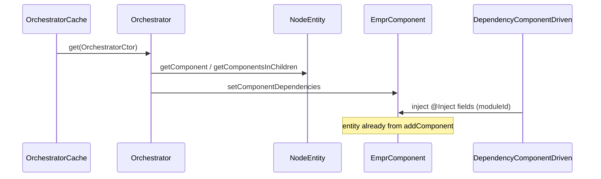

# API: `core/component` (`@empr/es-componente`)

Public entry point for the component-driven **behavior** base class. Import from the package barrel or the core index.

```typescript
import { EmprComponent, ComponentNodeliasType, ESComponentTypeRegistry } from '@empr/es-componente';
// or
import { EmprComponent } from './core/component';
```

| Export (barrel) | Source | Description |
|-----------------|--------|-------------|
| `EmprComponent` | `empr.component.ts` | Abstract base for scene-attached logic components |
| `ComponentNodeliasType` | `component.types.ts` | Typed host entity (app-augmented) |
| `ESComponentTypeRegistry` | `component.types.ts` | Module augmentation hook |

**Not the same as** `@empr/es` `core/component` (`Component`, `ComponentType`) — those are **ECS data** tokens. `EmprComponent` is a **class** you attach to `INodeEntity` and drive from **orchestrators**.

**Dependencies:** `./component.types` only at this layer; runtime links to `@empr/es` `Entity.addComponent` and `../dependency` (`@Inject`, `DependencyComponentDriven`).

---

## Distinction: ECS `Component` vs `EmprComponent`

| | `@empr/es` `Component` | `EmprComponent<TProps>` |
|---|------------------------|-------------------------|
| Layer | ECS kernel | Component-driven stack |
| Shape | Plain object / class instance (data) | Abstract class (behavior + props) |
| Base class | None required | `extends EmprComponent` |
| Execution | `System` + `PipelineComposer` | `Orchestrator` + `ComponentDrivenExecutor` |
| Lifecycle hooks on base | N/A | **None** (no `update`/`onDestroy` on `EmprComponent`) |

Apps using **only** `@empr/es-sistema` typically do not subclass `EmprComponent`.

---

## `ComponentNodeliasType`

```typescript
type ComponentNodeliasType = ESComponentTypeRegistry extends {
  ComponentNodeliasType: infer T;
}
  ? T
  : never;
```

Without augmentation, `entity` types as `never` — configure in app `.d.ts`:

```typescript
import '@empr/es-componente';
import { PixiEntity } from '@empr/es-lienzo';

declare module '@empr/es-componente' {
  interface ESComponentTypeRegistry {
    ComponentNodeliasType: PixiEntity;
  }
}
```

Reference: `empr-es.componente.d.ts`.

---

## `EmprComponent<TProps>`

```typescript
abstract class EmprComponent<TProps = any>
```

Base for **scene-owned** components: hold configuration (`props`), expose `entity` for the host node, optional `@Inject` fields (wired by `DependencyComponentDriven`).

### Members

| Member | Visibility | Description |
|--------|------------|-------------|
| `entity` | `public` | Host entity — **assigned at runtime** by `@empr/es` when `entity.addComponent(instance)` runs (non-enumerable getter on the instance) |
| `props` | `protected` getter | Constructor argument `TProps` (immutable reference via `_props`) |
| `_props` | `private` | Stored props from `constructor(props)` |

```typescript
abstract class EmprComponent<TProps = any> {
  public entity!: ComponentNodeliasType;

  protected get props(): TProps {
    return this._props;
  }

  constructor(private _props: TProps) {}
}
```

### Constructor pattern

```typescript
interface ISymbolProps {
  id: number;
  type: string;
  width: number;
  height: number;
}

class SymbolComponent extends EmprComponent<ISymbolProps> {
  public readonly id: number;

  constructor(props: ISymbolProps) {
    super(props);
    this.id = props.id;
  }
}

// Scene setup (app / prefab layer)
entity.addComponent(new SymbolComponent({ id: 1, type: 'A', width: 100, height: 100 }));
// After addComponent: this.entity → host INodeEntity / PixiEntity
```

### `entity` runtime wiring

`EmprComponent` does **not** set `entity` itself. `Entity.addComponent` defines:

```typescript
Object.defineProperty(component, 'entity', {
  get: () => this,
  enumerable: false,
  configurable: false,
});
```

| Rule | Detail |
|------|--------|
| Access | Only after `addComponent` on the owning entity |
| Type | `ComponentNodeliasType` (e.g. `PixiEntity`) after augmentation |
| `disposable` | Also added by `Entity.addComponent` (`IContextDisposable`) — separate from `EmprComponent` API |

---

## Dependency injection (`@Inject`)

From `core/dependency` — not exported by `component/index.ts`, but central to `EmprComponent` usage.

When a **class field** on an `EmprComponent` subclass uses `@Inject(token)`:

| Step | Behavior |
|------|----------|
| Decorator | Detects `target instanceof EmprComponent` |
| Registration | `DependencyComponentDriven.memorizeComponent(constructor, token, propertyKey)` |
| Resolution | `Orchestrator.getComponent` / `getComponents` → `setComponentDependencies` → `getDependencyForComponent(orchestratorId, component)` |

Injected properties are materialized when an orchestrator **discovers** the component on the scene tree (`getComponent` / `getComponentsInChildren`).

| Scope | `moduleId` = `orchestrator.id.toString()` |
| Immutable providers | Wrapped in read-only `Proxy` with mutation warning |

```typescript
import { Inject } from '@empr/es-componente';
import { SomeService } from './some.service';

class ReelComponent extends EmprComponent<IProps> {
  @Inject(SomeService)
  private _service!: SomeService;

  public spin(): void {
    this._service.run(this.entity);
  }
}
```

Orchestrator must call `registerGroupDependencies()` (via `OrchestratorCache.get`) before execution so module-scoped providers exist.

Also stamped on discovery:

```typescript
// orchestrator.ts — not on EmprComponent type, but on component instance
environmentId: orchestrator.id  // non-enumerable
```

---

## Orchestrator discovery (consumer flow)



`EmprComponent` subclasses are **not** executed automatically each frame — orchestrators invoke methods (e.g. `resize()`, `spin()`) explicitly.

---

## Usage patterns

### Data + behavior component

```typescript
class SizeComponent extends EmprComponent<IProps> {
  public resize(data: IResizeEventData): void {
    const view = this.entity.node;
    view.width = this.props.landscape().width;
  }
}
```

### Abstract family base

```typescript
abstract class ResizerComponent<T> extends EmprComponent<T> {
  public abstract resize(data: IResizeEventData): void;
}
```

### Typing strict props (avoid default `any`)

```typescript
class MyComponent extends EmprComponent<IMyProps> {
  constructor(props: IMyProps) {
    super(props);
  }
}
```

---

## Semantics and constraints

| Topic | Behavior |
|-------|----------|
| **Abstract** | Cannot instantiate `EmprComponent` directly |
| **No built-in lifecycle** | No `init`/`update`/`destroy` on base — app/orchestrator defines calls |
| **`TProps` default** | `any` in source — prefer explicit `IProps` interfaces |
| **`entity!`** | Definite assignment for TS; must be used only after `addComponent` |
| **vs ECS systems** | Behavior on component instances, not `System(props)` functions |
| **Package boundary** | Do not mix with `@empr/es-sistema` pipelines in the same app |
| **Typo in API name** | `ComponentNodeliasType` (spelling in repo) |

---

## Related documentation

- [`../../../es/src/core/component/API_DOC.md`](/docs/api/es/core/component) — ECS `Component` / `ComponentType`
- [`../../../es/src/core/entity/API_DOC.md`](/docs/api/es/core/entity) — `addComponent`, `entity` getter
- [`../dependency`](/docs/api/es-componente/core/dependency) — `@Inject`, `DependencyComponentDriven`
- [`../orchestrator`](/docs/api/es-componente/core/orchestrator) — `getComponent`, `getComponents`
- [`../../README.md`](/docs/api/es-componente/) — component-driven stack overview
- `../../bootstrap/use-cd-backend.ts` — `useCDBackend`
- Source: `empr.component.ts`, `component.types.ts`, export: `index.ts`

## Known consumers (reference)

| Module | Usage |
|--------|--------|
| `component-driven app` | `SymbolComponent`, `ReelComponent`, `ResizerComponent`, … |
| `core/orchestrator` | Discovers components, runs DI |
| `core/dependency/inject.decorator` | `instanceof EmprComponent` branch |

