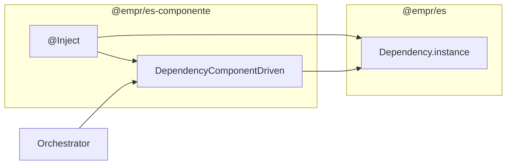

# API: `core/dependency` (`@empr/es-componente`)

Public entry point for component-driven DI extensions. Import from the package barrel or the core index.

```typescript
import {
  Inject,
  DependencyComponentDriven,
  IComponentToken,
} from '@empr/es-componente';
```

| Export (barrel) | Source | Description |
|-----------------|--------|-------------|
| `Inject` | `inject.decorator.ts` | Property decorator for `EmprComponent` and `Orchestrator` |
| `DependencyComponentDriven` | `dependency-component-driven.ts` | Deferred injection into scene components |
| `IComponentToken` | `dependency.types.ts` | Registry entry for `@Inject` on components |

**Underlying container:** [`@empr/es` `Dependency`](/docs/api/es/core/dependency) (`Dependency.instance`) — this module does not replace it.

**Bootstrap:** `useCDBackend` registers `DependencyComponentDriven` globally (factory singleton).

**Dependencies:** `@empr/es` (`Dependency`, `Token`, `Component`, `ComponentType`, `Provider`), `../component` (`EmprComponent`), `../orchestrator` (`Orchestrator`).

---

## Architecture overview



| Path | When DI resolves | `moduleId` |
|------|------------------|------------|
| `Orchestrator` field `@Inject` | Each property read (getter) | Captured at decorator apply — usually `'root'` (see below) |
| `EmprComponent` field `@Inject` | When orchestrator discovers component | `orchestrator.id.toString()` |
| `Orchestrator.setupDependencies()` | `registerGroupDependencies()` | `orchestrator.id` |

---

## `Inject<T>(token)`

```typescript
function Inject<T>(token: Token<T>): PropertyDecorator
```

| Parameter | Description |
|-----------|-------------|
| `token` | `Constructor<T>` or `InjectionToken<T>` from `@empr/es` |

Throws if `token` is falsy:

```text
Token must be provided to @Inject decorator when not using reflect-metadata
```

Does **not** use `reflect-metadata` — token must be passed explicitly.

### Branch A: `EmprComponent` (prototype target)

When `target instanceof EmprComponent` at decoration time (subclass **prototype** satisfies this):

| Step | Action |
|------|--------|
| 1 | `defineProperty(target, 'injectHere', 'injectHere')` — marker for deferred injection |
| 2 | `defineProperty(target, propertyKey, { value: null })` — placeholder |
| 3 | `DependencyComponentDriven.instance.memorizeComponent(constructor, token, propertyKey)` |

Resolution happens later in `getDependencyForComponent(moduleId, componentInstance)` (called from `Orchestrator.getComponent` / `getComponents`).

### Branch B: `Orchestrator` (prototype target)

When `target instanceof Orchestrator`:

```typescript
Object.defineProperty(target, propertyKey, {
  get: () => Dependency.instance.inject(token, moduleId),
  enumerable: true,
  configurable: false,
});
```

| `moduleId` at decoration | Typical value |
|--------------------------|---------------|
| `target.id?.toString()` | `undefined` on class prototype → **`'root'`** |

Orchestrator-specific providers registered via `setupDependencies()` use `this.id.toString()`. Field `@Inject` getters therefore resolve **global (`root`)** unless the decoration target carries `id` (unusual). App services (`AssetsLoader`, `Scene`, …) are normally registered globally — matches [`slot-cd-client` orchestrators``initialization.orchestrator.ts``.

### Example — orchestrator

```typescript
class InitializationOrchestrator extends Orchestrator<ITransitionData<GlobalStore>> {
  @Inject(AssetsLoader)
  private _assetsLoader!: AssetsLoader;

  public async execute(props: ITransitionData<GlobalStore>): Promise<void> {
    await this._assetsLoader.load(...);
  }

  // Optional module-scoped overrides:
  protected override setupDependencies(): Provider<unknown>[] {
    return [{ provide: SomeToken, useClass: MockImpl }];
  }
}
```

Call `registerGroupDependencies()` before `execute` (done in `OrchestratorCache.get`).

### Example — scene component

```typescript
class ReelComponent extends EmprComponent<IProps> {
  @Inject(ReelService)
  private _reelService!: ReelService;
}
```

After `entity.addComponent(new ReelComponent(...))` and orchestrator discovery, `_reelService` is populated.

---

## `DependencyComponentDriven`

```typescript
class DependencyComponentDriven
```

Singleton bridge between `@Inject` metadata on `EmprComponent` classes and live component instances on entities.

### `instance` (static getter)

```typescript
static get instance(): DependencyComponentDriven
```

Lazy global singleton. `useCDBackend` also registers a DI instance via `registerGlobal({ provide: DependencyComponentDriven, useFactory })` — same pattern, separate from `instance` unless app wires them to one object.

### `memorizeComponent(component, token, key)`

```typescript
memorizeComponent(
  component: ComponentType<any>,
  token: Token<any>,
  key: string,
): void
```

Appends to internal `_componentTokens` list:

```typescript
interface IComponentToken {
  component: ComponentType<any>;
  token: Token<any>;
  key: string;
}
```

Called only from `@Inject` (EmprComponent branch). **Append-only** — duplicate registrations for same class/key are possible if decorators run multiple times.

### `getDependencyForComponent(moduleId, component)`

```typescript
getDependencyForComponent(moduleId: string, component: Component): void
```

| Guard | Behavior |
|-------|----------|
| No `'injectHere' in component` | Return immediately (not an `@Inject`-enabled component instance) |
| `component instanceof registered class` | Collect matching tokens |

Per matched field:

| Step | Action |
|------|--------|
| 1 | Skip if `key` not on component instance |
| 2 | `hasProvider(token, moduleId)` then `hasProvider(token)` (`root`) |
| 3 | Prefer **module** scope, else **global** |
| 4 | `value = dependency.inject(token, findInModule)` |
| 5 | If `provider.immutable` truthy on **injected value** → wrap in read-only `Proxy` (nested objects shallow-proxied) |
| 6 | `defineProperty(component, key, { value, enumerable: true, configurable: true })` |

**Immutable note:** Code assigns `provider = this._dependency.inject(...)`, which returns the **resolved instance**, not the `Provider` registration. The `immutable` flag on `Provider` in `@empr/es` types is **not read** from the registry; the proxy branch runs only if the injected **instance** has a truthy `immutable` property.

**Silent skip:** If neither module nor global provider exists, the field is left unchanged (no throw).

```typescript
// Typical call site (orchestrator.ts)
DependencyComponentDriven.instance.getDependencyForComponent(
  this.id.toString(),
  componentInstance,
);
```

| `moduleId` | Matches `Orchestrator.register(id, provider)` |
|------------|-----------------------------------------------|
| `orchestrator.id.toString()` | Per-orchestrator overrides from `setupDependencies()` |

---

## Resolution precedence (components)

```text
1. inject(token, orchestratorModuleId)  if hasProvider(token, moduleId)
2. inject(token, 'root')                else if hasProvider(token) globally
3. skip                                 else
```

Aligns with `@empr/es` `inject` fallback: module map first, then `root`.

---

## Integration checklist

| Step | Action |
|------|--------|
| 1 | `Empr.init()` / `EmprLienzo.init()` |
| 2 | `useCDBackend(app, sceneRootSource)` |
| 3 | Register app services on `Dependency.instance` (`registerGlobal` or orchestrator `register`) |
| 4 | `OrchestratorCache.get(OrchestratorCtor)` → `registerGroupDependencies()` |
| 5 | `orchestrator.execute(data)` → `getComponent` triggers component injection |

---

## Usage patterns

### Global service on orchestrator

```typescript
@Inject(PixiPools)
private _pools!: PixiPools;
```

Requires `PixiPools` in global DI (`Empr` / `EmprLienzo`).

### Per-orchestrator override

```typescript
protected override setupDependencies(): Provider<unknown>[] {
  return [
    { provide: NetworkService, useFactory: () => new MockNetwork() },
  ];
}
```

Component `@Inject(NetworkService)` resolves mock when `getDependencyForComponent(orchestratorId, ...)` runs.

### InjectionToken

```typescript
export const CONFIG = new InjectionToken<IConfig>('CONFIG');

@Inject(CONFIG)
private _config!: IConfig;
```

---

## Semantics and constraints

| Topic | Behavior |
|-------|----------|
| **Not a DI container** | Wraps `Dependency.instance` |
| **EmprComponent timing** | Injection on orchestrator discovery, not `addComponent` |
| **`injectHere` marker** | Internal; set on prototype at class definition |
| **Orchestrator `@Inject` scope** | Getter usually uses `'root'` (prototype has no `id`) |
| **Component `@Inject` scope** | Uses orchestrator id at discovery |
| **`immutable` proxy** | Rarely active with standard providers |
| **No `any` in public API** | Decorator uses `target: any` internally (legacy decorator API) |
| **vs `es-sistema`** | ECS systems use `props.inject(token, pipelineId)` instead |

---

## Related documentation

- [`../component/API_DOC.md`](/docs/api/es-componente/core/component) — `EmprComponent`, `entity`
- `../orchestrator/orchestrator.ts` — `registerGroupDependencies`, `getComponent`
- [`../../../es/src/core/dependency/API_DOC.md`](/docs/api/es/core/dependency) — `Dependency`, `Provider`, scopes
- `../../bootstrap/use-cd-backend.ts` — registers `DependencyComponentDriven`
- Source: `inject.decorator.ts`, `dependency-component-driven.ts`, `dependency.types.ts`, export: `index.ts`

## Known consumers (reference)

| Module | Usage |
|--------|--------|
| `apps/slot-cd-client` | `@Inject` on orchestrators and components |
| `core/orchestrator` | `getDependencyForComponent` after component lookup |
| `bootstrap/use-cd-backend` | Global `DependencyComponentDriven` registration |

