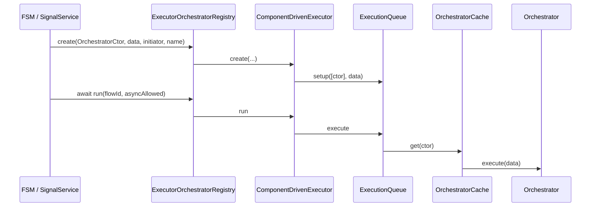

# API: `core/orchestrator` (`@empr/es-componente`)

Public entry point for component-driven orchestration. Import from the package barrel or the core index.

```typescript
import {
  Orchestrator,
  OrchestratorCache,
  OrchestratorType,
  SceneRootSource,
} from '@empr/es-componente';
```

| Export (barrel) | Source | Description |
|-----------------|--------|-------------|
| `Orchestrator` | `orchestrator.ts` | Abstract unit of CD logic |
| `OrchestratorCache` | `orchestrator-cache.ts` | Singleton cache + scene root binding |
| `OrchestratorType` | `orchestrator.types.ts` | Constructor token for orchestrators |
| `SceneRootSource` | `orchestrator.types.ts` | Scene root entity provider |

**Runtime consumer:** `features/executor` (`ComponentDrivenExecutor`, `ExecutionQueue`) treats `OrchestratorType` as the CD equivalent of `PipelineFactory`.

**Dependencies:** `@empr/es` (`Dependency`, `Provider`, `NodeEntity`, `Component`, `EntityComponent`, …), `../dependency` (`DependencyComponentDriven`, `@Inject`).

---

## Type aliases

### `OrchestratorType<T>`

```typescript
type OrchestratorType<T = any> = new (...args: any[]) => Orchestrator<T>;
```

Passed to `ExecutionRegistry.create` / `ComponentDrivenExecutor.create` as the **flow** argument (orchestrator **class**, not instance).

Augment `@empr/es` for FSM / signals:

```typescript
declare module '@empr/es' {
  interface ESCoreTypeRegistry {
    SSFlowAliasType: OrchestratorType<any>;
  }
}
```

### `SceneRootSource<T>`

```typescript
type SceneRootSource<T extends NodeEntity<any>> = { root: T };
```

Implemented by lienzo `Scene` (`root` scene entity). Set on `OrchestratorCache` via `useCDBackend(app, scene)`.

---

## `Orchestrator<T>`

```typescript
abstract class Orchestrator<T = any>
```

Application logic unit: receives payload `T` in `execute`, queries scene tree for `EmprComponent` subclasses, wires DI per discovery.

**No built-in lifecycle** on the base class — only `execute(data)` is required.

### `id` (getter)

```typescript
get id(): number  // nextId() at construction
```

Used as DI `moduleId` (`id.toString()`) for `registerGroupDependencies` and `getDependencyForComponent`.

### `setRootEntity(entity)`

```typescript
setRootEntity(entity: NodeEntity<any>): void
```

Sets scene tree root for `getComponent` / `getComponents`. Called by `OrchestratorCache.get` when `SceneRootSource` is configured.

Throws on lookup if `_rootEntity` is null:

```text
Tree in scene null is not initialized
```

### `registerGroupDependencies()`

```typescript
registerGroupDependencies(): void
```

| Step | Action |
|------|--------|
| 1 | `providers = setupDependencies()` (override hook, default `[]`) |
| 2 | `Dependency.instance.register(this.id.toString(), provider)` for each |

Per-orchestrator module overrides for `@Inject` on **components** (via `getDependencyForComponent`).

### `execute(data)` (abstract)

```typescript
abstract execute(data: T): void | Promise<void>
```

Entry point invoked by `ExecutionQueue` when the orchestrator class is scheduled.

| Return | `ExecutionQueue` behavior |
|--------|---------------------------|
| `void` | Continues |
| `Promise` | Awaited if `asyncAlowed === true`; throws if `false` |

### `setupDependencies()` (protected)

```typescript
protected setupDependencies(): Provider<any>[]  // default []
```

Override to register module-scoped providers before `execute`.

```typescript
class MyOrchestrator extends Orchestrator<IMyData> {
  protected override setupDependencies(): Provider<unknown>[] {
    return [{ provide: MockService, useClass: MockService }];
  }
}
```

---

### Scene queries

#### `getComponent<T>(component)`

```typescript
protected getComponent<T extends Component>(
  component: ComponentType<T>,
): EntityComponent<T, INodeEntity<any>>
```

| Step | Behavior |
|------|----------|
| 1 | `root.getComponent(type, safe: false)` — if found, **return immediately** (no `environmentId` / `@Inject` wiring) |
| 2 | Else `root.getComponentInChildren(type, deep: true)` |
| 3 | If missing → `throw Error('Component X not found in scene Y')` |
| 4 | On child hit → `setComponentEnvironmentId` + `setComponentDependencies` |

**Implication:** Components attached **directly to scene root** skip CD injection unless you use `getComponents` or attach below root.

#### `getComponents<T>(component)`

```typescript
protected getComponents<T extends Component>(
  component: ComponentType<T>,
): EntityComponent<T, INodeEntity<any>>[]
```

| Step | Behavior |
|------|----------|
| 1 | Root component (if any) + `getComponentsInChildren(type, deep: true, safe: false)` |
| 2 | If none → **`[]`** (no throw) |
| 3 | Each hit → `environmentId` + `getDependencyForComponent` |

Typical for multi-instance components (e.g. all `SizeComponent` in tree):

```typescript
this.getComponents(SizeComponent).forEach((c) => c.resize(data));
```

### Side effects on discovered components

| Property | Set when | Value |
|----------|----------|-------|
| `environmentId` | Child discovery path only | `orchestrator.id` (non-enumerable) |
| `@Inject` fields | Via `DependencyComponentDriven` | `moduleId = orchestrator.id.toString()` |

See [`../dependency/API_DOC.md`](/docs/api/es-componente/core/dependency).

---

## `OrchestratorCache`

```typescript
class OrchestratorCache
```

Caches orchestrator **instances** per constructor; binds scene root on every `get`.

### `setSceneRootSource(source)`

```typescript
setSceneRootSource(soucre: SceneRootSource<any>): void
```

Stores reference (parameter name `soucre` in source — typo). Called from `useCDBackend(app, sceneRootSource)`.

### `get<T>(ctor)`

```typescript
get<T>(ctor: OrchestratorType<T>): Orchestrator<T>
```

| Cache hit | Behavior |
|-----------|----------|
| Yes | `setRootEntity(sceneRoot.root)` if source set; return cached instance |
| No | `new ctor()` → `setRootEntity` → **`registerGroupDependencies()`** → cache → return |

| Property | Detail |
|----------|--------|
| Singleton per `ctor` | Same orchestrator instance reused across executions |
| First `get` | Always runs `registerGroupDependencies()` |
| Root refresh | Updated from `SceneRootSource` on each `get` |

Resolved in `ExecutionQueue` via:

```typescript
Dependency.instance.inject(OrchestratorCache).get(ctor);
```

Registered globally in `useCDBackend`.

---

## Execution integration (`ComponentDrivenExecutor`)

Not exported from `orchestrator/`, but defines how orchestrators run:



| API | `flow` type (CD stack) |
|-----|-------------------------|
| `ExecutionRegistry.create` | `OrchestratorType` (class) |
| `ExecutionRegistry.run` | Awaits orchestrator `execute` |

`create` currently wraps a **single** orchestrator ctor: `queue.setup([flow], data)`.

---

## Usage patterns

### FSM state flow

```typescript
class InitializationOrchestrator extends Orchestrator<ITransitionData<GlobalStore>> {
  @Inject(AssetsLoader)
  private _loader!: AssetsLoader;

  public async execute(props: ITransitionData<GlobalStore>): Promise<void> {
    await this._loader.load(...);
    props.next({ loaded: true });
  }
}

// Factory for ExecutionRegistry (FSM onEnter)
const onEnter = (props: FSMPipelineProps<GlobalStore>) => {
  // FSM runtime uses OrchestratorType via augmented registry — configured in app .d.ts
};
```

### Local orchestrator (manual)

```typescript
const cache = dependency.inject(OrchestratorCache);
cache.setSceneRootSource(scene);
const resizer = cache.get(ResizerOrchestrator);
await resizer.execute(resizeData);
```

### Interaction mapping (lienzo)

```typescript
// empr-es.lienzo.d.ts
interface ESCoreTypeRegistry {
  ISFlowAliasType: OrchestratorType<IInteraction>;
}
```

---

## Semantics and constraints

| Topic | Behavior |
|-------|--------|
| **vs `PipelineComposer`** | Classes + scene walk, not `System` chains |
| **Root `getComponent`** | No DI stamp — prefer children or `getComponents` |
| **`getComponents` empty** | `[]`, not an error |
| **Cached orchestrators** | Stateful across runs — reset in `execute` if needed |
| **`T` default** | `any` on `Orchestrator<T>` — prefer explicit payload interfaces |
| **`@Inject` on orchestrator fields** | Usually resolves `root` DI (see dependency API doc) |
| **Pause / stop** | Handled in `ExecutionQueue` / `ComponentDrivenExecutor`, not on `Orchestrator` |
| **Package conflict** | Do not combine with `@empr/es-sistema` in one app |

---

## Related documentation

- [`../component/API_DOC.md`](/docs/api/es-componente/core/component) — `EmprComponent`
- [`../dependency/API_DOC.md`](/docs/api/es-componente/core/dependency) — `@Inject`, module id
- `../features/executor/component-driven-executor.ts` — queue runtime
- `../../bootstrap/use-cd-backend.ts` — `OrchestratorCache` registration
- [`../../../es/src/core/execution-registry/API_DOC.md`](/docs/api/es/core/execution-registry) — registry contract
- [`../../../es/src/features/fsm/API_DOC.md`](/docs/api/es/features/fsm) — `create` / `run` flows
- Source: `orchestrator.ts`, `orchestrator-cache.ts`, `orchestrator.types.ts`, export: `index.ts`

## Known consumers (reference)

| Module | Usage |
|--------|--------|
| `component-driven app` | Global/main-game/resizer orchestrators |
| `features/executor/execution-queue` | `OrchestratorCache.get` + `execute` |
| `useCDBackend` | `setSceneRootSource`, DI register |
| `@empr/es-lienzo` `InteractionService` | `OrchestratorType` flows (typed in app) |

