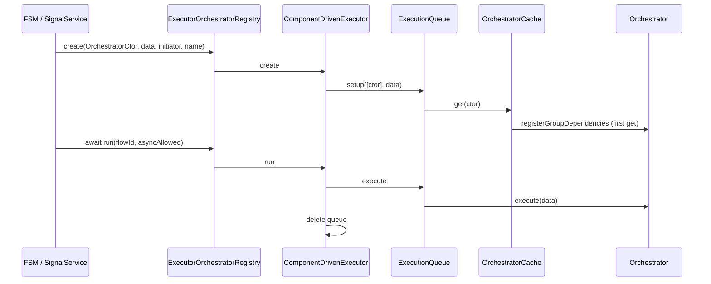

# API: `features/executor` (`@empr/es-componente`)

Public entry point for the component-driven execution runtime. Import from the package barrel or the features index.

```typescript
import {
  ComponentDrivenExecutor,
  ExecutorOrchestratorRegistry,
  ExecutionQueue,
  IQueueItem,
} from '@empr/es-componente';
```

| Export (barrel) | Source | Description |
|-----------------|--------|-------------|
| `ComponentDrivenExecutor` | `component-driven-executor.ts` | Queue map: create / run / pause / stop |
| `ExecutorOrchestratorRegistry` | `executior-composer-registry.ts` | `ExecutionRegistry` adapter for `@empr/es` |
| `ExecutionQueue` | `execution-queue.ts` | Sequential orchestrator runner |
| `IQueueItem` | `executor.types.ts` | One queued orchestrator step |

**Flow type:** `OrchestratorType<T>` from ](/docs/api/es-componente/core/orchestrator) — orchestrator **class**, not `PipelineFactory`.

**Dependencies:** `@empr/es` (`ExecutionRegistry`, `Dependency`, `nextId`), `core/orchestrator` (`Orchestrator`, `OrchestratorCache`, `OrchestratorType`).

**Wiring:** `useCDBackend(app, sceneRootSource)` registers executor + registry; hooks `UpdateLoop` → `pauseAll` / `resumeAll`.

**Not included:** Per-system signals, execution stack, `EntityStorage` filter context (orchestrators query scene via `OrchestratorCache`).

---

## `ComponentDrivenExecutor`

```typescript
class ComponentDrivenExecutor
```

Manages `ExecutionQueue` instances keyed by queue id. Each `create` builds a queue with **one** orchestrator ctor (array of length 1 today).

### Debug accessors

| Member | Type | Description |
|--------|------|-------------|
| `activeQueues` | `number[]` | Keys of live queues |
| `queueSize` | `number` | `_queues.size` |

### `create(flow, data, initiator, name)`

```typescript
create(
  flow: OrchestratorType<any>,
  data: any,
  initiator: string,
  name: string,
): Promise<number>
```

| Step | Action |
|------|--------|
| 1 | `new ExecutionQueue(nextId(), name)` |
| 2 | `queue.setup([flow], data)` — resolves orchestrator via `OrchestratorCache` |
| 3 | Store queue in `_queues` |
| 4 | Return `queue.id` (sync wrapped in `Promise.resolve`) |

| Parameter | Used in implementation |
|-----------|-------------------------|
| `flow` | Yes — orchestrator constructor |
| `data` | Yes — passed to every `orchestrator.execute(data)` |
| `name` | Yes — `ExecutionQueue.name` (debug) |
| `initiator` | **No** — accepted for `ExecutionRegistry` signature parity only |

**Requires:** `OrchestratorCache` registered in DI and `setSceneRootSource` called (`useCDBackend`) before `setup` runs.

Does not auto-run — call `run(id)` separately (same split as `@empr/es-sistema` `Executor`).

### `run(flowId, asyncAlowed?)`

```typescript
async run(flowId: number, asyncAlowed = true): Promise<void>
```

| Step | Action |
|------|--------|
| 1 | Lookup queue — throw if missing |
| 2 | `await queue.execute(asyncAlowed)` |
| 3 | Delete queue from `_queues` |

| `asyncAlowed` | Behavior |
|---------------|----------|
| `true` (default) | Await `execute()` returning `Promise` |
| `false` | Throw if orchestrator returns `Promise` (FSM `onExit` style) |

**No global pause gate** on `run` (unlike `@empr/es-sistema` `Executor` — only per-queue pause).

### `stop(flowId)`

Clears queue, `AbortController.abort()` on in-flight async `execute`, removes from map.

### `pause(flowId)` / `resume(flowId)`

Per-queue pause: current orchestrator finishes; next item waits until `resume`.

### `pauseAll()` / `resumeAll()` / `stopAll()`

Applied to **all** entries in `_queues`. Wired to `UpdateLoop` in `useCDBackend`.

### `hasQueue(executionId)`

```typescript
hasQueue(executionId: number): boolean
```

### `getQueueStatus(executionId)`

```typescript
getQueueStatus(executionId: number): { isPaused: boolean } | null
```

Returns `{ isPaused }` by reading queue internal state, or `null` if id missing.

---

## `ExecutionQueue`

```typescript
class ExecutionQueue
```

Runs orchestrator instances **sequentially**. Exported for advanced multi-step queues; normally created inside `ComponentDrivenExecutor.create`.

### Read-only

| Member | Description |
|--------|-------------|
| `id` | Queue id (from `nextId()` in executor) |
| `name` | Debug label |

### `setup(modules, data)`

```typescript
setup<T>(modules: OrchestratorType<T>[], data: T): void
```

| Step | Action |
|------|--------|
| 1 | For each ctor: `Dependency.instance.inject(OrchestratorCache).get(ctor)` |
| 2 | Build `IQueueItem[]` with shared `data`, same `executionId` (= queue id) |

Supports **multiple** orchestrators per queue when constructed manually:

```typescript
const q = new ExecutionQueue(nextId(), 'multi');
q.setup([InitOrchestrator, LoadOrchestrator], transitionData);
await q.execute(true);
```

`ComponentDrivenExecutor.create` currently passes only `[flow]`.

### `execute(asyncAlowed?)`

```typescript
async execute(asyncAlowed = true): Promise<void>
```

```text
while queue not empty:
  if paused → waitForResume()
  if aborted → break
  shift item → item.module.execute(item.data)
  if Promise → race with abort (when asyncAlowed)
```

| Stop | Behavior |
|------|----------|
| `stop()` | Clear queue, abort async work |
| Abort error | Swallowed: `'Queue execution was stopped'` |

No telemetry signals (contrast with `OnPipelineExecution*` in es-sistema).

### `pause()` / `resume()` / `stop()`

Same semantics as documented for `ComponentDrivenExecutor` delegation.

---

## `IQueueItem`

```typescript
interface IQueueItem {
  data: any;
  module: Orchestrator<any>;
  executionId: number;
}
```

| Field | Description |
|-------|-------------|
| `data` | Payload for `execute` |
| `module` | Cached orchestrator instance from `OrchestratorCache` |
| `executionId` | Parent queue id (not orchestrator id) |

---

## `ExecutorOrchestratorRegistry`

```typescript
class ExecutorOrchestratorRegistry extends ExecutionRegistry<OrchestratorType<any>>
```

```typescript
constructor(executor: ComponentDrivenExecutor)

create(flow, data, initiator, name): Promise<number>  // → executor.create
run(flowId, asyncAlowed): Promise<void>               // → executor.run
stop(flowId): void                                    // → executor.stop
```

**Not forwarded:** `pause`, `resume`, `pauseAll`, `resumeAll`, `stopAll`, `hasQueue`, `getQueueStatus` — use `inject(ComponentDrivenExecutor)`.

Registered globally in `useCDBackend`. Typical wiring:

```typescript
fsmService.setExecutionRegistry(registry);
signalService.setExecutionRegistry(registry);
interactionService.setExecutionRegistry(registry); // component-driven pattern
```

Augment `@empr/es` so `SSFlowAliasType` / `FSMFlowAliasType` = `OrchestratorType<...>` (see `component-driven app` `.d.ts` files).

---

## End-to-end flow



---

## `useCDBackend` integration

| Registration / action | Target |
|----------------------|--------|
| `new ComponentDrivenExecutor()` | Single instance |
| `new ExecutorOrchestratorRegistry(executor)` | Registry |
| `fsmService` / `signalService` `.setExecutionRegistry(registry)` | Required |
| `updateLoop.onPause` / `onResume` | `executor.pauseAll` / `resumeAll` |
| `orchestratorCache.setSceneRootSource(scene)` | Scene root for `getComponent` |
| DI globals | `ComponentDrivenExecutor`, `DependencyComponentDriven`, `OrchestratorCache`, `ExecutorOrchestratorRegistry` |

See `../../bootstrap/use-cd-backend.ts`.

---

## Usage patterns

### Via registry (framework)

```typescript
const registry = app.dependency.inject(ExecutorOrchestratorRegistry);

const id = await registry.create(
  InitializationOrchestrator,
  transitionData,
  stateName,
  `${fsmName}_${state}_OnEnter_`,
);

await registry.run(id, true);
```

### Direct executor (pause API)

```typescript
const executor = app.dependency.inject(ComponentDrivenExecutor);
executor.pauseAll(); // game paused
executor.resumeAll();
```

### FSM exit (sync-only)

```typescript
await registry.run(exitFlowId, false);
```

### Custom multi-orchestrator queue

```typescript
const queue = new ExecutionQueue(nextId(), 'custom');
queue.setup([StepA, StepB], sharedData);
await queue.execute(true);
```

---

## Comparison: CD executor vs `@empr/es-sistema` `Executor`

| | `ComponentDrivenExecutor` | `Executor` (es-sistema) |
|---|---------------------------|-------------------------|
| Flow type | `OrchestratorType` | `PipelineFactory` |
| Build step | `OrchestratorCache.get(ctor)` | `PipelineComposer` + `Pipeline` |
| Unit of work | `orchestrator.execute(data)` | `System(props)` chain |
| Global pause on `run` | No | Yes (`_pausePromise`) |
| Signals | None | `OnPipelineExecution*` |
| `initiator` param | Ignored | Passed to `Pipeline` |
| `EntityStorage` filter context | N/A | Per-system `executionContext` |

---

## Semantics and constraints

| Topic | Behavior |
|-------|----------|
| **Single-use queue id** | Removed from map after `run` completes |
| **`OrchestratorCache` required** | `setup` injects cache — must be in DI |
| **Cached orchestrators** | Same instance across runs — mind mutable state |
| **`asyncAlowed` typo** | Matches `ExecutionRegistry` spelling in source |
| **Filename** | `executior-composer-registry.ts` |
| **No `Executor` export** | CD stack uses `ComponentDrivenExecutor` name |
| **vs es-sistema** | Mutually exclusive per application |

---

## Related documentation

- [`../core/orchestrator/API_DOC.md`](/docs/api/es-componente/core/orchestrator) — `Orchestrator`, `OrchestratorCache`
- `../../bootstrap/use-cd-backend.ts` — wiring
- [`../../../es/src/core/execution-registry/API_DOC.md`](/docs/api/es/core/execution-registry) — registry contract
- [`../../../es-sistema/src/features/executor/API_DOC.md`](/docs/api/es-sistema/features/executor) — ECS pipeline executor (alternative)
- Source: `component-driven-executor.ts`, `execution-queue.ts`, `executior-composer-registry.ts`, export: `index.ts`

## Known consumers (reference)

| Module | Usage |
|--------|--------|
| `useCDBackend` | Creates and registers executor + registry |
| `component-driven app` | FSM, signals, `InteractionService` + registry |
| `@empr/es` `FSMService` / `SignalService` | `create` / `run` / `stop` via `ExecutionRegistry` |

