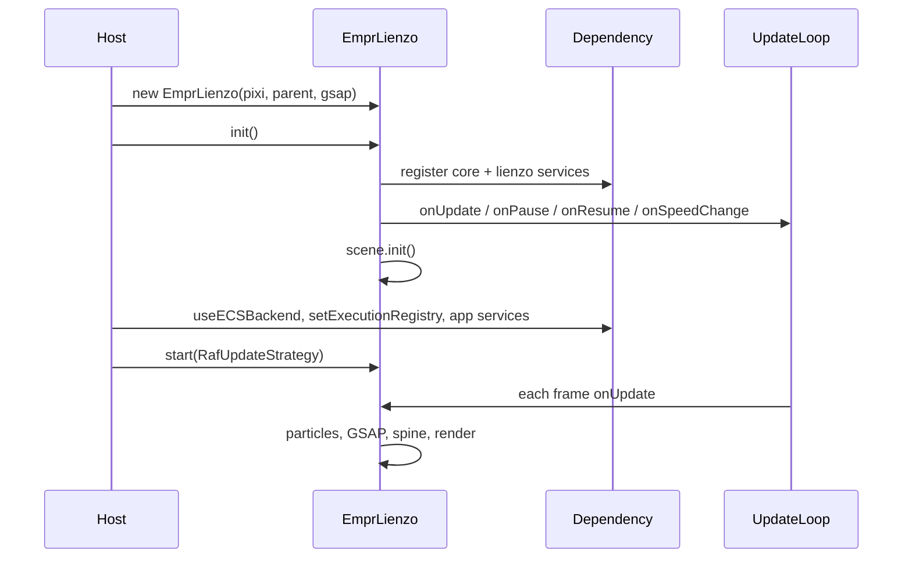

# API: `bootstrap`

Public entry point for the PixiJS application shell. Import from the package barrel or the bootstrap index.

```typescript
import { EmprLienzo } from '@empr/es-lienzo';
// or
import { EmprLienzo } from './bootstrap';
```

| Export | Source | Description |
|--------|--------|-------------|
| `EmprLienzo` | `empr.lienzo.ts` | Extends `@empr/es` `Empr` — DOM, DI, render loop wiring |

**Layer position:** Top integration layer — imports `features`, `widgets`, `core`, `shared`. **No lower layer may import `bootstrap`.**

**Base class:** [`@empr/es` `bootstrap/API_DOC.md`](/docs/api/es/bootstrap) — `Empr`, `init()`, `start(ticker)`, `dependency`, core service registration.

---

## Role

`EmprLienzo` is the standard entry point for browser games on PixiJS v7. It:

1. Registers `pixi.Application` in DI and mounts the canvas to a DOM parent.
2. Registers the visual stack (assets, scene, spine, tween, particles, interaction, pools, …).
3. Binds rendering and animation to `UpdateLoop` (manual `renderer.render`, no Pixi auto-ticker in this class).
4. Initializes [`Scene``scene` (`@pixi/layers` stage).

Gameplay (FSM, pipelines, manifests, `TimerService`, `ResizerService`, layer group names) stays in the **host app** (e.g. `EmprGame` in slot-client).

---

## Lifecycle sequence

```text
new EmprLienzo(pixi, parent, gsap)
  → registerGlobal(Application)
  → appendToDOM + connectDebugger (__PIXI_APP__)

init()
  → super.init()           // Empr core services
  → registerServices()     // es-lienzo services (override)
  → setUpdateDeps()        // UpdateLoop hooks
  → initializeScenes()     // scene.init()

// Host (typical, after init):
useECSBackend(empr)
interactionService.setExecutionRegistry(executor)
register TimerService, ResizerService, domain services…

start(RafUpdateStrategy)
  → UpdateLoop.start(ticker)   // inherited from Empr
```



---

## `EmprLienzo`

```typescript
class EmprLienzo extends Empr
```

### Constructor

```typescript
constructor(
  pixi: Application,
  parent: HTMLDivElement,
  gsap: typeof gsap,
)
```

| Parameter | Description |
|-----------|-------------|
| `pixi` | Pre-configured Pixi `Application` (host should disable Pixi auto-tickers — see [Host Pixi setup](#host-pixi-setup)) |
| `parent` | DOM node receiving `pixi.view` |
| `gsap` | Shared GSAP module; `TweenService` removes GSAP’s default ticker |

**Side effects (constructor):**

| Step | Action |
|------|--------|
| `super()` | Base `Empr` construction |
| DI | `registerGlobal({ provide: Application, useFactory: () => pixi })` |
| DOM | `parent.appendChild(pixi.view)` |
| DevTools | `globalThis.__PIXI_APP__ = pixi` (all environments; see note in source) |

---

### `init()` (override)

```typescript
public override init(): void
```

| Order | Action |
|-------|--------|
| 1 | `super.init()` → `Empr.registerServices()` (core ECS) |
| 2 | `registerServices()` → lienzo services (below) |
| 3 | `setUpdateDeps()` → loop hooks + manual render |
| 4 | `initializeScenes()` → `Scene.init()` |

Does not call `start()` or load assets.

---

### `start(ticker)` (inherited)

```typescript
start(ticker: IUpdateTicker): void  // from Empr
```

Starts `UpdateLoop` with the supplied ticker. Browser apps typically pass `RafUpdateStrategy` from `@empr/es-lienzo` / `core` export.

---

### `dependency` (inherited getter)

```typescript
get dependency(): IDependency  // Dependency.instance
```

Use after `init()` to `inject()` services and `registerGlobal()` app-specific tokens.

---

## `registerServices()` (protected override)

Calls `super.registerServices()` first, then constructs and registers:

| Token | Instance | Registration |
|-------|----------|--------------|
| `AssetsStorage` | `new AssetsStorage()` | `useFactory` singleton |
| `AssetsLoader` | `new AssetsLoader(assetsStorage)` | `useFactory` singleton |
| `LayersService` | `new LayersService()` | `useFactory` singleton |
| `Scene` | `new Scene(app, layersService, storage)` | `useFactory` singleton |
| `InteractionService` | `new InteractionService()` + **`init()`** | `useFactory` singleton |
| `TreeBuilder` | `new TreeBuilder(dependency)` | `useFactory` singleton |
| `SpineService` | `new SpineService(lifecycleTracker)` | `useFactory` singleton |
| `TweenService` | `new TweenService(gsap, lifecycleTracker)` | `useFactory` singleton |
| `TweenUtils` | — | `useClass` |
| `ParticleService` | — | `useClass` |
| `PrefabService` | — | `useClass` |
| `PixiPools` | — | `useClass` |

**Not registered by `EmprLienzo` (host responsibility):**

| Service | Typical host wiring |
|---------|---------------------|
| `ExecutionRegistry` / `Executor` | `useECSBackend(empr)` after `init()` |
| `InteractionService.setExecutionRegistry` | After executor is available |
| `TimerService` | `onUpdate` + `registerGlobal` in app bootstrap |
| `ResizerService` | App `setupDependencies` |
| Render layer `createGroup` names | App `setupLayers()` on `LayersService` |

---

## `setUpdateDeps()` (private) — frame pipeline

Subscribes to [`UpdateLoop`](/docs/api/es/core/update-loop) on the shared instance:

### `onSpeedChange(modifier)`

```typescript
tweenService.setTimeScale(modifier);
spineService.multiplyTimeScaleAll(modifier);
```

### `onPause` / `onResume`

```typescript
spineService.pauseAll() / resumeAll();
tweenService.pauseAll() / resumeAll();
```

### `onUpdate(data: IUpdateLoopData)`

Executed **in this order** each frame:

| Step | Call | Time input |
|------|------|------------|
| 1 | `particleService.update(data.multipliedDelta)` | Scaled delta |
| 2 | `tweenService.syncDeltaToFPS(data.gameTime)` | Absolute game time |
| 3 | `spineService.update(data.deltaTime)` | Unscaled clamped delta |
| 4 | `pixi.renderer.render(pixi.stage)` | Manual draw |

Pixi’s internal RAF ticker is **not** used by this class — the ECS loop is the single driver.

See also [`timer` timing note`timer` — `TimerService` is not wired here.

---

## `initializeScenes()` (private)

```typescript
dependency.inject(Scene).init();
```

Creates `@pixi/layers` `Stage`, root/`View`/`Shared` branches ([`scene/API_DOC.md``scene`). Does not call `setView` — host pipelines do that after assets load.

---

## Private helpers (reference)

| Method | Role |
|--------|------|
| `appendToDOM(app, parent)` | `parent.appendChild(app.view)` |
| `connectDebugger(app)` | Exposes `globalThis.__PIXI_APP__` for Pixi DevTools |

---

## Host Pixi setup

`EmprLienzo` does not create the `Application`. Recommended pattern (slot-client `PixiRender`):

- `autoStart: false` on `Application`
- Stop `Ticker.shared` and `Ticker.system` so only `RafUpdateStrategy` + `UpdateLoop` drive frames

```typescript
const render = new PixiRender();
const pixi = render.init({ color: 0x000000 });
const empr = new EmprLienzo(pixi, parent, gsap);
```

---

## Usage pattern (full stack)

```typescript
import { EmprLienzo, RafUpdateStrategy, InteractionService } from '@empr/es-lienzo';
import { useECSBackend, Executor } from '@empr/es-sistema';
import gsap from 'gsap';

const pixi = createPixiApplication(); // host factory
const parent = document.getElementById('game') as HTMLDivElement;

const empr = new EmprLienzo(pixi, parent, gsap);
empr.init();

useECSBackend(empr);
empr.dependency.inject(InteractionService).setExecutionRegistry(
  empr.dependency.inject(Executor),
);

// App-specific: TimerService, ResizerService, LayersService.createGroup, assets pipelines…

empr.start(new RafUpdateStrategy());
```

Reference implementation: `apps/slot-client/src/app/bootstrap/empr.game.ts`, `apps/slot-cd-client/src/app/bootstrap/empr.game.ts`.

---

## Semantics and constraints

| Topic | Behavior |
|-------|----------|
| **Single `Application`** | One `registerGlobal(Application)` per process |
| **`InteractionService.init()`** | Called during `registerServices` — ECS signal listeners for add/remove component |
| **`setExecutionRegistry`** | Must be called by host before pointer flows run |
| **Render order** | ECS/state should be updated before or via same-frame pipelines; render is last in `onUpdate` |
| **Subclassing** | Override `registerServices` / `init`; call `super` first |
| **DevTools exposure** | `__PIXI_APP__` set in production unless host removes it |
| **No gameplay** | No FSM, scenes content, or asset manifests in this module |

---

## Service map (quick reference)

```text
Empr (core)
  EntityStorage, UpdateLoop, SignalService, LifecycleTracker, …

EmprLienzo adds
  features:  AssetsStorage, AssetsLoader, TreeBuilder, Scene
  widgets:   LayersService, SpineService, TweenService, TweenUtils,
             ParticleService, PrefabService, InteractionService, PixiPools
  pixi:      Application (constructor)
```

---

## Related documentation

- `feature_description.md` — design goals, manual render, ticker hijacking
- `layer_responsibility.md` — import boundaries
- [`@empr/es` `bootstrap/API_DOC.md`](/docs/api/es/bootstrap) — `Empr` base API
- [`../core/update-loop/API_DOC.md``update-loop` — `IUpdateLoopData`, `RafUpdateStrategy`
- [`@empr/es-sistema` `bootstrap/API_DOC.md`](/docs/api/es-sistema/bootstrap) — `useECSBackend`
- Per-service API docs under `widgets/` and `features/`
- Source: `empr.lienzo.ts`, export: `index.ts`

## Known consumers (reference)

| Module | Usage |
|--------|--------|
| `apps/slot-client/.../empr.game.ts` | `new EmprLienzo`, `init`, `start`, extends DI |
| `apps/slot-cd-client/.../empr.game.ts` | Same pattern |
| `apps/*/render.ts` | Documents `EmprLienzo` + Pixi ticker disable |
| `es-componente` / `es-sistema` docs | `useECSBackend` + `EmprLienzo` examples |

Custom products can subclass `EmprLienzo` (rare) or wrap it in an app bootstrap class like `EmprGame`.

