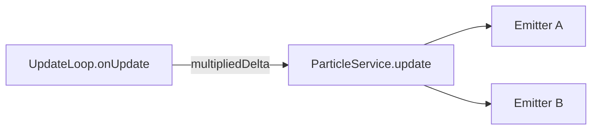

# API: `widgets/particle-service`

Public entry point for centralized `@pixi/particle-emitter` lifecycle. Import from the widgets barrel or the feature index.

```typescript
import { ParticleService } from '@empr/es-lienzo';
// or
import { ParticleService } from './widgets/particle-service';
```

| Export | Source | Description |
|--------|--------|-------------|
| `ParticleService` | `particle.service.ts` | Registry of named emitters, frame `update`, activation helpers |

**Dependencies:**

| Package | Symbols |
|---------|---------|
| `pixi.js` | `Container` (emitter parent) |
| `@pixi/particle-emitter` | `Emitter` (constructed via namespace import `particles`) |

**Not exported:** particle JSON config types — callers pass `config: any` (standard emitter editor / library JSON shape).

**Update driver:** `EmprLienzo` wires `particleService.update(data.multipliedDelta)` on `UpdateLoop.onUpdate` (scaled game time step, not raw wall-clock RAF).

---

## `ParticleService`

Global facade over `@pixi/particle-emitter`. Emitters are created once, cached by string id, advanced every frame from the ECS update loop, and started via `emit` / `emitAll`.

**Layer:** `widgets` — no ECS entity types; parent `Container` is supplied by the caller (scene node, layer container, etc.).

### Internal state

| Field | Type | Role |
|-------|------|------|
| `_emitters` | `Map<string, any>` | `name` → `particles.Emitter` instance |

There is no public API to remove, destroy, or list emitters. Entries persist for the service lifetime unless overwritten by a second `createParticleEmitter` with the same `name`.

---

### `createParticleEmitter(name, parent, config)`

```typescript
createParticleEmitter(
  name: string,
  parent: Container,
  config: any,
): particles.Emitter
```

| Parameter | Type | Description |
|-----------|------|-------------|
| `name` | `string` | Unique registry key for `emit(name)` and internal cache |
| `parent` | `Container` | Pixi container that displays emitted particles |
| `config` | `any` | Emitter definition (JSON / object accepted by `@pixi/particle-emitter`) |

| | |
|---|---|
| **Returns** | Constructed `Emitter` (also stored in `_emitters`) |

**Side effects:**

1. `new particles.Emitter(parent, config)`
2. `_emitters.set(name, emitter)` — **overwrites** prior entry for `name` without destroying the old emitter

```typescript
const emitter = particleService.createParticleEmitter(
  'coin_burst',
  hudContainer,
  coinBurstConfig,
);

// Optional: further configure returned instance before first emit
emitter.emit = false;
```

Host apps are responsible for valid config content (textures, behaviors, lifetime) per `@pixi/particle-emitter` documentation.

---

### `update(dt)`

```typescript
update(dt: number): void
```

| Parameter | Type | Description |
|-----------|------|-------------|
| `dt` | `number` | Delta time in **seconds** for this frame |

**Side effects:** `emitter.update(dt)` for **every** value in `_emitters` (including idle emitters).

**Bootstrap wiring (`EmprLienzo`):**

```typescript
updateLoop.onUpdate((data) => {
  particleService.update(data.multipliedDelta);
  // ...
});
```

| Topic | Behavior |
|-------|----------|
| **`multipliedDelta` vs `deltaTime`** | Particles respect `UpdateLoop` speed multiplier (`gameTime` scale); paused loop stops calling `onUpdate`, so particles stop too |
| **No self RAF** | Emitters do not auto-advance on browser time — must go through this method |

```typescript
particleService.update(0.016);
```

---

### `emit(name)`

```typescript
emit(name: string): void
```

| Parameter | Type | Description |
|-----------|------|-------------|
| `name` | `string` | Registry key passed to `createParticleEmitter` |

**Side effects:** If emitter exists, sets `emitter.emit = true` (library flag to start / continue emission).

| | |
|---|---|
| **Missing name** | No-op (no throw, no warn) |

```typescript
particleService.emit('coin_burst');
```

---

### `emitAll()`

```typescript
emitAll(): void
```

**Side effects:** Sets `emitter.emit = true` on **all** registered emitters.

```typescript
particleService.emitAll();
```

---

## Lifecycle (reference)

```text
Setup (app / scene / system)
  createParticleEmitter(name, parent, config)
  → cached in _emitters

Gameplay trigger
  emit(name)  |  emitAll()
  → emitter.emit = true

Every frame (UpdateLoop → EmprLienzo.onUpdate)
  update(multipliedDelta)
  → each emitter.update(dt)
```



---

## Usage patterns

### Register at load, fire on event

```typescript
const particles = inject(ParticleService);

particles.createParticleEmitter('win_sparkle', winContainer, sparkleJson);

// On win signal / FSM transition:
particles.emit('win_sparkle');
```

### Multiple effects

```typescript
particles.createParticleEmitter('dust', worldLayer, dustConfig);
particles.createParticleEmitter('smoke', worldLayer, smokeConfig);

particles.emit('dust');
// later
particles.emit('smoke');
```

### Hold direct emitter reference

```typescript
const emitter = particles.createParticleEmitter('trail', ship.node, trailConfig);
emitter.particleParent = customContainer; // library-specific tweaks
```

Service still owns the cache entry under `'trail'` for `emit('trail')`.

### Simultaneous burst

```typescript
particles.emitAll();
```

---

## Semantics and constraints

| Topic | Behavior |
|-------|----------|
| **No `remove` / `destroy`** | Emitters stay in `_emitters` until process end or overwrite by name |
| **Name overwrite** | Second `createParticleEmitter(sameName, …)` replaces map entry; previous `Emitter` is not destroyed by the service |
| **Missing `emit` target** | Silent no-op |
| **Config typing** | `any` — no validation in this widget |
| **Pause** | When `UpdateLoop` is paused, `update` is not called — particles freeze |
| **ECS** | No `PixiEntity` / storage integration — pass `entity.node` or child `Container` as `parent` |
| **Render order** | Parent container layer / `parentGroup` (see `LayersService`) affects draw order, not this service |
| **Library version** | Locked via `es-lienzo` `peerDependencies` / `vite.config` external `@pixi/particle-emitter` |

---

## Config payload (`config: any`)

The service forwards `config` unchanged to `new Emitter(parent, config)`. Shape matches **`@pixi/particle-emitter`** (Particle Editor 2.x JSON or equivalent object): textures, spawn behaviors, lifetime, etc.

This module does not document individual config fields — refer to the [Particle Emitter](https://github.com/pixijs-userland/particle-emitter) project for schema and examples.

---

## Internal model (reference)

```
┌─────────────────────────────────────────────┐
│  ParticleService                            │
│  _emitters: Map<name, Emitter>              │
├─────────────────────────────────────────────┤
│  createParticleEmitter → new Emitter, set   │
│  emit(name)            → emitter.emit=true  │
│  emitAll()             → all emit=true      │
│  update(dt)            → all emitter.update │
└─────────────────────────────────────────────┘
         ▲
         │ multipliedDelta each frame
    UpdateLoop (EmprLienzo)
```

---

## Related documentation

- `feature_description.md` — determinism, registry design, facade for activation
- `../../bootstrap/empr.lienzo.ts` — DI registration and `onUpdate` binding
- [`../core/update-loop/API_DOC.md`](/docs/api/es-lienzo/core/update-loop) — `IUpdateLoopData.multipliedDelta`
- Source: `particle.service.ts`, export: `index.ts`

## Known consumers (reference)

| Module | Usage |
|--------|--------|
| `bootstrap/empr.lienzo.ts` | `registerGlobal(ParticleService)`, `update(multipliedDelta)` on each frame |

`createParticleEmitter` / `emit` / `emitAll` are intended for host apps and game systems; no in-repo callers outside the widget yet.

