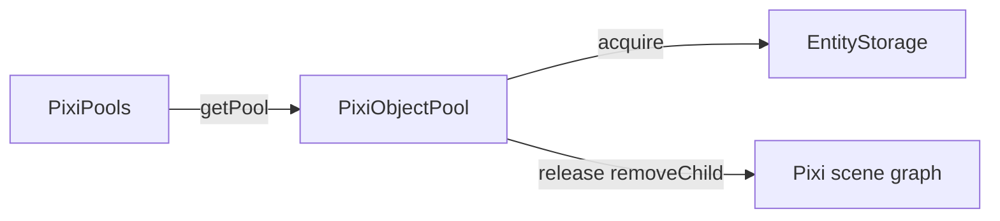

# API: `widgets/pixi-pools`

Public entry point for the PixiJS-aware multi-pool registry. Import from the widgets barrel or the feature index.

```typescript
import { PixiPools } from '@empr/es-lienzo';
// or
import { PixiPools } from './widgets/pixi-pools';
```

| Export | Source | Description |
|--------|--------|-------------|
| `PixiPools` | `pixi-pools.ts` | Registry of named `PixiObjectPool` instances |

**Re-exported from `@empr/es` (used, not defined here):**

| Symbol | Package | Role |
|--------|---------|------|
| `PoolKey` | `@empr/es` `widgets/pools` | Registry key: `string \| number \| symbol` |
| `IObjectPoolOptions` | `@empr/es` `shared/object-pool` | `createPool` configuration |

**Base registry (reference):** [`@empr/es` `widgets/pools`](/docs/api/es/widgets/pools) — framework-agnostic `Pools` + `ObjectPool<T>`.

**Pool implementation:** ](/docs/api/es-lienzo/core/object-pool) — `PixiObjectPool` (scene detach + `acquireEntity` on acquire).

---

## `PoolKey` (from `@empr/es`)

```typescript
type PoolKey = string | number | symbol;
```

| Form | Typical use in slot apps |
|------|-------------------------|
| `number` | Symbol / reel id (`SymbolId`, math strip id) |
| `string` | Named effect pools (`'bullets'`) |
| `symbol` | Module-scoped collision-safe keys |

`Map` identity semantics apply (symbols must be the same reference).

---

## `PixiPools`

```typescript
class PixiPools
```

Thin registry over `PixiObjectPool`. Same ergonomics as `@empr/es` `Pools`, but every stored pool is Pixi/ECS-aware.

**Layer:** `widgets` — imports `@empr/es` types, `PixiEntity`, `PixiObjectPool`; does not implement acquire/release itself.

### Internal storage

```typescript
private readonly pools = new Map<PoolKey, PixiObjectPool>();
```

| Behavior | Detail |
|----------|--------|
| Registration | `createPool` → `pools.set(key, pool)` |
| Overwrite | Second `createPool(sameKey)` **replaces** entry without destroying the previous pool |
| Removal | No `deletePool` / `clear` API |

---

### `createPool(key, options)`

```typescript
createPool(
  key: PoolKey,
  options: IObjectPoolOptions<PixiEntity>,
): PixiObjectPool
```

| Parameter | Type | Description |
|-----------|------|-------------|
| `key` | `PoolKey` | Unique lookup id |
| `options` | `IObjectPoolOptions<PixiEntity>` | Passed to `new PixiObjectPool(options)` |

| | |
|---|---|
| **Returns** | `PixiObjectPool` (concrete class, not `IObjectPool`) |

**Side effects:**

1. `new PixiObjectPool(options)` — may `preallocate` when `initialSize > 0`
2. Store under `key`
3. Return instance (optional direct reference; registry pattern avoids passing pools through constructors)

```typescript
const pixiPools = inject(PixiPools);

pixiPools.createPool(SymbolId.Wild, {
  factory: () => instantiate(symbolView, { id: SymbolId.Wild, type: 'wild' }),
  reset: (entity) => entity.node.position.set(0, 0),
  initialSize: 10,
  maxSize: 50,
  autoGrow: true,
});
```

### `IObjectPoolOptions<PixiEntity>` (inherited contract)

| Property | Type | Default | Description |
|----------|------|---------|-------------|
| `factory` | `() => PixiEntity` | — | **Required.** New instance when idle stack empty (if `autoGrow`) or during warmup |
| `reset` | `(item: PixiEntity) => void` | `undefined` | Called on `release` after scene detach |
| `initialSize` | `number` | `0` | Constructor `preallocate` |
| `maxSize` | `number` | `Infinity` | Max **idle** instances retained |
| `autoGrow` | `boolean` | `true` | If `false`, `acquire()` throws when idle stack empty |

Full acquire/release semantics: [`@empr/es` `shared/object-pool`](/docs/api/es/shared/object-pool).

**Factory guidance:** typically `instantiate(viewFactory, { parent?, … })` so entities are created with components and initial `addEntity`; `acquire` then calls `acquireEntity` for re-entry into queries.

---

### `getPool(key)`

```typescript
getPool(key: PoolKey): PixiObjectPool
```

| Parameter | Type | Description |
|-----------|------|-------------|
| `key` | `PoolKey` | Key used in `createPool` |

| | |
|---|---|
| **Returns** | Registered `PixiObjectPool` |
| **Throws** | `Error`: `` No Pixi pool with key "${String(key)}" found `` |

Fail-fast: pools must be registered at init before hot-path `getPool` in systems.

```typescript
const pool = pixiPools.getPool(symbolId);
const symbol = pool.acquire();
reelContainer.addChild(symbol);
```

---

## Delegated pool API (`PixiObjectPool`)

After `createPool` or `getPool`, use the returned pool:

| Member | Description |
|--------|-------------|
| `available` | Idle `PixiEntity` count in internal stack |
| `totalCreated` | Lifetime `factory` invocations |
| `inUse` | Acquired, not yet `release`d |
| `acquire()` | Pop or grow → `EntityStorage.acquireEntity(item)` |
| `release(item)` | `parent.removeChild(item)` → reset → idle stack |
| `preallocate(count)` | Warm idle stack |
| `clear()` | Clear idle stack only |
| `releaseAll(items)` | Batch `release` |

Pixi/ECS hooks (not in base `ObjectPool`):

| Method | Extra behavior |
|--------|----------------|
| `acquire()` | `entityStorage.acquireEntity(item)` after `super.acquire()` |
| `release(item)` | `item.parent?.removeChild(item)` before `super.release()` |

`release` does **not** call `EntityStorage.releaseEntity` — pair with `releaseEntity` when entities must leave ECS queries while pooled (e.g. `TreeBuilder` `removed`).

Details: [`../core/object-pool/API_DOC.md`](/docs/api/es-lienzo/core/object-pool).

```typescript
const pool = pixiPools.getPool(id);

const entity = pool.acquire();
parent.addChild(entity);

// ... gameplay ...

storage.releaseEntity(entity); // optional: de-index ECS
pool.release(entity);
```

---

## `PixiPools` vs `@empr/es` `Pools`

| | `PixiPools` (`es-lienzo`) | `Pools` (`@empr/es`) |
|---|---------------------------|----------------------|
| Stored type | `PixiObjectPool` | `ObjectPool<T>` / `IObjectPool<T>` |
| Item type | `PixiEntity` only | Any `T` |
| `createPool` return | `PixiObjectPool` | `IObjectPool<T>` |
| Scene graph | Detach on `release` | None |
| ECS | `acquireEntity` on `acquire` | None |
| Use when | Pooling view entities | Plain data / non-Pixi objects |

Both share `PoolKey`, overwrite-on-duplicate-key, fail-fast `getPool`, no registry deletion API.

---

## Usage patterns

### Bootstrap: pre-warm symbol pools (slot-client)

```typescript
function symbolCreatePoolSystem(props: SystemProps<IProps>) {
  const pools = inject(PixiPools);

  symbolsMap().forEach(({ id, key }) => {
    pools.createPool(id, {
      initialSize: 10,
      autoGrow: true,
      factory: () => instantiate(symbolView, { id, type: key }),
      reset: (symbol) => {
        symbol.node.position.set(0, 0);
        // reset components...
      },
    });
  });
}
```

### System: acquire / release per spin

```typescript
const pools = inject(PixiPools);
const pool = pools.getPool(symbolId);
const symbol = pool.acquire();
reel.addChild(symbol);

// end of spin
pool.release(symbol);
```

### Inject into services

```typescript
class ReelService {
  constructor(private readonly _pools: PixiPools) {}

  getSymbol(id: number): PixiEntity {
    return this._pools.getPool(id).acquire();
  }
}
```

### Direct reference from `createPool`

```typescript
const wildPool = pixiPools.createPool(SymbolId.Wild, options);
// equivalent lookup:
const same = pixiPools.getPool(SymbolId.Wild);
```

---

## End-to-end lifecycle (reference)

```text
Init (orchestrator / system)
  pixiPools.createPool(key, { factory: instantiate(...), initialSize, reset })

Runtime
  pool = pixiPools.getPool(key)
  entity = pool.acquire()     → acquireEntity (ECS on)
  parent.addChild(entity)     → visible (caller)

Despawn
  storage.releaseEntity(entity)  → optional ECS off
  pool.release(entity)           → removeChild + reset + idle

Reuse
  entity = pool.acquire()     → acquireEntity again
```



---

## Semantics and constraints

| Topic | Behavior |
|-------|----------|
| **Thin registry** | No pooling logic — delegates to `PixiObjectPool` |
| **Duplicate keys** | `createPool` overwrites map entry |
| **Missing key** | `getPool` throws (no `undefined`) |
| **Registry cleanup** | No API to remove pools from map |
| **Non-`PixiEntity` pools** | Use `@empr/es` `Pools` + `ObjectPool<T>` |
| **Scene attachment** | `acquire` does not `addChild` — caller attaches |
| **ECS release** | `releaseEntity` separate from `pool.release` |
| **DI** | `EmprLienzo` registers `PixiPools` globally |
| **Hot path** | `createPool` at init only; `getPool` + `acquire`/`release` during play |

---

## Related documentation

- `feature_description.md` — mirror of `Pools`, fail-fast, delegation to `PixiObjectPool`
- Base registry: [`@empr/es` `widgets/pools/API_DOC.md`](/docs/api/es/widgets/pools)
- Pool engine: [`../core/object-pool/API_DOC.md`](/docs/api/es-lienzo/core/object-pool)
- Entity bridge: [`../core/entity/API_DOC.md`](/docs/api/es-lienzo/core/entity)
- Storage: [`@empr/es` `widgets/entity-storage/API_DOC.md`](/docs/api/es/widgets/entity-storage)
- Source: `pixi-pools.ts`, export: `index.ts`

## Known consumers (reference)

| Module | Usage |
|--------|--------|
| `bootstrap/empr.lienzo.ts` | `registerGlobal({ provide: PixiPools, useClass: PixiPools })` |
| `apps/slot-client/.../symbol-create-pool.system.ts` | `createPool` per symbol id |
| `apps/slot-client/.../slot-create-symbols.system.ts` | `inject(PixiPools)` |
| `apps/slot-client/.../reel.service.ts` | Constructor injection |
| `apps/slot-cd-client/.../initialization.orchestrator.ts` | `@Inject(PixiPools)` |
| `apps/slot-client/.../empr.game.ts` | `ReelService(pixiPools)` |

For generic non-Pixi pooling, use `@empr/es` `Pools` instead of this widget.

