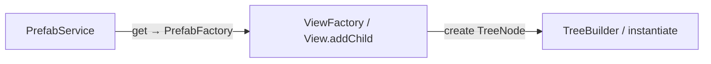

# API: `widgets/prefab-service`

Public entry point for token-based `View` prefab registries. Import from the widgets barrel or the feature index.

```typescript
import {
  PrefabService,
  PrefabFactory,
  IPrefabProvider,
} from '@empr/es-lienzo';
// or
import { PrefabService, PrefabFactory, IPrefabProvider } from './widgets/prefab-service';
```

| Export | Source | Description |
|--------|--------|-------------|
| `PrefabService` | `prefab.service.ts` | `InjectionToken` → `PrefabFactory` registry |
| `PrefabFactory` | `prefab.types.ts` | `(view: View, props: T) => void` mutating builder callback |
| `IPrefabProvider` | `prefab.types.ts` | `{ provide, prefab }` registration payload |

**Dependencies:**

| Package / module | Symbols |
|------------------|---------|
| `@empr/es` | `InjectionToken` |
| `features/view` | `View` (fluent declarative builder) |

**Not in scope:** Pixi instantiation, `TreeBuilder`, `instantiate`, or ECS — this widget stores **blueprints** only. Compilation happens when the returned factory is invoked inside a `ViewFactory` / tree build path.

---

## `PrefabFactory<T>`

```typescript
type PrefabFactory<T> = (view: View, props: T) => void;
```

| Parameter | Type | Description |
|-----------|------|-------------|
| `view` | `View` | Existing builder instance to mutate (fluent chain) |
| `props` | `T` | Prefab-specific configuration payload |

| | |
|---|---|
| **Returns** | `void` — structure is applied via side effects on `view` |

Aligns with `ViewFactory` in `features/view` (`(view, props) => void`): prefabs nest inside larger trees without allocating a separate `View` instance inside the factory.

```typescript
const healthBarPrefab: PrefabFactory<IHealthBarProps> = (view, props) => {
  view
    .ofType(Container, 'health_bar')
    .size(props.width, props.height)
    .addChild((child) => {
      child.ofType(Text, 'label').text(props.label);
    });
};
```

---

## `IPrefabProvider<T>`

```typescript
interface IPrefabProvider<T> {
  provide: InjectionToken<PrefabFactory<T>>;
  prefab: PrefabFactory<T>;
}
```

| Field | Type | Description |
|-------|------|-------------|
| `provide` | `InjectionToken<PrefabFactory<T>>` | Token used as map key and for `get()` |
| `prefab` | `PrefabFactory<T>` | Implementation bound to that token |

```typescript
import { InjectionToken } from '@empr/es';

export interface IButtonProps {
  label: string;
}

export const BUTTON_PREFAB = new InjectionToken<PrefabFactory<IButtonProps>>('ButtonPrefab');

export const buttonProvider: IPrefabProvider<IButtonProps> = {
  provide: BUTTON_PREFAB,
  prefab: (view, { label }) => {
    view.ofType(Container, 'button').addChild((c) => {
      c.ofType(Text, 'label').text(label);
    });
  },
};
```

---

## `InjectionToken` (from `@empr/es`)

Typed DI token — carries generic `T` for inference and stable identity in the registry `Map`.

```typescript
new InjectionToken<T>(description: string, options?: { factory?: () => T })
```

| | |
|---|---|
| **Error message** | `get` uses `token.description` when prefab is missing |

See [`@empr/es` `core/dependency```injection-token.ts`` for full DI usage.

**Typing note:** `PrefabService.get<T>(token: InjectionToken<T>)` declares `T` as the **props** type, while `IPrefabProvider.provide` is `InjectionToken<PrefabFactory<T>>`. At runtime only token **reference equality** matters — pass the **same** token object as `provide`. If strict TypeScript complains, align generics with your project’s pattern (e.g. pass `BUTTON_PREFAB` as registered, or use a typed helper wrapper).

---

## `PrefabService`

Global registry mapping `InjectionToken` → `PrefabFactory`. Lets core modules request UI templates by token and allows apps to override implementations at bootstrap.

**Layer:** `widgets` — no Pixi/ECS imports in the service itself.

### Internal state

```typescript
private _prefabs: Map<InjectionToken<any>, PrefabFactory<any>>
```

| Behavior | Detail |
|----------|--------|
| Registration | `register` → `Map.set(provide, prefab)` |
| Overwrite | Same `provide` token replaces previous factory |
| Removal | No `unregister` / `clear` API |

---

### `register(provider)`

```typescript
register<T>(provider: IPrefabProvider<T>): void
```

| Parameter | Type | Description |
|-----------|------|-------------|
| `provider` | `IPrefabProvider<T>` | Token + factory pair |

**Side effects:** `_prefabs.set(provider.provide, provider.prefab)`.

```typescript
const prefabService = inject(PrefabService);

prefabService.register(buttonProvider);
prefabService.register({
  provide: TOOLTIP_PREFAB,
  prefab: tooltipPrefab,
});
```

Call during bootstrap or module init (before any `get` on the hot path).

---

### `get(token)`

```typescript
get<T>(token: InjectionToken<T>): PrefabFactory<T>
```

| Parameter | Type | Description |
|-----------|------|-------------|
| `token` | `InjectionToken<T>` | Must be the same reference passed as `provider.provide` |

| | |
|---|---|
| **Returns** | Registered `PrefabFactory<T>` |
| **Throws** | `Error`: `` Prefab ${token.description} not found `` |

```typescript
const buildButton = prefabService.get(BUTTON_PREFAB);
// later, inside a parent ViewFactory:
buildButton(view, { label: 'Spin' });
```

---

## Usage patterns

### Define token + register at bootstrap

```typescript
// symbols/prefabs.tokens.ts
export const HUD_PANEL_PREFAB = new InjectionToken<PrefabFactory<IHudProps>>('HudPanelPrefab');

// bootstrap / orchestrator
inject(PrefabService).register({
  provide: HUD_PANEL_PREFAB,
  prefab: (view, props) => {
    /* declarative View chain */
  },
});
```

### Compose prefab inside a scene `ViewFactory`

```typescript
import { View, ViewFactory } from '@empr/es-lienzo';

const mainHudFactory: ViewFactory<{ score: number }> = (view, props) => {
  const panel = inject(PrefabService).get(HUD_PANEL_PREFAB);

  view.ofType(Container, 'hud_root').addChild((child) => {
    panel(child, { score: props.score, showBonus: true });
  });
};

const entity = instantiate(mainHudFactory, { parent: sceneEntity, score: 100 });
```

### Override default UI for a skin / module

```typescript
// Default module
prefabService.register({ provide: BUTTON_PREFAB, prefab: defaultButton });

// Theme override (later registration wins)
prefabService.register({ provide: BUTTON_PREFAB, prefab: neonButton });
```

### Module-specific token (no string collision)

```typescript
export const REEL_FRAME_PREFAB = new InjectionToken<PrefabFactory<IReelFrameProps>>(
  'ReelFramePrefab',
);
```

Unlike string keys, tokens are unique by reference and typed at compile time.

---

## Lifecycle (reference)

```text
Bootstrap
  new InjectionToken<PrefabFactory<Props>>(description)
  prefabService.register({ provide, prefab })

Build time (ViewFactory / nested addChild)
  factory = prefabService.get(token)
  factory(view, props)   → mutates View config

Compile time (elsewhere)
  TreeBuilder / instantiate consumes resulting TreeNode
```



---

## Semantics and constraints

| Topic | Behavior |
|-------|----------|
| **Registry only** | Does not call `create()`, `instantiate`, or touch Pixi |
| **Mutation contract** | Factory must configure the passed `view`; do not replace the `View` instance |
| **Missing token** | `get` throws — fail-fast, no fallback factory |
| **Overwrite** | Second `register` with same `provide` replaces factory |
| **Token identity** | `Map` keyed by token reference — export tokens from a shared module |
| **Pooling / destroy** | Out of scope — handled by `PixiPools`, `deinstantiate`, etc. |
| **DI** | `EmprLienzo` registers `PrefabService` globally (`useClass`) |
| **Consumers in repo** | Registered in bootstrap; app `register` / `get` expected in game code |

---

## Comparison: `PrefabService` vs direct `ViewFactory`

| | `PrefabService` | Inline `ViewFactory` |
|---|-----------------|----------------------|
| Lookup | `InjectionToken` | Import / closure |
| Override | Re-`register` at bootstrap | Replace import / branch |
| Coupling | Core asks token; skin provides prefab | Core imports concrete view |
| Runtime cost | Map lookup on `get` | Direct function reference |

---

## Related documentation

- `feature_description.md` — token vs string keys, mutating factories, fail-fast
- `../../features/view/view.types.ts` — `ViewFactory`, `ViewData`, `instantiate`
- [`@empr/es` `InjectionToken```injection-token.ts``
- Bootstrap: `../../bootstrap/empr.lienzo.ts`
- Source: `prefab.service.ts`, `prefab.types.ts`, export: `index.ts`

## Known consumers (reference)

| Module | Usage |
|--------|--------|
| `bootstrap/empr.lienzo.ts` | `registerGlobal({ provide: PrefabService, useClass: PrefabService })` |

No in-monorepo `register` / `get` call sites yet — intended for app-level HUD/symbol/skin overrides.

