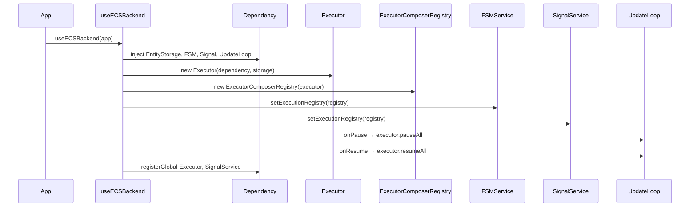

# API: `bootstrap` (`@empr/es-sistema`)

Public entry point for ECS execution-stack wiring. Import from the package barrel.

```typescript
import { useECSBackend } from '@empr/es-sistema';
// or
import { useECSBackend } from './bootstrap';
```

| Export (barrel) | Source | Description |
|-----------------|--------|-------------|
| `useECSBackend` | `use-ecs-backend.ts` | Wires `Executor` + registry into `@empr/es` services |

**Package role:** Satellite bootstrap for [`@empr/es`](/docs/features). Complements `Empr.init()` — does **not** replace it.

**Alternative stack:** [`@empr/es-componente`](/docs/features/es-componente) `useCDBackend` — pick **one** execution model per app.

---

## `useECSBackend`

```typescript
function useECSBackend(app: Empr): void
```

Connects the **ECS pipeline runtime** (`Executor`, `ExecutorComposerRegistry`) to services already registered by `Empr.registerServices()`.

### Prerequisites

| Step | Required |
|------|----------|
| `new Empr()` or `new EmprLienzo(...)` | Yes |
| `app.init()` (or subclass `init()` calling `super.init()`) | Yes — `EntityStorage`, `FSMService`, `SignalService`, `UpdateLoop` must exist |
| `useECSBackend(app)` | Before `FSM` / `SignalService` pipelines run |
| `app.start(ticker)` | After wiring (typical order) |

`useECSBackend` does not call `init()` or `start()`.

### Parameter

| Param | Type | Description |
|-------|------|-------------|
| `app` | `Empr` | Any `Empr` subclass (`EmprLienzo`, custom bootstrap) — uses `app.dependency` |

---

## What the function does



### 1. Resolve core services

```typescript
const storage = app.dependency.inject(EntityStorage);
const fsmService = app.dependency.inject(FSMService);
const signalService = app.dependency.inject(SignalService);
const updateLoop = app.dependency.inject(UpdateLoop);
```

Uses instances created in [`@empr/es` `Empr.registerServices`](/docs/api/es/bootstrap).

### 2. Construct execution stack

```typescript
const executor = new Executor(app.dependency, storage);
const composerRegistry = new ExecutorComposerRegistry(executor);
```

| Object | Role |
|--------|------|
| `Executor` | Runs `PipelineFactory` → systems (see ](/docs/api/es-sistema/features/executor)) |
| `ExecutorComposerRegistry` | `ExecutionRegistry` facade for `@empr/es` features |

One `Executor` instance per `useECSBackend` call — shared by registry and (optionally) direct `inject(Executor)`.

### 3. Attach registry to features

```typescript
fsmService.setExecutionRegistry(composerRegistry);
signalService.setExecutionRegistry(composerRegistry);
```

Required before:

- `FSMService.createFSM` / `fsm.start()` (state `onEnter` / `onExit` pipelines)
- `SignalService.listen(signal, factory, owner?)`

Without this, `create` / `run` on those services will use an unset registry.

### 4. Pause / resume integration

```typescript
updateLoop.onPause(() => executor.pauseAll());
updateLoop.onResume(() => executor.resumeAll());
```

When `UpdateLoop.pause()` runs (game pause), all active pipelines:

- Block new `Executor.run()` at the global gate
- Pause between systems on in-flight pipelines

`resumeAll()` reverses both behaviors.

### 5. DI re-registration

```typescript
app.dependency.registerGlobal({ provide: Executor, useFactory: () => executor });
app.dependency.registerGlobal({ provide: SignalService, useFactory: () => signalService });
```

| Token | Effect |
|-------|--------|
| `Executor` | **New** global binding — apps can `inject(Executor)` |
| `SignalService` | Re-binds same instance (factory) after registry injection |

`ExecutorComposerRegistry` is **not** registered globally — obtain via `setExecutionRegistry` on consumers or hold a local reference.

`FSMService` is not re-registered (still `useClass` from `Empr`; registry set by reference on existing instance).

---

## Typical application sequence

```typescript
import { EmprLienzo, InteractionService } from '@empr/es-lienzo';
import { Executor, useECSBackend } from '@empr/es-sistema';

const app = new EmprLienzo(pixi, parent, gsap);
app.init();

useECSBackend(app);

// Pixi input — NOT done inside useECSBackend
const interaction = app.dependency.inject(InteractionService);
const executor = app.dependency.inject(Executor);
interaction.setExecutionRegistry(executor); // Executor implements create/run/stop

app.start(rafTicker);
```

Reference: `apps/slot-client/src/app/bootstrap/empr.game.ts`.

### TypeScript augmentation

Declare `PipelineFactory` on `@empr/es` `ESCoreTypeRegistry` / FSM flows so `SignalService.listen` and FSM builders type-check:

- `apps/slot-client/src/app/types/empr-es.d.ts`

---

## What is NOT included

| Concern | Where to wire |
|---------|----------------|
| Core DI (`EntityStorage`, `UpdateLoop`, …) | `@empr/es` `Empr.init()` |
| Rendering / Pixi services | `@empr/es-lienzo` `EmprLienzo` |
| `InteractionService.setExecutionRegistry` | App after `useECSBackend` |
| Component-driven execution | `useCDBackend` from `@empr/es-componente` |
| `Executor.pause` / `resume` per pipeline | `inject(Executor)` — manual |
| `ExecutorComposerRegistry` in DI | Not registered by default |

---

## `useECSBackend` vs `useCDBackend`

| | `useECSBackend` | `useCDBackend` |
|---|-----------------|----------------|
| Package | `@empr/es-sistema` | `@empr/es-componente` |
| Runtime | `Executor` + `PipelineComposer` | `ComponentDrivenExecutor` + orchestrators |
| Registry type | `ExecutorComposerRegistry` | `ExecutorOrchestratorRegistry` |
| Pause target | `executor.pauseAll` / `resumeAll` | `componentDrivenExecutor.pauseAll` / `resumeAll` |
| Extra DI | `Executor` | `ComponentDrivenExecutor`, `DependencyComponentDriven`, `OrchestratorCache` |
| Co-install | **Do not** use both in one app |

---

## Usage patterns

### Minimal headless ECS

```typescript
const empr = new Empr();
empr.init();
useECSBackend(empr);
empr.start(ticker);
```

### Access executor after wiring

```typescript
useECSBackend(empr);
const executor = empr.dependency.inject(Executor);
const id = await executor.create(myPipeline, data, 'app', 'MyPipeline_');
await executor.run(id);
```

### Registry-only consumers

```typescript
useECSBackend(empr);
const fsm = empr.dependency.inject(FSMService);
// FSM internally uses ExecutorComposerRegistry via setExecutionRegistry
```

---

## Semantics and constraints

| Topic | Behavior |
|-------|----------|
| **Idempotent calls** | Second `useECSBackend` creates a **second** `Executor` and overwrites DI / registry refs — call **once** per app lifecycle |
| **Order** | After `init()`, before pipeline execution |
| **Return value** | `void` |
| **Storage coupling** | `Executor` uses the same `EntityStorage` singleton from DI |
| **SignalService factory** | Re-register ensures DI resolves post-wiring instance |
| **Layer** | Thin integration — no game logic |
| **Import boundary** | `@empr/es-sistema` imports `@empr/es` + local `features/executor` only |

---

## Related documentation

- [`../features/executor/API_DOC.md``executor` — `Executor`, `ExecutorComposerRegistry`
- [`../features/composer/API_DOC.md``composer` — `PipelineFactory`
- [`../../../es/src/bootstrap/API_DOC.md`](/docs/api/es/bootstrap) — `Empr`, `init`, `start`
- [`../../../es/src/core/execution-registry/API_DOC.md`](/docs/api/es/core/execution-registry) — registry contract
- [`../../../es/src/features/fsm/API_DOC.md`](/docs/api/es/features/fsm) — `setExecutionRegistry`
- [`../../../es/src/features/signal-service/API_DOC.md`](/docs/api/es/features/signal-service) — `listen` → `run`
- [`../../README.md`](/docs/api/es-sistema/) — package overview
- Source: `use-ecs-backend.ts`, export: `index.ts`

## Known consumers (reference)

| Module | Usage |
|--------|--------|
| `apps/slot-client` | `setupECS()` after `EmprLienzo.init()` |
| `@empr/es` README | Documented execution stack |
| `@empr/es-lienzo` README | Interaction + `useECSBackend` sequence |

