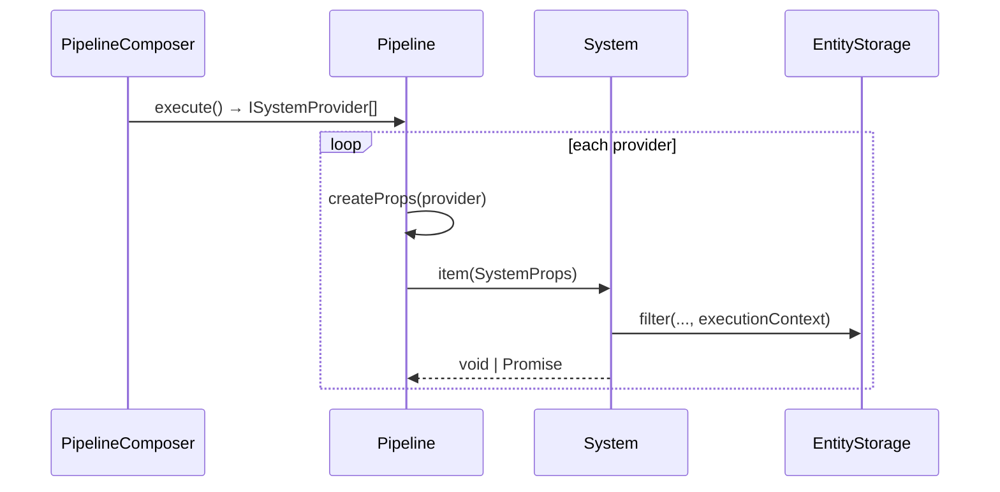

# API: `core/system` (`@empr/es-sistema`)

Public entry point for the feature. Import from the package barrel or the core index.

```typescript
import { System, SystemProps, ISystemOptions } from '@empr/es-sistema';
// or
import { System, SystemProps, ISystemOptions } from './core/system';
```

| Export (barrel) | Source | Description |
|-----------------|--------|-------------|
| `System` | `system.types.ts` | Function type alias for ECS logic |
| `SystemProps` | `system.types.ts` | Runtime payload = framework tools + custom data |
| `ISystemOptions` | `system.types.ts` | Framework-injected toolkit on every system call |

**Runtime:** This module exports **types only** — no classes or executors. `SystemProps` is built at runtime in `features/executor/pipeline.ts` when `Pipeline.execute()` runs each registered system.

**Dependencies (types):** `@empr/es` — `Token`, `ComponentFilter`, `IFiltered`.

**Downstream:** `PipelineComposer.use(system, data?)` → `Executor` / `Pipeline` → `system(props)`.

---

## `System<T>`

```typescript
type System<T = void> = (props: SystemProps<T>) => void | Promise<void>;
```

| Aspect | Detail |
|--------|--------|
| Form | Plain function (not a class) |
| Sync / async | Return `void` or `Promise<void>` |
| Generic `T` | Extra fields merged into `props` from composer `.use()` |
| Default `T` | `void` — no custom data required |

```typescript
type MoveData = { deltaTime: number };

const moveSystem: System<MoveData> = async (props) => {
  const { filter, deltaTime } = props;
  const entities = filter({ includes: [PositionComponent] });

  await entities.sequential(async (entity) => {
    const pos = entity.getComponent(PositionComponent);
    pos.x += 10 * deltaTime;
  });
};
```

Named functions improve `executionContext` strings (`provider.item.name` in `Pipeline.setExecutionContext`).

---

## `ISystemOptions`

Framework toolkit injected on every system invocation (implemented in `Pipeline.createProps`).

```typescript
interface ISystemOptions {
  inject<T>(token: Token<T>): T;
  filter(filter: ComponentFilter, withDisabled?: boolean): IFiltered;
  onStop(callback: () => void): void;
  executionId: number;
}
```

| Member | Runtime behavior (`Pipeline`) |
|--------|-------------------------------|
| `inject(token)` | `_dependency.inject(token, pipeline.id)` — **pipeline-scoped** DI module id |
| `filter(filter, withDisabled?)` | `_storage.filter(filter, withDisabled, provider.executionContext)` — enables live `EntityQuery` cache per system slot |
| `onStop(callback)` | Replaces pipeline stop handler; invoked when `Pipeline.stop()` runs |
| `executionId` | `Pipeline.id` (numeric instance id from `nextId()`) |

Systems should **not** import global `EntityStorage` or `Dependency.instance` directly when running inside pipelines — use `props.inject` / `props.filter` for correct scope and query context.

---

## `SystemProps<T>`

```typescript
type SystemProps<T = void> = ISystemOptions & T;
```

| Source | Fields |
|--------|--------|
| `ISystemOptions` | `inject`, `filter`, `onStop`, `executionId` |
| Composer `.use(system, data)` | Spread from `provider.data` (`{ ...data[0] }`) |

```typescript
type WinData = { winLines: number[][] };

const showWinSystem: System<WinData> = (props) => {
  const { winLines, filter, inject } = props;
  const pools = inject(PixiPools);
  // ...
};

// Registration (PipelineComposer)
composer.use(showWinSystem, { winLines });
```

### Typing custom data

In `features/composer`:

```typescript
type SystemData<T extends System> = T extends System<infer U> ? U : never;
```

`SystemArgs` omits the data argument when `System<void>` or data is `unknown`.

---

## Execution flow (where types meet runtime)



| Step | Location |
|------|----------|
| Define system | App / feature `*.system.ts` as `System<T>` |
| Register | `pipeline.use(mySystem, { ...data })` |
| Build queue | `composer.execute()` → `ISystemProvider[]` |
| Run | `new Pipeline(...).execute(asyncAllowed)` |
| Props | `createProps`: spread `provider.data` + inject/filter/onStop/executionId |

### `executionContext` for `filter`

Set per provider before run:

```text
`${pipeline.name}${systemFunction.name}_${index}`
```

Passed to `EntityStorage.filter` as third argument — caches `EntityQuery` per pipeline + system slot (see [`entity-storage` API](/docs/api/es/widgets/entity-storage) in `@empr/es`).

### Async rules

| `execute(asyncAllowed)` | System returns `Promise` |
|---------------------------|---------------------------|
| `true` (default) | Allowed; abort races with `Pipeline.stop()` |
| `false` | Throws if system returns a `Promise` |

### `onStop` semantics

| Event | Action |
|-------|--------|
| `props.onStop(fn)` during system run | Registers cleanup (last call wins — overwrites `_onStopCallback`) |
| `Pipeline.stop()` | Clears queue, runs `_onStopCallback`, aborts async race |

---

## Usage patterns

### Minimal system (no extra data)

```typescript
function cleanupSystem(props: SystemProps): void {
  props.filter({ includes: [DeadTagComponent] }).forEach((e) => {
    props.inject(EntityStorage).destroyEntity(e);
  });
}
```

### With `@empr/es` update payload

```typescript
import type { IUpdateLoopData } from '@empr/es';

const tickSystem: System<IUpdateLoopData> = (props) => {
  const { deltaMs, filter } = props;
  // ...
};

composer.use(tickSystem, updateLoopData);
```

### Unit test (mock props)

```typescript
await moveSystem({
  inject: (token) => mockContainer.resolve(token),
  filter: () => mockFiltered,
  onStop: () => {},
  executionId: 1,
  deltaTime: 0.016,
});
```

### Pipeline callback helper

`features/composer/utils/pipeline-callback.system.ts` — `System<IProps>` with `{ call: () => void | Promise<void> }` for imperative steps inside composers.

---

## Semantics and constraints

| Topic | Behavior |
|-------|----------|
| **Types-only core** | No scheduler here — `PipelineComposer` + `Executor` own execution |
| **No `any` in public types** | Use generics on `System<T>` |
| **DI scope** | `inject` uses pipeline id as `moduleId` — register overrides with same id if needed |
| **Live queries** | `filter` with `executionContext` → cached `EntityQuery` until context cleared |
| **Function.name** | Anonymous arrows lose readable context strings — prefer named exports |
| **Layer** | `core/system` — structural contract; game logic lives in apps |
| **CD stack** | `@empr/es-componente` uses different orchestration types; ECS stack uses this `System` model |

---

## Related types (composer — not in this folder)

| Type | Module | Role |
|------|--------|------|
| `ISystemProvider` | `features/composer` | Configured system + `data`, `when`, `executionContext` |
| `SystemData`, `SystemArgs` | `composer.types.ts` | Typing for `.use()` |
| `PipelineFactory` | `composer.types.ts` | Factory receiving `PipelineComposer` |

See `features/composer` and `features/executor` for builder and runtime.

---

## Related documentation

- `feature_description.md` — design rationale
- `../../features/executor/pipeline.ts` — `createProps` implementation
- `../../features/composer/pipeline-composer.ts` — `.use()`, `.when()`
- [`../../../../empr/es/src/widgets/entity-storage/API_DOC.md`](/docs/api/es/widgets/entity-storage) — `filter(..., executionContext)`
- [`../../../../empr/es/src/core/dependency/API_DOC.md`](/docs/api/es/core/dependency) — scoped `inject(token, moduleId)`
- [`../../../../empr/es/src/core/filtered/API_DOC.md`](/docs/api/es/core/filtered) — `IFiltered` iteration
- Source: `system.types.ts`, export: `index.ts`

## Known consumers (reference)

| Module | Usage |
|--------|--------|
| `apps/slot-client`, `slot-cd-client` | `*.system.ts` files |
| `features/composer` | `System`, `SystemData`, `ISystemProvider` |
| `features/executor` | Builds and invokes `SystemProps` |
| `pipeline-callback.system` | Generic callback system |

