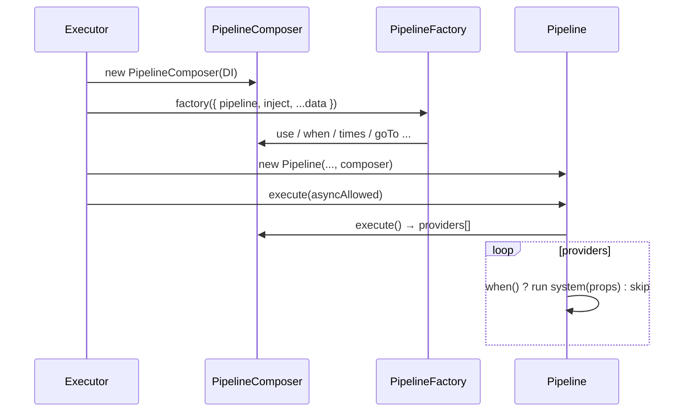

# API: `features/composer` (`@empr/es-sistema`)

Public entry point for the feature. Import from the package barrel or the features index.

```typescript
import {
  PipelineComposer,
  PipelineFactory,
  PipelineProps,
  FSMPipelineProps,
  ISystemProvider,
  IComposerSnapshot,
  SystemData,
  SystemArgs,
  pipelineCallback,
} from '@empr/es-sistema';
```

| Export (barrel) | Source | Description |
|-----------------|--------|-------------|
| `PipelineComposer` | `pipeline-composer.ts` | Fluent builder for system execution chains |
| `PipelineFactory` | `composer.types.ts` | Callback that configures a composer |
| `PipelineProps` | `composer.types.ts` | Factory argument (`pipeline` + `inject` + payload) |
| `FSMPipelineProps` | `composer.types.ts` | FSM transition payload variant |
| `ISystemProvider` | `composer.types.ts` | One configured system slot |
| `IProvider`, `IComposerSnapshot` | `composer.types.ts` | Provider base + debug snapshot |
| `SystemData`, `SystemArgs` | `composer.types.ts` | Typing helpers for `.use()` |
| `pipelineCallback` | `utils/pipeline-callback.system.ts` | Ad-hoc `System` for inline steps |

**Dependencies:** `@empr/es` (`IDependency`, `Provider`, `Token`, `ITransitionData`), `core/system` (`System`).

**Does not execute systems** — returns `ISystemProvider[]` via `execute()`; `Executor` / `Pipeline` run the queue (see `features/executor`).

---

## `PipelineFactory<T>`

```typescript
type PipelineFactory<T> = (props: PipelineProps<T>) => void | Promise<void>;
```

| Field | Description |
|-------|-------------|
| `pipeline` | `PipelineComposer` instance to configure |
| `inject` | DI helper (in `Executor.create`: resolves **`'root'`** scope) |
| `...T` | Initiator payload spread into props (signal data, FSM context, etc.) |

```typescript
const spinPipeline: PipelineFactory<ISpinData> = async (props) => {
  const { pipeline, inject, spinResult } = props;
  const storage = inject(EntityStorage);

  pipeline
    .use(slotCreateSymbolsSystem)
    .use(slotStartSpinSystem, { spinResult })
    .when(() => spinResult.canAnimate);
};
```

Registered with `SignalService`, `FSM` state `onEnter` / `onExit`, or `Executor.create(factory, data, initiator, name)`.

---

## `PipelineProps` / `FSMPipelineProps`

```typescript
type PipelineProps<T = void> = {
  pipeline: PipelineComposer;
  inject<K>(token: Token<K>): K;
} & T;

type FSMPipelineProps<T extends object> = PipelineProps<ITransitionData<T>>;
```

FSM flows receive `ITransitionData` fields (`from`, `to`, `context`, `prev`, `next`, `quit`, `disposable`, …) alongside `pipeline` and `inject`.

---

## `ISystemProvider`

```typescript
interface ISystemProvider extends IProvider<System> {
  executionContext: string;
}

interface IProvider<T> {
  id: number;
  hook: symbol;
  item: T;
  data: any;
  when: () => boolean;
  required?: boolean;
}
```

| Field | Set by | Used at runtime |
|-------|--------|-----------------|
| `id` | `nextId()` on `.use()` / clone | Execution stack tracking |
| `hook` | Auto `Symbol(id)` or `.options({ hook })` | `goTo`, `remove`, repeat groups |
| `item` | System function | Invoked by `Pipeline` |
| `data` | `.use(system, data)` spread | Merged into `SystemProps` |
| `when` | Default `() => true`; `.when(fn)` | Evaluated each run in `Pipeline.execute` |
| `required` | `.options({ required: true })` or `.lock()` | Blocks `remove` / `replace` |
| `executionContext` | Starts `''`; filled in `Pipeline.setExecutionContext` | `EntityStorage.filter` cache key |

---

## `PipelineComposer`

```typescript
class PipelineComposer
```

### Constructor

```typescript
new PipelineComposer(dependency: IDependency)
```

| Member | Description |
|--------|-------------|
| `id` | Composer instance id (`nextId()`) — used by `dependency()` registration |
| `_currentIndex` | Insertion cursor for `use()` / splice operations |

Created inside `Executor.create()` per pipeline build (one composer per factory invocation).

---

### Building the chain

#### `use(system, ...data)`

```typescript
use<T extends System<any>>(
  item: T,
  ...data: SystemArgs<T, SystemData<typeof item>>
): this
```

| Step | Action |
|------|--------|
| 1 | Create `ISystemProvider` with `data: { ...data[0] }`, `when: () => true`, unique `hook` |
| 2 | `splice(_currentIndex, 0, provider)` — insert at cursor |
| 3 | Increment `_currentIndex` |

`SystemArgs` omits the data tuple when `System<void>` or data type is `unknown`.

```typescript
composer
  .use(assetsInitSystem, { manifest })
  .use(assetsLoadSystem)
  .when(() => manifest.ready);
```

#### `when(predicate)`

Applies to the **last** provider (`_currentIndex - 1`). Evaluated at **execution** time in `Pipeline`, not at build time.

#### `times(count)`

Eagerly expands the last system into `count` sequential slots.

| `count` | Behavior |
|---------|----------|
| `< 0` or non-integer | `throw Error` |
| `0` | `console.warn`, removes the system |
| `1` | No-op |
| `N >= 2` | Inserts `N - 1` clones after original; tracks clones in `_repeatGroups` |

Clone hooks: `Symbol(`${originalHook.description}_${i}`)` (1-based). Group ops (`remove`, `replace` on original hook) affect all clones.

#### `options({ hook?, required? })`

| Option | Effect |
|--------|--------|
| `hook` | Replace auto hook; throws if duplicate in composer |
| `required` | `true` → cannot `remove` / `replace` |

#### `dependency(provider)`

```typescript
dependency<T>(provider: Provider<T>): void
```

Registers on `IDependency` with **`moduleId = composer.id`**.

> **Scope note:** At run time, `SystemProps.inject` uses **`Pipeline.id`** (see [`core/system/API_DOC.md`](/docs/api/es-sistema/core/system)). Factory-time `PipelineProps.inject` in `Executor.create` uses **`'root'`**. Plan registrations accordingly.

---

### Cursor navigation (mutation insertion point)

| Method | Effect |
|--------|--------|
| `goToStart()` | `_currentIndex = 0` |
| `goTo(hook)` | Cursor after provider with matching `hook`; throws if not found |
| `goToEnd()` | `_currentIndex = providers.length` |

Subsequent `use()` **splices** at `_currentIndex` — enables inserting systems after a hook without `.before()` / `.after()` helpers (those methods are **not** in the API).

```typescript
composer
  .use(coreSystem)
  .options({ hook: HOOK_AFTER_LOAD })
  .goTo(HOOK_AFTER_LOAD)
  .use(extensionSystem);
```

---

### Mutation

| Method | Description |
|--------|-------------|
| `replace(system, data?)` | Replace provider at `_currentIndex - 1`; cascades to `times()` clones; clears `required` on replacement |
| `remove(hook)` | Remove by hook (+ clone group if origin hook) |
| `lock()` | Sets `required: true` on **all** current providers |

Throws if target is `required`.

---

### Output

#### `execute()`

```typescript
execute(): ISystemProvider[]
```

Returns the internal provider array (reference). `Pipeline.execute()` copies `[...composer.execute()]` then assigns `executionContext` per slot.

Does **not** run systems.

#### `getSnapshot()`

```typescript
getSnapshot(): IComposerSnapshot[]
```

```typescript
interface IComposerSnapshot {
  hook: string | null;
  system: string;
  required: boolean;
}
```

Serializable debug view (`hook.description`, `item.name`).

#### `debug(message?)`

Logs grouped provider list to console; returns `this`.

---

## `pipelineCallback` utility

```typescript
// System<IProps> where IProps = { call: () => void | Promise<void> }

composer.use(pipelineCallback, {
  call: async () => {
    await doSomething();
  },
});
```

Runs arbitrary sync/async logic as a pipeline step without defining a dedicated system file.

---

## End-to-end flow



| Phase | Owner |
|-------|--------|
| Configure | `PipelineFactory` + `PipelineComposer` |
| Run | `Pipeline` + `Executor` |
| Entity queries | `props.filter` → `EntityStorage` + `executionContext` |

---

## Type helpers

### `SystemData<T extends System>`

```typescript
type SystemData<T extends System> = T extends System<infer U> ? U : never;
```

Extracts custom data type from a system function for `.replace()` / typing.

### `SystemArgs<TSystem, TParams>`

Conditional tuple for `.use()` second argument — enforces data when the system generic requires it.

---

## Usage patterns

### Pipeline factory module

```typescript
export const updatePipeline: PipelineFactory<IUpdateLoopData> = (props) => {
  props.pipeline.use(tickSystem, props).use(cleanupSystem);
};
```

### Conditional step

```typescript
pipeline
  .use(showWinSystem, { lines })
  .when(() => lines.length > 0);
```

### Protected core + extension

```typescript
pipeline.use(physicsSystem).options({ required: true });
// elsewhere after goTo(hook):
pipeline.goTo(INSERT_POINT).use(vfxSystem);
```

### Repeat effect

```typescript
pipeline.use(popupWinSystem, { amount }).times(3);
```

### FSM enter flow

```typescript
const onEnter: PipelineFactory<ITransitionData<GameStore>> = (props) => {
  const { pipeline, to, context } = props;
  if (to === 'spin') pipeline.use(startSpinSystem, { bet: context.bet });
};
```

---

## Semantics and constraints

| Topic | Behavior |
|-------|----------|
| **Builder only** | No tick, no `filter` implementation here |
| **`when`** | Runtime skip in `Pipeline`; false → system not invoked |
| **Hooks** | `symbol` anchors; unique per composer via `hasHookError` |
| **`required`** | Hard guard on `remove` / `replace` |
| **No `.before`/`.after`** | Use `goTo` / `goToEnd` + `use` for insertion |
| **`executeContext`** | Assigned in `Pipeline`, not in composer |
| **Repeat groups** | Atomic `remove` / `replace` on origin hook |
| **Composer id ≠ Pipeline id** | DI scopes differ between build and run |

---

## Related documentation

- `feature_description.md` — design narrative (verify against this API for method names)
- [`../core/system/API_DOC.md`](/docs/api/es-sistema/core/system) — `System`, `SystemProps`
- `../executor/pipeline.ts` — execution, `when`, `executionContext`
- `../executor/executor.ts` — `create` invokes `PipelineFactory`
- [`../../../../empr/es/src/widgets/entity-storage/API_DOC.md`](/docs/api/es/widgets/entity-storage) — `filter(..., executionContext)`
- Source: `pipeline-composer.ts`, `composer.types.ts`, export: `index.ts`

## Known consumers (reference)

| Module | Usage |
|--------|--------|
| `features/executor` | `new PipelineComposer`, `composer.execute()` |
| `ExecutorComposerRegistry` | `PipelineFactory` as `ExecutionRegistry` flow type |
| `@empr/es` `SignalService` / `FSM` | Flow factories typed via `ESCoreTypeRegistry` |
| `apps/slot-*` | `*.pipeline.ts` factory modules |

