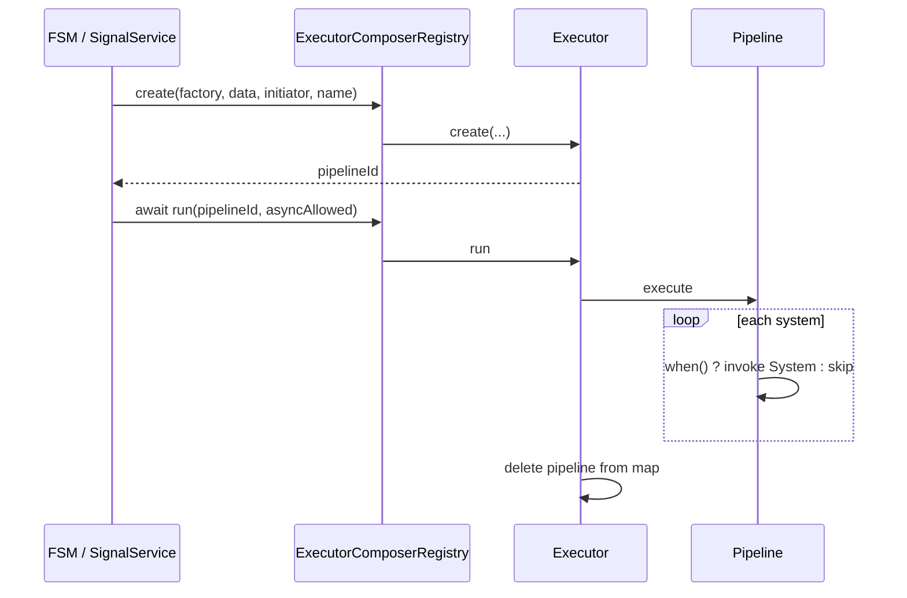

# API: `features/executor` (`@empr/es-sistema`)

Public entry point for the feature. Import from the package barrel or the features index.

```typescript
import {
  Executor,
  ExecutorComposerRegistry,
  IExecution,
  OnPipelineExecutionStartSignal,
  OnPipelineExecutionEndSignal,
} from '@empr/es-sistema';
```

| Export (barrel) | Source | Description |
|-----------------|--------|-------------|
| `Executor` | `executor.ts` | Pipeline runtime: create, run, pause, stop |
| `ExecutorComposerRegistry` | `executior-composer-registry.ts` | `ExecutionRegistry` adapter for `@empr/es` |
| `IExecution` | `executor.types.ts` | Per-system telemetry payload |
| `OnPipelineExecutionStartSignal` | `pipeline.signals.ts` | Fires before each system runs |
| `OnPipelineExecutionEndSignal` | `pipeline.signals.ts` | Fires after each system completes |

**Not in barrel:** `Pipeline` (`pipeline.ts`) — internal; constructed by `Executor.create`, not part of public package API.

**Dependencies:** `@empr/es` (`ExecutionRegistry`, `EntityStorage`, `IDependency`, `DeferredPromise`, `Signal`), `features/composer` (`PipelineComposer`, `PipelineFactory`, `ISystemProvider`), `core/system` (`SystemProps`).

**Wiring:** `useECSBackend(app)` registers `Executor` in DI and sets `ExecutorComposerRegistry` on `FSMService` / `SignalService`; hooks `UpdateLoop.onPause` / `onResume` → `pauseAll` / `resumeAll`.

---

## `Executor`

```typescript
class Executor
```

Orchestrates pipeline **lifecycle**: build via `PipelineFactory`, run systems sequentially, global/per-pipeline pause, stop, and execution stack for nested/async visibility.

### Constructor

```typescript
constructor(dependency: IDependency, storage: EntityStorage)
```

**Side effects:** Subscribes to `OnPipelineExecutionStartSignal` / `OnPipelineExecutionEndSignal` to maintain `_executionStack`.

| Internal state | Role |
|----------------|------|
| `_pipelines` | `Map<pipelineId, Pipeline>` active until `run` finishes or `stop` |
| `_pausePromise` | Global gate — `run()` awaits until `resumeAll()` |
| `_executionStack` | Currently running systems (LIFO via `unshift`) |

### `id` (getter)

Executor instance id (`nextId()`). Distinct from **pipeline** ids returned by `create()`.

---

### `create(factory, data, initiator, name?)`

```typescript
async create(
  pipelineFactory: PipelineFactory<any>,
  data: any,
  initiator: string,
  name = 'unknown_pipeline',
): Promise<number>
```

| Step | Action |
|------|--------|
| 1 | `new PipelineComposer(dependency)` |
| 2 | `inject = (token) => dependency.inject(token, 'root')` |
| 3 | `await pipelineFactory({ pipeline: composer, inject, ...data })` |
| 4 | `new Pipeline(initiator, name, composer, dependency, storage)` |
| 5 | Store in `_pipelines`, return **`pipeline.id`** |

Does **not** run systems. Same id is used as `run(flowId)` / `stop(flowId)` and as `SystemProps.executionId`.

---

### `run(pipelineId, asyncAlowed?)`

```typescript
async run(pipelineId: number, asyncAlowed = true): Promise<void>
```

| Step | Action |
|------|--------|
| 1 | `await _pausePromise` (global pause gate) |
| 2 | `pipeline.execute(asyncAlowed)` |
| 3 | Remove pipeline from `_pipelines` on completion |

| Parameter | Description |
|-----------|-------------|
| `asyncAlowed` | If `false`, throws when a system returns `Promise` (FSM `onExit` pattern) |

Throws `Queue with id ${pipelineId} not found` if id missing or already removed.

After successful `run`, the pipeline id is **invalid** — create again for a new run.

---

### `stop(executionId)`

```typescript
stop(executionId: number): void
```

Calls `pipeline.stop()` (clear queue, `onStop` callback, `AbortController.abort`) and deletes from map.

Used by `FSM.quit()` via `ExecutionRegistry.stop`.

---

### Per-pipeline `pause` / `resume`

```typescript
pause(executionId: number): void
resume(executionId: number): void
```

Only affects pipelines still in `_pipelines` (between `create` and completing `run`). Current system finishes; next queued system waits on internal resume promise.

---

### Global `pauseAll` / `resumeAll` / `stopAll`

```typescript
pauseAll(): void
resumeAll(): void
stopAll(): void
```

| Method | Behavior |
|--------|----------|
| `pauseAll` | New unresolved `_pausePromise`; `pause()` on every active pipeline — blocks **new** `run()` at gate |
| `resumeAll` | Resolves `_pausePromise`; `resume()` on all pipelines |
| `stopAll` | `stop()` every pipeline; clears map |

Wired to `UpdateLoop` in `useECSBackend` when the game loop pauses.

---

### Execution stack (introspection)

| Method | Returns |
|--------|---------|
| `getCurrentExecution()` | Top of stack (`ISystemProvider \| null`) |
| `getAllCurrentExecutions()` | Copy of stack |
| `pushExecution` / `removeExecution` | Used internally by signal listeners |

Useful for debugging which system is active during nested async work.

---

## `Pipeline` (internal)

```typescript
class Pipeline  // not exported from index.ts
```

Single runnable instance built from a configured `PipelineComposer`.

### Read-only API

| Member | Description |
|--------|-------------|
| `id` | Pipeline / `executionId` for systems |
| `name` | Debug label from `Executor.create` |
| `pipelineFinish` | Promise resolving when `execute()` completes or stops |

### `execute(asyncAlowed?)`

| Phase | Action |
|-------|--------|
| Queue | `[...composer.execute()]` |
| Context | `executionContext = \`${name}${system.name}_${index}\`` per provider |
| Loop | Shift provider; if `when()` → run system else skip |
| Signals | `OnPipelineExecutionStartSignal` → run → `OnPipelineExecutionEndSignal` |
| Async | `Promise.race` with abort on `stop()` |
| Finally | Resolve `pipelineFinish` |

Skipped systems (`when() === false`) do not dispatch start/end signals.

### `stop()` / `pause()` / `resume()`

See `Executor` wrappers above.

### `createProps` → `SystemProps`

```typescript
{
  ...provider.data,
  executionId: pipeline.id,
  onStop: (cb) => { /* last registration wins */ },
  inject: (token) => dependency.inject(token, pipeline.id),
  filter: (f, withDisabled?) => storage.filter(f, withDisabled, provider.executionContext),
}
```

---

## `ExecutorComposerRegistry`

```typescript
class ExecutorComposerRegistry extends ExecutionRegistry<PipelineFactory<any>>
```

Thin facade so `@empr/es` features depend on `ExecutionRegistry`, not `Executor` directly.

```typescript
constructor(executor: Executor)

create(flow, data, initiator, name): Promise<number>  // → executor.create
run(flowId, asyncAlowed): Promise<void>               // → executor.run
stop(flowId): void                                    // → executor.stop
```

**Not forwarded:** `pause`, `resume`, `pauseAll`, `resumeAll`, `stopAll` — call `inject(Executor)` for those.

```typescript
// useECSBackend
const executor = new Executor(app.dependency, storage);
const registry = new ExecutorComposerRegistry(executor);
fsmService.setExecutionRegistry(registry);
signalService.setExecutionRegistry(registry);
app.dependency.registerGlobal({ provide: Executor, useFactory: () => executor });
```

---

## Signals & `IExecution`

```typescript
interface IExecution {
  provider: ISystemProvider;
  finish: Promise<void>;
  startTime: number;
  executionTime: number;  // ms, set on end event
  initiator: string;
}

const OnPipelineExecutionStartSignal = new Signal<IExecution>();
const OnPipelineExecutionEndSignal = new Signal<IExecution>();
```

| Signal | When | `executionTime` |
|--------|------|-----------------|
| `OnPipelineExecutionStartSignal` | Before `provider.item(props)` | `0` |
| `OnPipelineExecutionEndSignal` | After system completes | Rounded ms since `startTime` |

`finish` on start event resolves when that system step completes — subscribe for per-step timing or tooling.

```typescript
OnPipelineExecutionEndSignal.listen((e) => {
  console.log(e.provider.item.name, e.executionTime, e.initiator);
});
```

---

## End-to-end flow



| Initiator | Typical `asyncAlowed` |
|-----------|------------------------|
| `SignalService` | `true` |
| FSM `onEnter` | `true` |
| FSM `onExit` | `false` |

---

## Usage patterns

### Direct executor (app / debug)

```typescript
const executor = dependency.inject(Executor);
const id = await executor.create(myPipeline, payload, 'manual', 'MyPipeline_');
await executor.run(id, true);
```

### Via registry (framework)

```typescript
const id = await registry.create(onEnterFlow, transitionData, stateName, `${fsm}_${state}_OnEnter_`);
await registry.run(id, true);
```

### Stop in-flight pipeline

```typescript
registry.stop(executionId);
// or
executor.stop(executionId);
```

### Metrics subscriber

```typescript
OnPipelineExecutionEndSignal.listen(async (e) => {
  await e.finish;
  recordSystemDuration(e.provider.item.name, e.executionTime);
});
```

---

## Semantics and constraints

| Topic | Behavior |
|-------|----------|
| **Composer per `create`** | Fresh `PipelineComposer` each time — isolated configuration |
| **`run` removes pipeline** | Id single-use unless you only `stop` without completing `run` |
| **Global vs local pause** | `pauseAll` blocks `run` entry; per-pipeline `pause` blocks between systems |
| **Stop async systems** | Abort races promise; swallows `'Queue execution was stopped'` |
| **`onStop` overwrite** | Last `props.onStop` wins per pipeline |
| **DI scopes** | Factory `inject` → `'root'`; system `inject` → `pipeline.id` |
| **Typo in source** | Parameter `asyncAlowed` (not `asyncAllowed`) across registry API |
| **Filename** | `executior-composer-registry.ts` (spelling in repo) |
| **Out of scope** | `SignalService` implementation (`@empr/es`) |

---

## Related documentation

- `feature_description.md` — design narrative
- [`../composer/API_DOC.md`](/docs/api/es-sistema/features/composer) — `PipelineComposer`, `PipelineFactory`
- [`../core/system/API_DOC.md`](/docs/api/es-sistema/core/system) — `SystemProps`
- [`../../../../empr/es/src/core/execution-registry/API_DOC.md`](/docs/api/es/core/execution-registry) — abstract registry contract
- `../bootstrap/use-ecs-backend.ts` — DI + pause wiring
- Source: `executor.ts`, `pipeline.ts`, `executior-composer-registry.ts`, export: `index.ts`

## Known consumers (reference)

| Module | Usage |
|--------|--------|
| `es-sistema/use-ecs-backend` | `Executor` + `ExecutorComposerRegistry` |
| `@empr/es` `FSMService` / `SignalService` | `create` / `run` / `stop` via registry |
| `@empr/es-lienzo` `InteractionService` | Same registry after backend setup |
| Apps | `inject(Executor)` for advanced control |

