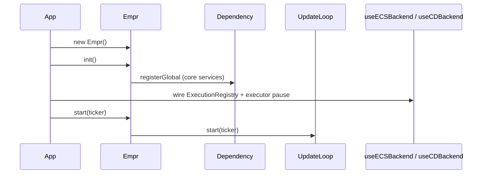

# API: `bootstrap`

Public entry point for the framework shell. Import from the package barrel or the bootstrap index.

```typescript
import { Empr } from '@empr/es';
// or
import { Empr } from './bootstrap';
```

| Export (barrel) | Source | Description |
|-----------------|--------|-------------|
| `Empr` | `empr.ts` | Renderer-agnostic framework bootstrap and DI wiring |

**Layer position:** Top integration layer — may import `shared`, `core`, `widgets`, `features`. **No lower layer may import `bootstrap`.**

**Extension:** Subclass `Empr` (e.g. `EmprLienzo` in `@empr/es-lienzo`) and override `registerServices()` / `init()`.

---

## `Empr`

```typescript
class Empr
```

Constructs core ECS infrastructure, registers services in the global DI container (`Dependency.instance`), and starts the main loop via an injected `IUpdateTicker`.

Does **not** register `ExecutionRegistry`, `Executor`, or rendering — apps add those after `init()` via satellite packages or subclasses.

### `dependency` (getter)

```typescript
get dependency(): IDependency
```

| | |
|---|---|
| **Backing field** | `protected _dependency = Dependency.instance` |
| **Use** | Resolve services, register app-specific globals after `init()` |

```typescript
const storage = empr.dependency.inject(EntityStorage);
```

Subclasses may assign a custom container to `_dependency` before `init()` (uncommon; default is global singleton).

---

### `init()`

```typescript
init(): void
```

| Action |
|--------|
| Calls `registerServices()` once |

Must run before `start()`. Safe to call from subclass `init()` after `super.init()`.

Does not start ticking, load assets, or wire execution backends.

---

### `start(ticker)`

```typescript
start(ticker: IUpdateTicker): void
```

| Step | Action |
|------|--------|
| 1 | `updateLoop = _dependency.inject(UpdateLoop)` |
| 2 | `updateLoop.start(ticker)` |

| Parameter | Description |
|-----------|-------------|
| `ticker` | Platform scheduling strategy (`IUpdateTicker`) — browser RAF, server timer, test stub |

Requires prior `init()`. Loop dispatches update / pause / resume through `UpdateLoop` (see [`core/update-loop/API_DOC.md``update-loop`).

```typescript
const empr = new Empr();
empr.init();
empr.start(new RafUpdateStrategy()); // from @empr/es-lienzo in browser apps
```

---

### `registerServices()` (protected)

```typescript
protected registerServices(): void
```

**Primary extension point.** Instantiates services and registers them with `registerGlobal` on `_dependency`.

Override in subclasses: call `super.registerServices()` first, then register renderer/domain services.

#### Services registered (base `Empr`)

| Token | Registration | Instance strategy |
|-------|--------------|-------------------|
| `EntityStorage` | `useFactory: () => storage` | Singleton (closure) |
| `UpdateLoop` | `useFactory: () => updateLoop` | Singleton |
| `SignalService` | `useFactory: () => signalService` | Singleton; constructed with shared `LifecycleTracker` |
| `LifecycleTracker` | `useFactory: () => lifecycleTracker` | Singleton |
| `ProxyEntity` | `useFactory: () => entityProxy` | Singleton; same instance passed into `EntityStorage` |
| `Pools` | `useClass: Pools` | New instance per `inject` (class provider) |
| `PRNG` | `useClass: PRNG` | New instance per `inject` |
| `FSMService` | `useClass: FSMService` | New instance per `inject` |

#### Construction graph (internal)

```text
LifecycleTracker
ProxyEntity ──► EntityStorage(proxy)
UpdateLoop
SignalService(lifecycleTracker)
```

`ExecutionRegistry` is **not** injected here — `FSMService` / `SignalService` need `setExecutionRegistry` from the app after `init()`.

---

## Lifecycle (full application)



| Phase | Responsibility |
|-------|----------------|
| `new Empr()` | No services registered yet |
| `init()` | Core DI graph |
| App backend | `useECSBackend(empr)` or `useCDBackend(empr)` — registry, executor, pause/resume |
| App code | `createFSM`, `SignalService.listen`, pools, scenes |
| `start(ticker)` | Main loop |

```typescript
const empr = new Empr();
await empr.init(); // sync in base Empr

useECSBackend(empr); // @empr/es-sistema

const fsm = empr.dependency.inject(FSMService);
// ... configure game ...

empr.start(rafTicker);
```

---

## `IUpdateTicker` (contract used by `start`)

From `core/update-loop` — not re-exported by `bootstrap`, import from `@empr/es`:

```typescript
interface IUpdateTicker {
  start(onTick: (tick: IUpdateTick) => void): void;
  stop(): void;
}
```

`Empr` forwards the ticker to `UpdateLoop.start`; the loop registers `onTick` internally.

---

## Subclass pattern (`EmprLienzo`)

Reference: `@empr/es-lienzo` — `class EmprLienzo extends Empr`.

| Override | Typical action |
|----------|----------------|
| `constructor` | Register `Application`, DOM setup |
| `registerServices()` | `super.registerServices()` + Pixi services (`TweenService`, `Scene`, …) |
| `init()` | `super.init()` + scene init, update hooks |
| `start()` | May wrap ticker (e.g. RAF strategy) then `super.start(ticker)` |

Keeps renderer code out of `@empr/es` bootstrap.

---

## Usage patterns

### Minimal headless / test

```typescript
const empr = new Empr();
empr.init();

const ticker: IUpdateTicker = {
  start: (onTick) => { /* drive onTick manually in tests */ },
  stop: () => {},
};

empr.start(ticker);
```

### Register app services after core init

```typescript
empr.init();
empr.dependency.registerGlobal({
  provide: MyGameConfig,
  useFactory: () => config,
});
```

### Custom bootstrap subclass

```typescript
class MyEmpr extends Empr {
  protected override registerServices(): void {
    super.registerServices();
    this._dependency.registerGlobal({ provide: AudioService, useClass: AudioService });
  }
}
```

---

## Semantics and constraints

| Topic | Behavior |
|-------|----------|
| **Thin layer** | Wiring + lifecycle only — no game/render logic |
| **Renderer agnostic** | Base `Empr` imports no Pixi/WebGL |
| **Isomorphic scheduling** | Ticker injected at `start`, not hardcoded RAF |
| **Execution stack** | App must call `useECSBackend` / `useCDBackend` (or equivalent) |
| **FSMService instances** | `useClass` — multiple `inject(FSMService)` may yield different instances unless app re-registers |
| **Shared singletons** | `EntityStorage`, `UpdateLoop`, `SignalService`, `LifecycleTracker`, `ProxyEntity` share one instance each |
| **Import rule** | `core` / `widgets` / `features` must not import `bootstrap` |
| **No `stop()` on `Empr`** | Teardown is app-level (`UpdateLoop`, `unsubscribe`, scene destroy) |

---

## What is NOT in `Empr.registerServices`

| Missing | Provided by |
|---------|-------------|
| `ExecutionRegistry` | `useECSBackend` / `useCDBackend` |
| `Executor` | `@empr/es-sistema` / `@empr/es-componente` |
| Rendering / input | `@empr/es-lienzo` (`EmprLienzo`, `InteractionService`) |
| Application FSMs / pipelines | App bootstrap (`EmprGame`, orchestrators) |

---

## Related documentation

- `feature_description.md` — rationale and boundaries
- `layer_responsibility.md` — layer rules and dependency graph
- [`../core/dependency/API_DOC.md``dependency` — `registerGlobal`, `inject`
- [`../core/update-loop/API_DOC.md``update-loop` — `UpdateLoop`, `IUpdateTicker`
- [`../core/execution-registry/API_DOC.md``execution-registry` — post-init wiring
- Widgets / features API docs — services registered here
- Source: `empr.ts`, export: `index.ts`

## Known consumers (reference)

| Module | Usage |
|--------|--------|
| `@empr/es-lienzo` | `EmprLienzo extends Empr` |
| `apps/slot-client`, `slot-cd-client` | `Empr` / `EmprLienzo` + `useECSBackend` / `useCDBackend` |
| `es-sistema` | `useECSBackend(app: Empr)` |
| `es-componente` | `useCDBackend(app: Empr)` |
| Vitest | `empr-update-loop-wiring.spec.ts` — `start` delegates to `UpdateLoop.start` |

