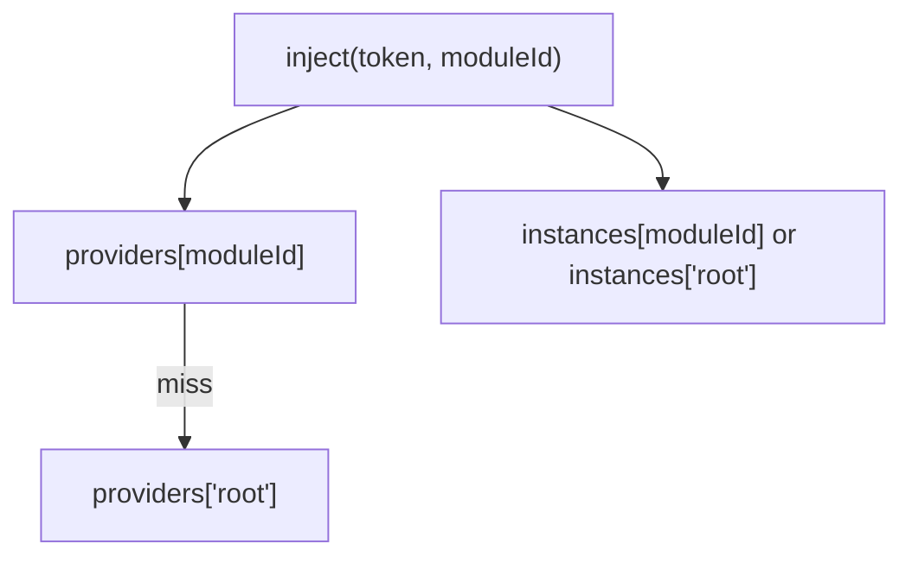

# API: `core/dependency`

Public entry point for the feature. Import from the core barrel or the feature index.

```typescript
import {
  Dependency,
  IDependency,
  InjectionToken,
  Token,
  Provider,
  IClassProvider,
  IFactoryProvider,
} from '@empr/es';
```

| Export | Source | Description |
|--------|--------|-------------|
| `Dependency` | `dependency.ts` | DI container implementation |
| `IDependency` | `dependency.types.ts` | Container contract |
| `InjectionToken` | `injection-token.ts` | Typed token for non-class keys |
| `Token`, `Provider`, … | `dependency.types.ts` | Registration and resolution types |

**Dependencies:** None within `core` (bottom-layer infrastructure).

---

## Type aliases

### `Constructor<T>`

```typescript
type Constructor<T = any> =
  | (abstract new (...args: any[]) => T)
  | (new (...args: any[]) => T);
```

Class constructor usable as a runtime token and for `new` instantiation.

### `Factory<T>`

```typescript
type Factory<T> = () => T;
```

Zero-arg factory used by `useFactory` providers.

### `Token<T>`

```typescript
type Token<T> = Constructor<T> | InjectionToken<T>;
```

Anything that can identify a dependency in the registry map.

---

## Provider types

### `Provider<T>`

```typescript
type Provider<T> = IClassProvider<T> | IFactoryProvider<T>;
```

Discriminated by presence of `useClass` vs `useFactory`.

### `IClassProvider<T>`

| Field | Type | Description |
|-------|------|-------------|
| `provide` | `Token<T>` | Lookup key |
| `useClass` | `Constructor<T> \| T` | Constructor to `new`, or **pre-built instance** |
| `immutable?` | `boolean` | Reserved — **not enforced** in `Dependency` |

**Resolution:**

```typescript
typeof useClass === 'function' ? new useClass() : useClass
```

### `IFactoryProvider<T>`

| Field | Type | Description |
|-------|------|-------------|
| `provide` | `Token<T>` | Lookup key |
| `useFactory` | `Factory<T>` | Called once on first `inject` |
| `immutable?` | `boolean` | Reserved — **not enforced** |

---

## `InjectionToken<T>`

```typescript
class InjectionToken<T> {
  constructor(
    description: string,
    options?: { factory?: () => T },
  );
  readonly description: string;
  toString(): string; // "InjectionToken(description)"
}
```

Typed runtime key for interfaces, configs, or primitives. Generic `T` drives `inject()` inference.

| | |
|---|---|
| **`options.factory`** | Declared in API — **not used** by `Dependency.inject` today (register a provider explicitly) |
| **Phantom `_type`** | Private field for TypeScript inference only |

```typescript
export const GAME_CONFIG = new InjectionToken<IGameConfig>('GAME_CONFIG');

dependency.registerGlobal({ provide: GAME_CONFIG, useFactory: () => loadConfig() });
const config = dependency.inject(GAME_CONFIG);
```

---

## `IDependency`

Contract implemented by `Dependency`.

| Method | Description |
|--------|-------------|
| `register(moduleId, provider)` | Register/override in a module scope |
| `registerGlobal(provider)` | Shorthand for `register('root', provider)` |
| `inject(token, moduleId?)` | Resolve (lazy + cached) |
| `hasProvider(token, moduleId?)` | Whether provider exists **in that scope map only** |

---

## `Dependency`

```typescript
class Dependency implements IDependency
```

Lightweight DI container: explicit registration, lazy singleton per `(moduleId, token)`, no constructor graph autowiring, no decorators.

### `Dependency.instance` (static getter)

| | |
|---|---|
| **Returns** | Global singleton container (creates on first access) |
| **Usage** | `bootstrap/empr.ts`, `ProxyEntity`, `TrackedSignal`, apps |

```typescript
const dep = Dependency.instance;
```

### Constructor

```typescript
new Dependency()
```

Initializes empty provider and instance maps for scope `'root'`.

---

### `registerGlobal(provider)`

```typescript
registerGlobal<T>(provider: Provider<T>): void
```

Equivalent to `register('root', provider)`. Overwrites existing provider for the same `provide` token in `root`.

```typescript
dependency.registerGlobal({ provide: PRNG, useClass: PRNG });
dependency.registerGlobal({ provide: UpdateLoop, useFactory: () => updateLoop });
dependency.registerGlobal({ provide: MyService, useClass: prebuiltInstance });
```

---

### `register(moduleId, provider)`

```typescript
register<T>(moduleId: string | number, provider: Provider<T>): void
```

| Parameter | Description |
|-----------|-------------|
| `moduleId` | Scope id (e.g. pipeline/composer id in `es-sistema`) |
| `provider` | Provider config |

Creates provider + instance maps for `moduleId` on first registration.

**Override pattern:** Module-scoped provider replaces lookup for that `moduleId` when registered; `inject(token, moduleId)` checks module map first, then falls back to `'root'` for **provider definition**.

---

### `inject(token, moduleId?)`

```typescript
inject<T>(token: Token<T>, moduleId = 'root'): T
```

| Step | Behavior |
|------|----------|
| 1 | Find provider: `_providers.get(moduleId)?.get(token) ?? _providers.get('root').get(token)` |
| 2 | If missing → `throw new Error('Provider for token … not found')` |
| 3 | Instance map: `_instances.get(moduleId) ?? _instances.get('root')` |
| 4 | If cached in map → return cached |
| 5 | Else instantiate (`useClass` / `useFactory`), cache in map, return |

| Topic | Behavior |
|-------|----------|
| **Lazy** | First `inject` constructs; later calls reuse cache |
| **Scope cache** | Separate cache per `moduleId` (and `root`) |
| **No graph DI** | Nested deps must be wired inside `useFactory` manually |
| **Token in errors** | Uses `token.toString()` (class name or `InjectionToken(desc)`) |

```typescript
const storage = dependency.inject(EntityStorage);
const prng = dependency.inject(PRNG, composerId);
```

---

### `hasProvider(token, moduleId?)`

```typescript
hasProvider(token: Token<any>, moduleId = 'root'): boolean
```

Returns whether `token` exists in **`_providers.get(moduleId)` only**.

> **Important:** Does **not** fall back to `'root'`. `hasProvider('otherModule', Token)` is `false` if token is only registered globally. Use `moduleId === 'root'` or call `inject` for resolution checks.

---

## Scopes model

```text
_providers: Map<moduleId, Map<Token, Provider>>
_instances: Map<moduleId, Map<Token, instance>>

'root'     → global registrations (registerGlobal)
moduleId   → overrides / additions (register)
```



---

## Usage patterns

### Bootstrap (global services)

```typescript
dependency.registerGlobal({ provide: EntityStorage, useFactory: () => storage });
dependency.registerGlobal({ provide: Pools, useClass: Pools });
```

### Module override (pipeline composer)

```typescript
dependency.register(composerId, { provide: TimerService, useClass: MockTimerService });
const timer = dependency.inject(TimerService, composerId);
```

### Class token vs injection token

```typescript
// Class as token
dependency.inject(UpdateLoop);

// Interface / config token
const CONFIG = new InjectionToken<IConfig>('CONFIG');
dependency.inject(CONFIG);
```

### Pre-singleton via `useClass: instance`

```typescript
const logger = new ConsoleLogger();
dependency.registerGlobal({ provide: LOGGER_TOKEN, useClass: logger });
```

### System `inject` callback

Interceptors and systems receive `inject: (token) => T` wired to `Dependency.instance.inject` (often without custom `moduleId` → `root`).

---

## Semantics and constraints

| Topic | Behavior |
|-------|----------|
| **Singleton** | One cached instance per `(moduleId, token)` after first `inject` |
| **Override** | Same `provide` in `register` replaces previous provider in that scope |
| **`immutable`** | Type-only; no runtime effect |
| **`InjectionToken.options.factory`** | Not wired in `Dependency` |
| **Constructor args** | `new useClass()` — no injected constructor parameters |
| **ECS awareness** | None — pure service locator |
| **Testing** | Swap providers per `moduleId` or replace `Dependency.instance` container |

---

## Related documentation

- `feature_description.md` — design rationale
- Source: `dependency.ts`, `dependency.types.ts`, `injection-token.ts`, export: `index.ts`
- `bootstrap/empr.ts` — default global registrations
- `es-sistema` / `pipeline-composer.ts` — scoped `register(this._id, …)`

## Known consumers (reference)

| Module | Usage |
|--------|--------|
| `bootstrap/empr.ts` | `IDependency`, `registerGlobal` for core services |
| `core/entity/proxy-entity` | `inject` in interceptor context |
| `widgets/lifecycle/tracked-signal` | `Dependency.instance.inject(LifecycleTracker)` |
| `es-lienzo` / `empr.lienzo.ts` | Pixi/services registration |
| `es-sistema` / `pipeline-composer` | Per-composer `register` |
| Apps (`empr.game`, `use-cd-backend`) | App-specific `registerGlobal` |

