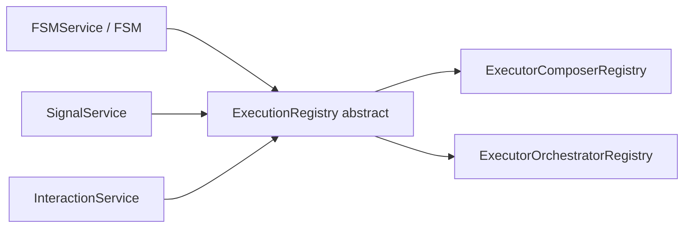

# API: `core/execution-registry`

Public entry point for the feature. Import from the core barrel or the feature index.

```typescript
import { ExecutionRegistry } from '@empr/es';
// or
import { ExecutionRegistry } from './core/execution-registry';
```

| Export | Source | Description |
|--------|--------|-------------|
| `ExecutionRegistry` | `execution-registry.ts` | Abstract bridge for creating and running typed flows |

**Runtime in `core`:** Only the **abstract contract** — no concrete executor. Implementations live in `@empr/es-sistema` and `@empr/es-componente`.

**Dependencies:** None within `core`.

---

## `ExecutionRegistry<TFlow>`

```typescript
abstract class ExecutionRegistry<TFlow> {
  abstract create(
    flow: TFlow,
    data: any,
    initiator: string,
    name: string,
  ): Promise<number>;

  abstract run(flowId: number, asyncAlowed: boolean): Promise<void>;

  abstract stop(flowId: number): void;
}
```

Generic **`TFlow`** is the flow descriptor type understood by the concrete backend (pipeline factory, orchestrator factory, interaction flow alias, etc.).

**Purpose:** Decouple `core` features (`FSMService`, `SignalService`) and `es-lienzo` (`InteractionService`) from ECS pipeline / component-driven execution details.



---

### `create(flow, data, initiator, name)`

```typescript
create(
  flow: TFlow,
  data: any,
  initiator: string,
  name: string,
): Promise<number>
```

| Parameter | Description |
|-----------|-------------|
| `flow` | Factory/orchestrator defining the execution graph |
| `data` | Payload passed into the flow builder (context, event data, FSM transition data, …) |
| `initiator` | Source label (e.g. signal name, FSM state name, `'unknown'`) |
| `name` | Debug / tracing name for the run |

**Returns:** `Promise<number>` — opaque **flow id** used by `run` / `stop`.

| Backend | Behavior (reference) |
|---------|----------------------|
| `Executor` (`es-sistema`) | Builds `Pipeline` via `PipelineFactory`, stores by `pipeline.id`, **does not run** yet |
| `ComponentDrivenExecutor` (`es-componente`) | Creates `ExecutionQueue`, `setup([flow], data)`, returns `queue.id` |

Typical pattern: `const id = await registry.create(factory, data, initiator, name); await registry.run(id, true);`

---

### `run(flowId, asyncAlowed)`

```typescript
run(flowId: number, asyncAlowed: boolean): Promise<void>
```

| Parameter | Description |
|-----------|-------------|
| `flowId` | Id from `create` |
| `asyncAlowed` | Whether async steps may block completion (spelling matches source: `asyncAlowed`) |

**Returns:** `Promise<void>` — resolves when execution finishes (consumers often `await` this, e.g. `Signal.listen`).

| `asyncAlowed` | Typical use |
|---------------|-------------|
| `true` | Signal handlers, FSM `onEnter`, interactions — full async pipelines |
| `false` | FSM `onExit` — fire-and-forget sync-oriented exit (see `fsm.ts`) |

| Backend | Behavior (reference) |
|---------|----------------------|
| `Executor` | Awaits global pause gate, runs `pipeline.execute(asyncAlowed)`, **removes** pipeline from map |
| `ComponentDrivenExecutor` | `queue.execute(asyncAlowed)`, deletes queue |

**Throws** (implementations): if `flowId` not found.

---

### `stop(flowId)`

```typescript
stop(flowId: number): void
```

| Parameter | Description |
|-----------|-------------|
| `flowId` | Id to cancel |

Halts in-flight flow, runs stop/cleanup logic, removes from internal registry.

**Usage:** `FSM.quit()` stops `_currentExecutionId` before exit processing.

> **Note:** `pause` / `resume` / `stopAll` exist on concrete `Executor` and `ComponentDrivenExecutor` but are **not** part of `ExecutionRegistry`.

---

## Concrete implementations (outside this folder)

### `ExecutorComposerRegistry` — `@empr/es-sistema`

```typescript
class ExecutorComposerRegistry extends ExecutionRegistry<PipelineFactory<any>> {
  constructor(executor: Executor);
}
```

Delegates to `Executor.create` / `run` / `stop`. Wired in `useECSBackend()`:

```typescript
const composerRegistry = new ExecutorComposerRegistry(executor);
fsmService.setExecutionRegistry(composerRegistry);
signalService.setExecutionRegistry(composerRegistry);
```

### `ExecutorOrchestratorRegistry` — `@empr/es-componente`

```typescript
class ExecutorOrchestratorRegistry extends ExecutionRegistry<OrchestratorType<any>> {
  constructor(executor: ComponentDrivenExecutor);
}
```

Same three methods; `TFlow` = component-driven orchestrator type. Wired in `useCDBackend()`.

---

## Consumer integration

Features hold `ExecutionRegistry` via **`setExecutionRegistry`** — must be called at app bootstrap before use.

| Consumer | `TFlow` (typical) | Pattern |
|----------|-------------------|---------|
| `FSMService` / `FSM` | `any` (pipeline factories on states) | `create` + `run` on enter; `stop` on quit; exit `run(..., false)` without await |
| `SignalService` | `SSFlowAliasType` | On dispatch: `create` → `await run(id, true)` |
| `InteractionService` | `ISFlowAliasType<IInteraction>` | Pointer events: `create` → `await run(id, true)` |

```typescript
// SignalService (simplified)
signal.listen(async (data) => {
  const id = await executor.create(factory, data, signal.name ?? '', `${signal.name}_`);
  await executor.run(id, true);
});
```

`Empr` bootstrap registers `FSMService` and `SignalService` globally but **does not** set `ExecutionRegistry` — the app backend (`useECSBackend` / `useCDBackend` / game bootstrap) must provide it.

---

## Extending `ExecutionRegistry`

1. Subclass `ExecutionRegistry<TFlow>` with your flow type.
2. Implement `create`, `run`, `stop` delegating to your runner.
3. Call `setExecutionRegistry(instance)` on `FSMService`, `SignalService`, and any widget services that execute flows.

```typescript
export class MyRegistry extends ExecutionRegistry<MyFlow> {
  constructor(private runner: MyRunner) {
    super();
  }
  create(flow, data, initiator, name) {
    return this.runner.create(flow, data, initiator, name);
  }
  run(flowId, asyncAlowed) {
    return this.runner.run(flowId, asyncAlowed);
  }
  stop(flowId) {
    this.runner.stop(flowId);
  }
}
```

---

## Semantics and constraints

| Topic | Behavior |
|-------|----------|
| **Two-phase execution** | `create` registers; `run` executes — allows setup before run |
| **Id lifetime** | Implementations delete entry after `run` completes; ids are not reusable |
| **Typing** | `data: any` at contract level — flow factories define real shapes |
| **No DI in base class** | Registry does not resolve dependencies; flows receive `inject` from backend |
| **ECS location** | Pipelines/systems in `es-sistema`; orchestrators in `es-componente` |
| **Core scope** | Contract only — keeps `core` free of `System` / `Pipeline` types |

---

## Related documentation

- `../layer_responsibility.md` — `execution-registry` role in core layer
- `es-sistema` / `executor/executor.ts` — pipeline `create` / `run` / `stop` semantics
- `es-componente` / `component-driven-executor.ts` — queue-based execution
- `features/signal-service/signal.service.ts` — signal → pipeline bridge
- `features/fsm/fsm.ts` — state enter/exit execution
- Source: `execution-registry.ts`, export: `index.ts`

## Known wiring (reference)

| Location | Registry implementation |
|----------|-------------------------|
| `es-sistema/bootstrap/use-ecs-backend.ts` | `ExecutorComposerRegistry` |
| `es-componente/bootstrap/use-cd-backend.ts` | `ExecutorOrchestratorRegistry` |
| `apps/slot-*/empr.game.ts` | `InteractionService.setExecutionRegistry(executor)` |

