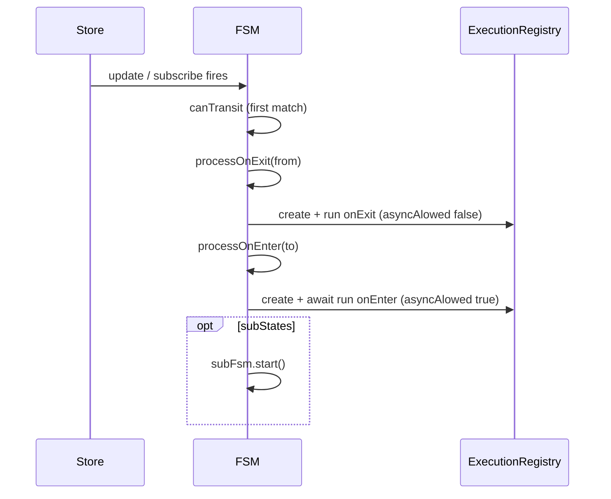

# API: `features/fsm`

Public entry point for the feature. Import from the package barrel or the features index.

```typescript
import {
  FSM,
  FSMBuilder,
  FSMService,
  IFSM,
  IFSMBuilder,
  ITransitionData,
  FSMFactorys,
  FSMFlowAliasType,
  // types: IStateConfig, IFSMConfig, IHooksConfig, TransitionConfig, ...
} from '@empr/es';
```

| Export (barrel) | Source | Description |
|-----------------|--------|-------------|
| `FSMService` | `services/fsm.service.ts` | Registry + factory for configured machines |
| `FSM` | `fsm.ts` | Data-driven state machine runtime |
| `FSMBuilder` | `fsm.builder.ts` | Fluent configuration builder |
| `IFSM`, `IFSMBuilder`, … | `fsm.types.ts` | Contracts and helper types |

**Dependencies:** `core/store` (`Store`), `core/execution-registry` (`ExecutionRegistry`), `shared` (`Signal`, `DeferredPromise`), `widgets/lifecycle` (`IContextDisposable` on transition payload).

**Bootstrap:** `Empr` registers `FSMService` globally. **`setExecutionRegistry` must be called by the app** (`useECSBackend` / `useCDBackend`) before `createFSM` / `start` — same registry as `SignalService`.

---

## Flow factory type (`FSMFlowAliasType`)

Pipeline factories for `onEnter` / `onExit` are typed via module augmentation:

```typescript
declare module '@empr/es' {
  interface FSMTypeRegistry<ITransitionData<object>> {
    FSMFlowAliasType: PipelineFactory<any>; // e.g. from @empr/es-sistema
  }
}
```

```typescript
type FSMFlowAliasType<TData extends ITransitionData<object>> =
  FSMTypeRegistry<TData> extends { FSMFlowAliasType: infer TFlow } ? TFlow : never;
```

Without augmentation, `FSMFlowAliasType` resolves to `never` — configure augmentation in the app when using typed builders.

---

## `FSMService`

```typescript
class FSMService
```

Global locator for FSM instances. Injects `ExecutionRegistry` into each `FSMBuilder`.

### `setExecutionRegistry(executionRegistry)`

```typescript
setExecutionRegistry(executionRegistry: ExecutionRegistry<any>): void
```

Must be set before `createFSM`. Typically the same `ExecutorComposerRegistry` or `ExecutorOrchestratorRegistry` wired for `SignalService`.

### `fsms` (getter)

```typescript
get fsms(): Map<string, IFSM<any>>
```

Read-only view of machines registered via `createFSM` (keyed by `fsm.name`).

### `createFSM(callback, data?)`

```typescript
createFSM<T extends object, K = void>(
  callback: FSMFactorys<T, K>,
  data: K = {} as K,
): IFSM<T>
```

| Step | Action |
|------|--------|
| 1 | `new FSMBuilder<T>(executionRegistry)` |
| 2 | `callback({ builder, ...data })` |
| 3 | `builder.build()` → `FSM` instance |
| 4 | `_fsms.set(fsm.name, fsm)` |
| 5 | Return FSM |

```typescript
type FSMFactorys<T extends object, K = void> = (props: { builder: FSMBuilder<T> } & K) => void;
```

```typescript
const fsmService = inject(FSMService);

const gameFsm = fsmService.createFSM<IGameStore>((props) => {
  props.builder
    .name('game')
    .store(gameStore)
    .initialState('boot')
    .state('boot')
    .transition('menu', (ctx) => ctx.loaded)
    .onEnter(bootFlowFactory);
});
```

### `getFSM(name)`

```typescript
getFSM<T extends object>(name: string): IFSM<T>
```

| Result | Behavior |
|--------|----------|
| Found | Returns cached `IFSM<T>` |
| Missing | `throw new Error('FSM with name ${name} didnt exist!')` |

---

## `FSMBuilder<T>`

```typescript
class FSMBuilder<T extends object> implements IFSMBuilder<T>
```

### Constructor

```typescript
new FSMBuilder(executionRegistry: ExecutionRegistry<any>)
```

Usually created only inside `FSMService.createFSM`.

### Configuration chain

| Method | Description |
|--------|-------------|
| `name(value)` | FSM identifier (map key in `FSMService`) |
| `store(value)` | `Store<T>` driving transitions |
| `initialState(value)` | Starting state name |
| `state(name)` | Add or select state for subsequent chaining |
| `removeState(state)` | Remove state from config |
| `transition(to, condition?)` | Outbound rule on **edited** state; default condition `() => true` |
| `removeTransition(to)` | Remove transition by target name |
| `replaceTransition(to, condition?)` | Replace condition for existing `to` |
| `onEnter(action)` | `FSMFlowAliasType<ITransitionData<T>>` for enter pipeline |
| `onExit(action)` | Exit pipeline factory |
| `subStates(fsm)` | Nested `IFSM` or `() => Promise<IFSM>` on edited state |
| `removeSubStates()` / `replaceSubStates(fsm)` | Manage nested machine |
| `onBeforeEnter` / `onAfterEnter` / `onBeforeExit` / `onAfterExit` | Global `IHooksConfig` hooks |
| `build()` | Validates and returns `new FSM(config, executionRegistry)` |

### `build()` validation

| Check | Error |
|-------|-------|
| `initialState` empty | `Initial state is not set!` |
| Initial name not in `states` | State does not exist |
| Transition `to` not in `states` | `Can't transit to X from Y because it does not exist!` |

### `config` (getter)

Exposes in-progress `IFSMConfig<T>` for introspection or tests.

---

## `FSM<T>` runtime

```typescript
class FSM<T extends object> implements IFSM<T>
```

Data-driven machine: transitions evaluate `Store` snapshots (`state`, `prev`); enter/exit run through `ExecutionRegistry`.

### Construction

```typescript
new FSM(config: IFSMConfig<T>, executor: ExecutionRegistry<any>)
```

Builds internal `Map` of `IStateConfig`, sets `_currentState` to `initialState` (no throw if missing — TODO in source).

### Read-only API

| Member | Description |
|--------|-------------|
| `name` | From config |
| `store` | Bound `Store<T>` |
| `context` | `store.state` shorthand |
| `initialState` / `currentState` | `IStateConfig` references |
| `states` | `Map<string, IStateConfig<T>>` |
| `hooks` | `IHooksConfig<T>` (on class; not on `IFSM` interface) |
| `parent` | Parent FSM when nested; set via `setParent` |

### `start()`

```typescript
async start(): Promise<void>  // implementation; IFSM declares void
```

Calls `transit(initialStateName)` — runs exit (if `from` provided), enter pipeline, optional `subStates.start()`.

### `update(callback)`

```typescript
async update(callback: (context: T, prev: T) => Partial<T>): Promise<void>
```

| Step | Action |
|------|--------|
| 1 | Dispose prior store subscription |
| 2 | Merge `callback(state, prev)` into `_changes` |
| 3 | Subscribe to store: on change → wait for in-flight transition → `next()` |
| 4 | `store.update` with accumulated `_changes` |
| 5 | Await `_transitionPromise` |
| 6 | Clear `_changes` |

Primary API for **data-driven** transitions: mutating the store triggers condition evaluation.

### `next()` / `nextOrUpdate(callback?)`

```typescript
async next(): Promise<void>
async nextOrUpdate(callback?: (context: T, prev: T) => Partial<T>): Promise<void>
```

| Method | Behavior |
|--------|----------|
| `next` | Await current transition; `canTransit` on current state; if target found → `transit(to, from)` |
| `nextOrUpdate` | `update(callback)` if callback provided, else `next()` |

`canTransit`: iterates `transitions` **in array order** — **first** matching `condition(state, prev)` wins.

### `quit(callback?)`

```typescript
quit(callback?: (context: T, prev: T) => Partial<T>): void
```

| Step | Action |
|------|--------|
| 1 | `_executor.stop(_currentExecutionId)` |
| 2 | `processOnExit(currentState)` |
| 3 | `_parent?.nextOrUpdate(callback)` if nested |

Stops in-flight enter execution; tears down active state `disposable`; notifies parent sub-machine finished.

### `waitForTransition()`

```typescript
async waitForTransition(): Promise<void>
```

Awaits `_transitionPromise` for the current transition cycle.

### `setParent(parent)`

Links nested FSM to parent (called automatically when `subStates` starts).

---

## Transition lifecycle



### `processOnEnter`

| Phase | Action |
|-------|--------|
| Context | Build `ITransitionData<T>` with `quit`, `next`, `disposable` (`IContextDisposable`) |
| State | Set `_currentState` to target |
| Hooks | `onBeforeEnter` → executor `onEnter` pipeline → `onAfterEnter` |
| Executor | `create(onEnter ?? noop, activeStateContext, to, name)` then `await run(id, true)` |

### `processOnExit`

| Phase | Action |
|-------|--------|
| Cleanup | `activeStateContext.disposable?.dispose()` |
| Hooks | `onBeforeExit` → `onExit` pipeline → `onAfterExit` |
| Executor | `create(onExit ?? noop, data, from, name)` then `run(id, false)` **without await** |

Pass `activeStateContext.disposable` as `LifecycleTracker` owner to auto-clear subscriptions on state exit.

### Nested `subStates`

After enter completes, if `currentState.subStates` is set:

| Form | Resolution |
|------|------------|
| `IFSM` instance | Use directly |
| `() => Promise<IFSM>` | Await factory (lazy / code-split) |

`subFsm.setParent(this)` then `await subFsm.start()`. Child shares parent's `Store` when configured on the same store in builder.

---

## Core types

### `ITransitionData<T>`

Payload for hooks and enter/exit pipelines:

```typescript
interface ITransitionData<T extends object> {
  fsmName: string;
  from: string;
  to: string;
  context: T;
  prev: T;
  disposable?: IContextDisposable;
  next: (callback?: (context: T, prev: T) => Partial<T>) => void;
  quit: () => void;
}
```

### `IStateConfig<T>`

```typescript
interface IStateConfig<T extends object> {
  name: string;
  transitions?: TransitionConfig<T>[];
  subStates?: FSMAsyncFactory<any>;
  onEnter?: FSMFlowAliasType<ITransitionData<T>>;
  onExit?: FSMFlowAliasType<ITransitionData<T>>;
}
```

```typescript
interface TransitionConfig<T extends object> {
  to: string;
  condition: (state: T, prev: T) => boolean;
}
```

### `IHooksConfig<T>`

Global hooks: `onBeforeEnter`, `onAfterEnter`, `onBeforeExit`, `onAfterExit` — each `(data: ITransitionData<T>) => void`.

### `IFSMConfig<T>`

```typescript
interface IFSMConfig<T extends object> {
  name: string;
  store: Store<T>;
  initialState: string;
  states: IStateConfig<T>[];
  hooks?: IHooksConfig<T>;
}
```

### Auxiliary types (exported, optional integrations)

| Type | Role |
|------|------|
| `TransitionContext<T>` | `{ from, to, store }` — lighter transition view |
| `IStoreAdapter<T, K>` | Adapter shape for non-`Store` backends |
| `IStoreFactory` | `create(initialState)` → adapter |
| `FSMState<T>` | Alias for `IStateConfig<T>` |
| `FSMAsyncFactory<T>` | `IFSM<T> \| () => Promise<IFSM<T>>` |
| `Condition<T>` | `(store: IStore<T>) => boolean` |

---

## Usage patterns

### Service + backend wiring

```typescript
const empr = new EmprLienzo();
await empr.init();
useECSBackend(empr); // sets FSMService + SignalService ExecutionRegistry

const fsm = empr.dependency.inject(FSMService).createFSM<MyStore>((p) => {
  p.builder.name('main').store(myStore).initialState('idle').state('idle').onEnter(idleFlow);
});

await fsm.start();
```

### Imperative advance inside pipeline

```typescript
// Inside onEnter flow, from ITransitionData:
data.next((ctx, prev) => ({ phase: 'ready' }));
data.quit();
```

### Nested gameplay FSM

```typescript
builder
  .state('gameplay')
  .subStates(() => import('./gameplay-fsm').then((m) => m.buildGameplayFsm(store)))
  .onEnter(gameplayEnterFlow);
```

### Lifecycle-bound listeners

```typescript
TrackedSignal.listen(handler, transitionData.disposable);
// disposable.dispose() runs on state exit (processOnExit)
```

---

## Semantics and constraints

| Topic | Behavior |
|-------|----------|
| **Data-driven** | Transitions driven by `Store` updates + `condition(state, prev)` |
| **First match** | Transition array order matters |
| **Enter vs exit async** | Enter `await run(..., true)`; exit `run(..., false)` fire-and-forget |
| **No imperative `goTo`** | Change store or call `next` / `nextOrUpdate` |
| **ExecutionRegistry** | Required; unset registry → runtime failure on build/run |
| **Interface vs impl** | `IFSM.start` typed `void`; implementation returns `Promise` — always `await start()` |
| **Hooks on instance** | `FSM.hooks` exists; not declared on `IFSM` |
| **Signals** | No `OnStateEnterSignal` in this module — use `ITransitionData.disposable.onDestroy` or hooks |
| **Layer** | Orchestration only — game logic lives in pipeline factories (app / es-sistema) |

---

## Related documentation

- `feature_description.md` — design narrative
- [`../core/store/API_DOC.md`](/docs/api/es/core/store) — reactive store
- [`../core/execution-registry/API_DOC.md`](/docs/api/es/core/execution-registry) — `create` / `run` / `stop`
- [`../widgets/lifecycle/API_DOC.md`](/docs/api/es/widgets/lifecycle) — `IContextDisposable`
- [`../signal-service`](/docs/api/es/features/signal-service) — parallel signal → execution bridge
- Source: `fsm.ts`, `fsm.builder.ts`, `fsm.types.ts`, `services/fsm.service.ts`, export: `index.ts`

## Known consumers (reference)

| Module | Usage |
|--------|--------|
| `bootstrap/empr.ts` | Registers `FSMService` |
| `@empr/es-sistema` / `useECSBackend` | `ExecutorComposerRegistry` → `setExecutionRegistry` |
| `@empr/es-componente` / `useCDBackend` | Orchestrator registry |
| `apps/slot-*` | `createFSM`, `start`, game flow |

