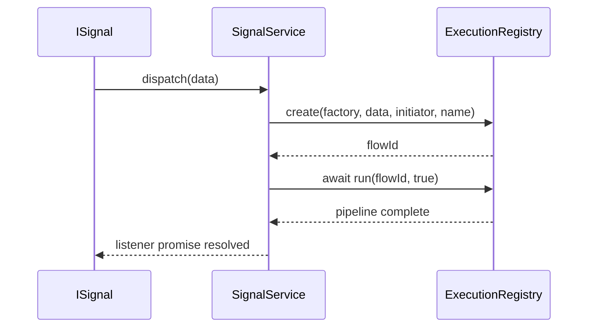

# API: `features/signal-service`

Public entry point for the feature. Import from the package barrel or the features index.

```typescript
import { SignalService, AbstractSignalService, SSFlowAliasType, ESCoreTypeRegistry } from '@empr/es';
// or
import { SignalService } from './features/signal-service';
```

| Export (barrel) | Source | Description |
|-----------------|--------|-------------|
| `SignalService` | `signal.service.ts` | Bridges `ISignal` dispatch → `ExecutionRegistry` flows |
| `AbstractSignalService` | `abstract-signal.service.ts` | Abstract contract for alternate implementations |
| `SSFlowAliasType` | `signal-service.types.ts` | Flow factory type (app-augmented) |
| `ESCoreTypeRegistry` | `signal-service.types.ts` | Module augmentation hook |

**Dependencies:** `shared/signal` (`ISignal`, `Disposable`), `core/execution-registry` (`ExecutionRegistry`), `widgets/lifecycle` (`LifecycleTracker`).

**Bootstrap:** `Empr.registerServices()` constructs `new SignalService(lifecycleTracker)` and registers it globally. **`setExecutionRegistry` is app responsibility** (`useECSBackend` / `useCDBackend`) — same registry instance as `FSMService`.

---

## Flow factory type (`SSFlowAliasType`)

Applications augment the registry so factories are typed for the active execution stack:

```typescript
declare module '@empr/es' {
  interface ESCoreTypeRegistry {
    SSFlowAliasType: PipelineFactory<any>; // @empr/es-sistema
    // or OrchestratorType<any> for @empr/es-componente
  }
}
```

```typescript
type SSFlowAliasType = ESCoreTypeRegistry extends { SSFlowAliasType: infer T } ? T : never;
```

Without augmentation, `SSFlowAliasType` is `never` — TypeScript will reject `listen(..., factory)` until the app declares the alias.

---

## `AbstractSignalService`

```typescript
abstract class AbstractSignalService {
  abstract get listeners(): Map<ISignal, Disposable>;
  abstract get factories(): Map<ISignal, SSFlowAliasType>;
  abstract listen<T>(signal: ISignal<T>, factory: SSFlowAliasType, owner?: object): void;
  abstract dispose(signal: ISignal): void;
  abstract unsubscribe(): void;
}
```

Extension point for tests or alternate mediators. Production code uses `SignalService`.

---

## `SignalService`

```typescript
class SignalService extends AbstractSignalService
```

Maps each `ISignal` instance to **at most one** execution flow. On dispatch: `ExecutionRegistry.create` → `await run(id, true)`.

### Constructor

```typescript
constructor(lifecycleTracker: LifecycleTracker)
```

Same `LifecycleTracker` instance as registered in `Empr` DI (shared with owner-aware `listen`).

### `setExecutionRegistry(executionRegistry)`

```typescript
setExecutionRegistry(executionRegistry: ExecutionRegistry<SSFlowAliasType>): void
```

| When | Who calls |
|------|-----------|
| After `Empr.init()` | `useECSBackend` → `ExecutorComposerRegistry` |
| CD stack | `useCDBackend` → `ExecutorOrchestratorRegistry` |

Must be set before any `listen` that can receive dispatches; otherwise `_executor` is undefined at runtime.

### Debug accessors

| Member | Type | Description |
|--------|------|-------------|
| `listeners` | `Map<ISignal, Disposable>` | Active signal → unsubscribe handle |
| `factories` | `Map<ISignal, SSFlowAliasType>` | Signal → bound flow factory (debug) |

---

### `listen(signal, factory, owner?)`

```typescript
listen<T>(signal: ISignal<T>, factory: SSFlowAliasType, owner?: object): this
```

| Step | Action |
|------|--------|
| 1 | `removeSignal(signal)` — dispose prior binding (1-to-1 rule) |
| 2 | Store `factory` in `_factories` |
| 3 | `signal.listen(async (data) => { ... })` |
| 4 | On dispatch: `executionId = await _executor.create(factory, data, signal.name \|\| '', \`${signal.name}_\`)` |
| 5 | `await _executor.run(executionId, true)` |
| 6 | Save `Disposable` in `_listeners` |
| 7 | If `owner`: `lifecycleTracker.track(owner, disposable)` + `_ownerTracking` |

| Parameter | Description |
|-----------|-------------|
| `signal` | Any `ISignal<T>` (`Signal`, `TrackedSignal`, module-level signals, …) |
| `factory` | Flow builder accepted by `ExecutionRegistry` (`PipelineFactory`, orchestrator, …) |
| `owner` | Optional lifecycle owner — auto-unsubscribe on destroy via `LifecycleTracker` |

**1-to-1 rule:** Second `listen` on the same signal instance replaces the first (listener disposed, owner untracked).

**Async completion:** `Signal.dispatch` awaits async listeners; pipeline completion propagates to callers of `await signal.dispatch(data)`.

**Owner binding:** Works with any `ISignal` — not limited to `TrackedSignal`. Entity / `IContextDisposable` / GC-backed owners follow [`lifecycle` API](/docs/api/es/widgets/lifecycle).

```typescript
const signals = inject(SignalService);

signals.listen(OnPlayerSpawnSignal, playerSpawnPipeline);
signals.listen(OnStateExitSignal, cleanupPipeline, fsmContext.disposable);

// Chaining
signals.listen(OnUpdateSignal, updatePipeline).listen(OnWinSignal, winPipeline); // second call is separate signals
```

---

### `dispose(signal)`

```typescript
dispose(signal: ISignal): void
```

| Action |
|--------|
| `disposable.dispose()` on signal listener |
| Remove from `_listeners`, `_factories` |
| `lifecycleTracker.untrack(owner, resource)` if owner-bound |

Manual teardown for a single channel. Idempotent if signal was not registered.

---

### `unsubscribe()`

```typescript
unsubscribe(): void
```

Calls `removeSignal` for every key in `_listeners`. Use on scene teardown or app shutdown.

---

## Internal cleanup (`removeSignal`)

Private path shared by `listen` (re-bind), `dispose`, and `unsubscribe`:

```text
listeners.get(signal)?.dispose()
→ delete listener + factory
→ untrack owner if _ownerTracking has entry
```

---

## Dispatch → execution flow



| `create` argument | Value in `SignalService` |
|-------------------|--------------------------|
| `flow` | `factory` from `listen` |
| `data` | Signal payload `T` |
| `initiator` | `signal.name \|\| ''` |
| `name` | `` `${signal.name}_` `` |

`run` always uses `asyncAlowed: true` (full async pipeline — same as FSM `onEnter`).

---

## Wiring checklist

| Step | Action |
|------|--------|
| 1 | `await empr.init()` — registers `SignalService` + `LifecycleTracker` |
| 2 | `useECSBackend(empr)` or `useCDBackend(empr)` — `setExecutionRegistry` |
| 3 | Augment `ESCoreTypeRegistry` in app `.d.ts` |
| 4 | `inject(SignalService).listen(signal, factory, owner?)` |
| 5 | Scene exit: `dispose(signal)` or `unsubscribe()` (or rely on `owner`) |

```typescript
// useECSBackend (simplified)
const signalService = app.dependency.inject(SignalService);
const registry = new ExecutorComposerRegistry(executor);
signalService.setExecutionRegistry(registry);
```

---

## Usage patterns

### Global update tick

```typescript
signalService.listen(OnUpdateSignal, updatePipeline);
```

### Scoped to entity

```typescript
signalService.listen(OnHitSignal, hitReactionPipeline, enemyEntity);
// entity.destroy() → listener removed via LifecycleTracker
```

### Re-bind factory

```typescript
signalService.listen(DebugSignal, debugPipeline);
signalService.listen(DebugSignal, productionPipeline); // replaces debug
```

### Full teardown

```typescript
signalService.unsubscribe();
```

---

## Semantics and constraints

| Topic | Behavior |
|-------|----------|
| **1-to-1** | One factory per signal **instance** (not per signal type/name) |
| **Re-listen** | Always disposes previous subscription first |
| **Registry required** | No guard if `setExecutionRegistry` omitted |
| **Typing** | `SSFlowAliasType` needs `ESCoreTypeRegistry` augmentation |
| **Not in scope** | Defining pipelines/orchestrators (`@empr/es-sistema`, `@empr/es-componente`) |
| **Pixi input** | `InteractionService` in `@empr/es-lienzo` — separate bridge, same registry pattern |
| **vs `TrackedSignal`** | `TrackedSignal` tracks at signal level; `SignalService` tracks the **listener Disposable** when `owner` passed |
| **Abstract return type** | `AbstractSignalService.listen` → `void`; `SignalService.listen` → `this` (chaining) |

---

## `SignalService` vs direct `signal.listen`

| | Direct `signal.listen` | `SignalService.listen` |
|---|------------------------|-------------------------|
| Executes | User callback | `ExecutionRegistry` pipeline |
| Factory map | None | `_factories` debug map |
| 1-to-1 enforcement | Manual | Built-in replace on re-bind |
| Owner lifecycle | Manual or `TrackedSignal` | Optional `LifecycleTracker` via `owner` |
| ECS integration | Custom | Standard `create` / `run` |

---

## Related documentation

- `feature_description.md` — design rationale
- [`../core/execution-registry/API_DOC.md`](/docs/api/es/core/execution-registry) — `create` / `run` / `stop`
- [`../shared/signal/API_DOC.md`](/docs/api/es/shared/signal) — `ISignal`, async `dispatch`
- [`../widgets/lifecycle/API_DOC.md`](/docs/api/es/widgets/lifecycle) — owner tracking
- [`../fsm/API_DOC.md`](/docs/api/es/features/fsm) — parallel FSM → registry bridge
- `@empr/es-sistema` — `useECSBackend`, `ExecutorComposerRegistry`
- `@empr/es-componente` — `useCDBackend`, `ExecutorOrchestratorRegistry`
- Source: `signal.service.ts`, `abstract-signal.service.ts`, `signal-service.types.ts`, export: `index.ts`

## Known consumers (reference)

| Module | Usage |
|--------|--------|
| `bootstrap/empr.ts` | Constructs and registers `SignalService` |
| `es-sistema/use-ecs-backend` | `setExecutionRegistry(composerRegistry)` |
| `es-componente/use-cd-backend` | `setExecutionRegistry(orchestratorRegistry)` |
| `apps/slot-client` | `listen(OnUpdateSignal, …)`, resizer, spin pipelines |
| Tests / mocks | Extend `AbstractSignalService` |

