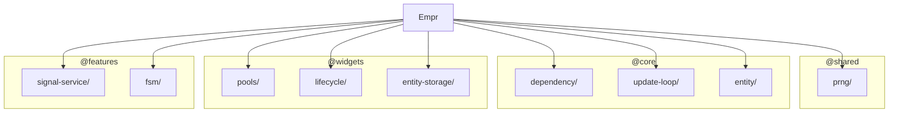

# Layer: `bootstrap`

## Purpose

The `bootstrap` layer is the topmost layer of the framework. Its sole responsibility is to wire together all services from the layers below into a runnable framework instance and hand control to the consumer. Nothing more.

`Empr` — the single class in this layer — constructs every framework service, registers them in the global DI container, and exposes a minimal lifecycle API: `init()` → `start(ticker)`. It is designed to be extended by environment-specific subclasses (e.g. `EmprPixi` for PixiJS integration), while the base class remains completely renderer-agnostic.

**This layer must stay thin.** Any new capability — rendering, physics, audio, animation, extended tooling — either goes to a lower layer or ships as a separate library that extends `Empr`. The `bootstrap` layer is not a place to accumulate features.

---

## Renderer Agnosticism

The framework is designed to be **renderer-agnostic by default**. The base `Empr` class has zero dependency on any rendering library. PixiJS, Three.js, or any other renderer is introduced exclusively via subclassing at the consumer level, never by modifying this layer.

This means the ECS runtime, FSM, signals, and stores all operate independently of how — or whether — anything is drawn on screen.

---

## Isomorphism

The framework aims to be **isomorphic** — usable identically in both browser and server environments. This is a design goal that guides decisions across all layers.

In the base package, runtime scheduling is externalized through `IUpdateTicker` and injected at `start(ticker)`.  
This keeps the framework fully isomorphic at core/bootstrap level: browser, server, and manual drivers are application concerns, not framework internals.

---

## Dependency Rules

| Direction | Allowed |
|---|---|
| `bootstrap` → any layer below | Allowed |
| Any layer below → `bootstrap` | **Forbidden** |
| External library → `bootstrap` | Allowed (via subclassing only) |

The `bootstrap` layer is the only layer with no upward restriction. It can import from `shared`, `core`, `widgets`, and `features` freely — it is the integration point, and that is its entire purpose.

No lower layer may ever import from `bootstrap`. Doing so would invert the dependency direction and tightly couple the framework's internals to its initialization logic.

---

## What Belongs Here

- **Framework entry point** — the `Empr` base class and any official environment-specific subclasses that ship as part of the library
- **Service wiring** — construction and DI registration of all framework services
- **Lifecycle API** — `init()` and `start(ticker)` (and any future `stop()` / `destroy()`)

---

## What Does NOT Belong Here

- Rendering, physics, audio, animation — ship as separate libraries or consumer-level extensions
- Game-domain logic of any kind
- New framework services or utilities — those belong to `features`, `widgets`, or lower layers
- Environment-specific polyfills or adapters beyond the minimal wiring needed to start

---

## Module Dependency Graph

## Current Modules

### `empr.ts`
The framework entry point. `Empr` constructs and wires renderer-agnostic services in `registerServices()`, registers them in the global `Dependency` container, and exposes `start(ticker)` for `UpdateLoop`. **`Executor` / pipeline pause wiring is *not* registered here** — call `useECSBackend` from `@empr/es-sistema` or `useCDBackend` from `@empr/es-componente` after `init()` so `FSMService`, `SignalService`, and (for Pixi) `InteractionService` receive an `ExecutionRegistry`.

`registerServices()` is `protected` and overridable — subclasses extend the service graph while preserving the base configuration via `super.registerServices()`. This is the intended extension point for renderer-specific bootstrapping (e.g. `EmprLienzo`).

**Registered services in base `Empr`:** `EntityStorage`, `SignalService`, `UpdateLoop`, `LifecycleTracker`, `Pools`, `PRNG`, `FSMService`, `ProxyEntity`.

