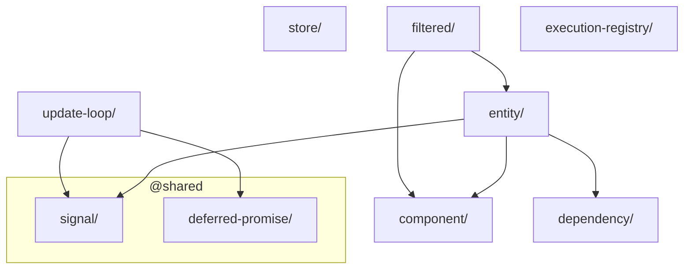

# Layer: `core`

## Purpose

The `core` layer is the ECS kernel of the framework. It defines every fundamental abstraction that makes the Entity-Component-System pattern work: what a Component is, what an Entity is, how Entities are queried, how dependencies are resolved, and how state is managed reactively. **Pipeline execution and the `System` / `SystemProps` function types ship in `@empr/es-sistema`** (or the component-driven equivalent in `@empr/es-componente`); `core` only exposes the abstract `ExecutionRegistry` contract those stacks implement.

Nothing placed here should contain game-domain logic. Every module in `core` is a framework-level building block — a contract or a mechanism, not a feature.

---

## Dependency Rules

| Direction | Allowed |
|---|---|
| `core` → `shared` | Allowed |
| `core` → layers above (`widgets`, `features`, `app`) | **Forbidden** |
| Any layer above → `core` | Allowed |
| `core` module → `core` module | Allowed, unavoidable in places |

**Cross-module imports within `core` are accepted but should be kept minimal.** Unlike `shared`, the ECS nature of this layer makes some internal coupling structurally unavoidable: a query result must know what an Entity is. These dependencies are intentional and form the backbone of the framework.

The guiding rule: if a module can be extracted without breaking the ECS contracts, it should go to `shared`. `object-pool` is an example of a module that was moved out precisely because it had zero ECS coupling. If an internal dependency cannot be eliminated without moving concepts to a wrong layer or breaking established abstractions, it stays here — as with `filtered`.

---

## Internal Sub-Ordering

Within `core` there is an implicit linear dependency chain. Modules must not create cycles. The order from lowest to highest:

```
component          ← no internal deps
dependency         ← no internal deps
store              ← no internal deps
update-loop        ← no internal deps
entity             ← component, dependency
filtered           ← entity, component
execution-registry ← no internal core deps (abstract contract for satellite executors)
```

Modules in the first group (`component`, `dependency`, `store`, `update-loop`) are conceptually independent of each other and of ECS specifics. They are in `core` because they are fundamental framework infrastructure, not because they couple to ECS.

---

## What Belongs Here

- **ECS primitive types and contracts** — `Component`, `ComponentType`, `IEntity`, `INodeEntity`, `ComponentFilter`
- **ECS implementations** — `Entity`, `NodeEntity`, `ProxyEntity`, `EntityIndexator`
- **Query abstractions** — `IFiltered`, `Filtered`, `EntityQuery`
- **Execution bridge** — `ExecutionRegistry<T>` (abstract; concrete pipeline runners live in `@empr/es-sistema` / `@empr/es-componente`)
- **Dependency injection** — `IDependency`, `Token`, `Provider`, `InjectionToken`
- **Reactive state** — `Store<T>`, `StoreMixer`, `computed`, `asyncComputed`, selectors
- **Engine timing** — `UpdateLoop`, `IUpdateLoop`, `IUpdateLoopData`, `OnUpdateSignal`

---

## What Does NOT Belong Here

- Game-specific components or entity archetypes
- Concrete infrastructure implementations that require external libraries (e.g. PixiJS containers) — those belong to `widgets`, renderer libraries (`@empr/es-lienzo`), or the `app` layer
- Orchestration logic (pipeline composition, concurrent execution) — satellite packages (`@empr/es-sistema`, `@empr/es-componente`) and the `app` layer
- Anything that imports from `widgets`, `features`, or the `app` layer (upward imports from `core` are forbidden)

---

## Module Dependency Graph



## Current Modules

### `component/`
Type-level definitions only. Defines `Component` (the base structural type for all data containers) and `ComponentType<T>` (the constructor token used to identify a component class at runtime). No runtime logic, no dependencies on other `core` modules.

### `dependency/`
Dependency injection container. `IDependency` provides `register`, `registerGlobal`, and `inject` methods. Supports class-based and factory-based providers, scoped to modules or global. `InjectionToken<T>` enables injection of non-class values. No ECS-specific dependencies.

### `entity/`
The central ECS primitive. `IEntity` defines the full contract for component management (add, remove, enable, disable, get, filter check). `INodeEntity<T>` extends it with a scene-tree structure for renderer integration — child management is handled via `addChild` / `removeChild`; `addChild` automatically re-parents a node that already belongs to another entity by calling `removeChild` on the previous parent first. `setParent` accepts `null` to detach a node from the hierarchy without destroying it (used internally by `removeChild` and during pool release). Implementations include `Entity` (base), `NodeEntity<T>` (tree-aware), and `ProxyEntity` (interceptor wrapper). `EntityIndexator` maintains a component-type index for O(1)-access filtering. Entity signals (`OnEntityAddComponent`, `OnEntityDestroy`, etc.) are the reactive backbone consumed by `EntityQuery`. Two additional signals — `OnEntityReleasedSignal` and `OnEntityAcquiredSignal` — support object-pool integration: they fire when an entity is de-registered from / re-registered in `EntityStorage`, allowing systems like `PixiObjectPool` to react to pool transitions without polling.

Depends on: `component`, `dependency`.

### `filtered/`
The query result layer. `IFiltered` is the unified interface returned by any entity filter operation, providing `forEach`, `sequential`, and `parallel` iteration. `Filtered` is a static snapshot of matched entities. `EntityQuery` is a live reactive query that automatically maintains its entity list as components change, using entity signals.

Sits directly on top of `entity` / `component`. Cannot be moved lower (depends on `IEntity`). Its position is structurally necessary.

Depends on: `entity`, `component`.

### `execution-registry/`
Abstract base class for anything that can **create** and **run** typed execution flows (`create`, `run`, `stop`). `FSMService`, `SignalService`, and `@empr/es-lienzo`'s `InteractionService` depend on this contract; **`ExecutorComposerRegistry`** (`@empr/es-sistema`) and **`ExecutorOrchestratorRegistry`** (`@empr/es-componente`) are the concrete implementations chosen at app bootstrap.

No dependencies on other `core` modules.

### `update-loop/`
The engine heartbeat as a platform-agnostic time core. `UpdateLoop` does not own scheduling directly; it receives an external ticker via `start(ticker: IUpdateTicker)`, normalizes incoming `deltaMs`, applies a hard-cap clamp against abnormal spikes (tab switches, stalls), tracks deterministic `gameTime`, computes `fps`, and applies `speedMultiplier` for time scaling. Lifecycle is managed via `start(ticker)`, `pause()`, `resume()`, and `stop()`. `waitResume` is a `DeferredPromise` that resolves when the loop leaves paused state (and is also resolved on stop), allowing async systems to synchronize safely. `OnUpdateSignal` broadcasts timing data globally each tick without tight coupling to consumers.

No dependencies on other `core` modules. Depends on `@shared/signal` and `@shared/deferred-promise`.

### `store/`
General-purpose reactive state container. `Store<T>` provides type-safe state updates with middleware, validators, transactions, and batched microtask notifications. `StoreMixer` allows composing and linking multiple stores. Includes `createComputed` (synchronous derived values), `createAsyncComputed` (async derived values with retry/timeout/abort), and memoized selectors. No ECS-specific dependencies — usable anywhere in the project.

