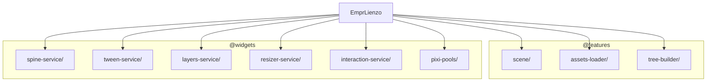

# Layer: `bootstrap`

## Purpose

The `bootstrap` layer is the entry point for the `es-lienzo` renderer. It extends the core `empr.es` framework to include a complete PixiJS rendering stack.

Its primary responsibility is to **wire everything together**: it takes the agnostic ECS core and injects all the renderer-specific services (`Scene`, `AssetsLoader`, `SpineService`, etc.) into the dependency container. It also takes control of the PixiJS rendering loop, driving it explicitly from the ECS `UpdateLoop` to ensure perfect synchronization between game logic and rendering.

---

## Dependency Rules

| Direction | Allowed |
|---|---|
| `bootstrap` → any layer below | Allowed |
| Any layer below → `bootstrap` | **Forbidden** |

The `bootstrap` layer sits at the very top. It imports from `features`, `widgets`, `core`, and `shared` to construct the application. No other layer should ever import from `bootstrap`.

---

## What Belongs Here

- **Entry Point Class** — `EmprLienzo`, which extends `Empr`.
- **Service Registration** — Registering all renderer services (`TweenService`, `SpineService`, `Scene`, etc.) into the DI container.
- **Loop Synchronization** — Wiring the ECS `UpdateLoop` to drive PixiJS rendering, GSAP animations, and Spine updates.
- **DOM Integration** — Appending the Canvas to the HTML document.
- **Tooling Integration** — Connecting to PixiJS DevTools.

---

## What Does NOT Belong Here

- **Game Logic** — Specific game rules or content.
- **Rendering Logic** — How to draw things (belongs in `features` or `widgets`).
- **Asset Loading Logic** — How to load files (belongs in `features/assets-loader`).

---

## Module Dependency Graph

## Current Modules

### `empr.lienzo.ts`
The concrete application class.

- **`EmprLienzo`**: Extends the base `Empr` class.
    - **Service Registration**: Overrides `registerServices()` to inject all the visual services (`Scene`, `AssetsStorage`, `TweenService`, `PixiPools`, etc.) alongside the core ECS services.
    - **Loop Wiring**: Connects `UpdateLoop` hooks (`onUpdate`, `onPause`, `onSpeedChange`) to the rendering services.
        - Drives `TweenService.syncDeltaToFPS` (GSAP) manually.
        - Drives `SpineService.update` manually.
        - Calls `pixi.renderer.render()` manually.
        - **Result**: The entire visual stack advances exactly one frame per ECS tick, enabling deterministic replay and precise speed control.
    - **Initialization**: `init()` triggers the initialization of the `Scene` and `InteractionService`.

