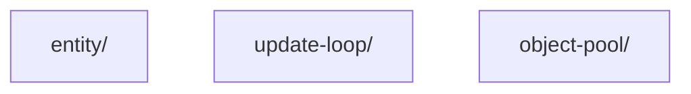

# Layer: `core`

## Purpose

The `core` layer contains the fundamental building blocks for integrating the `empr.es` ECS framework with the PixiJS rendering engine.

It defines the concrete `Entity` implementation used by the renderer (`PixiEntity`) and the update loop strategy (`RafUpdateStrategy`) that drives the simulation in a browser environment.

---

## Dependency Rules

| Direction | Allowed |
|---|---|
| `core` → `shared` | Allowed |
| `core` → layers above (`features`, `widgets`, `bootstrap`) | **Forbidden** |
| Any layer above → `core` | Allowed |
| `core` module → `core` module | Allowed |

---

## What Belongs Here

- **Concrete Entity Implementation** — `PixiEntity`, which binds an ECS entity to a PixiJS `Container`.
- **Update Loop Strategy** — `RafUpdateStrategy`, implementing the game loop via `requestAnimationFrame`.
- **Core Types** — Interfaces and types defining the contract between ECS and PixiJS (e.g., `IMaskOptions`).

---

## What Does NOT Belong Here

- **Game Logic** — Specific gameplay mechanics or systems.
- **Asset Management** — Loading or storing textures (belongs in `features`).
- **Scene Management** — High-level scene switching (belongs in `features`).
- **UI Components** — Specific UI widgets or prefabs (belongs in `widgets`).

---

## Module Dependency Graph

## Current Modules

### `entity/`
Defines `PixiEntity`, the bridge between the ECS world and the PixiJS scene graph.

- `PixiEntity` extends `NodeEntity<Container>`. It wraps a PixiJS `Container` (or any display object) and exposes it as an ECS entity.
- Manages the synchronization of `active` state with Pixi's `visible` property.
- Handles the destruction of the Pixi node when the entity is destroyed.
- Provides helper methods for scene graph manipulation (`addChild`, `removeChild`, `mask`).

**Key Responsibility:** Ensuring that every ECS entity has a corresponding visual representation in the PixiJS scene graph and that their lifecycles are synchronized.

### `update-loop/`
Provides the time-driving mechanism for the application.

- `RafUpdateStrategy` implements `IUpdateTicker`. It uses the browser's `requestAnimationFrame` to generate tick events.
- Calculates `deltaMs` (time since last frame) and `elapsedMs` (total time running).
- Handles the loop's start and stop states.

**Key Responsibility:** Feeding the `empr.es` `UpdateLoop` with accurate, browser-synchronized timing pulses to drive the game simulation.

### `object-pool/`
Provides `PixiObjectPool` — a PixiJS-aware specialization of the framework-agnostic `ObjectPool<T>` from `@empr/es`.

- Overrides `release` to detach the entity from its PixiJS parent `Container` before the base reset runs, eliminating one-frame render artefacts.
- Overrides `acquire` to re-register the entity in `EntityStorage` via DI, making it visible to live ECS queries immediately after it leaves the pool.
- All pooling mechanics (pre-allocation, `autoGrow`, `maxSize`, double-release protection) are fully inherited from the base class without duplication.

**Key Responsibility:** Bridging the gap between the isomorphic pooling infrastructure (`ObjectPool<T>`) and the PixiJS scene graph / ECS lifecycle, so consuming systems can pool `PixiEntity` objects safely without manual scene-graph or storage management.

