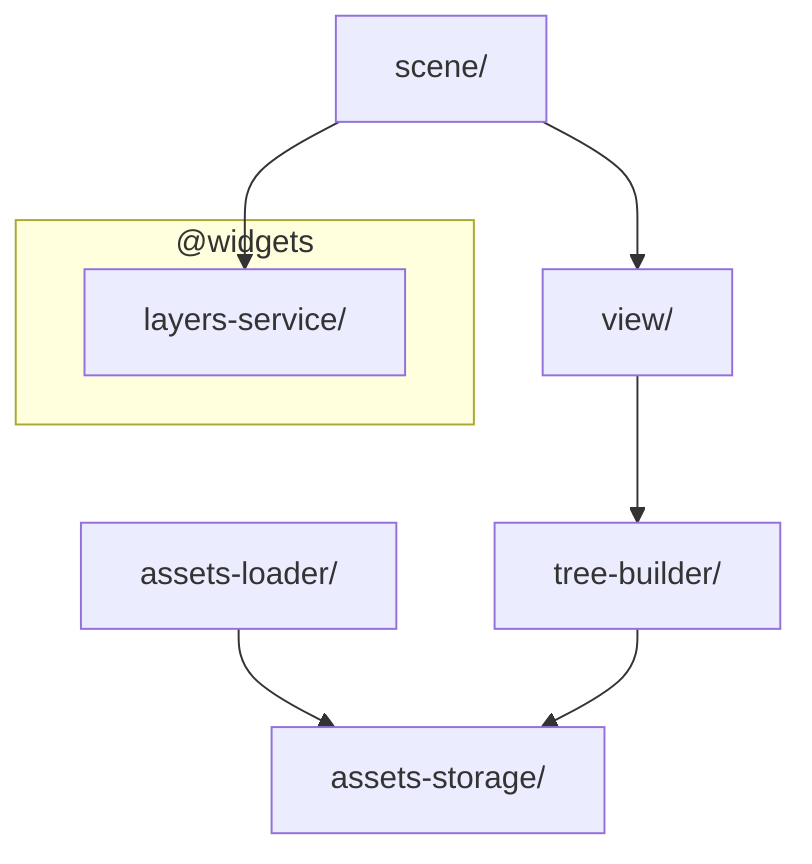

# Layer: `features`

## Purpose

The `features` layer contains the high-level executable machinery of the renderer: asset management, scene orchestration, and the view construction pipeline.

These modules form the "engine" part of the project. They orchestrate how raw data (assets, configs) is turned into a running visual simulation. Unlike `widgets`, which provide isolated services, `features` modules are often interconnected to form complete workflows (e.g., loading assets -> building a tree -> rendering a scene).

---

## Dependency Rules

| Direction | Allowed |
|---|---|
| `features` → `shared` | Allowed |
| `features` → `core` | Allowed |
| `features` → `widgets` | Allowed |
| `features` → layers above (`bootstrap`) | **Forbidden** |
| Any layer above → `features` | Allowed |
| `features` module → `features` module | Allowed, coupling is expected |

**Cross-module imports within `features` are accepted.** The orchestration nature of this layer means modules naturally compose each other (e.g., `TreeBuilder` needs `AssetsStorage`). However, the dependency direction between modules must remain acyclic.

---

## Internal Sub-Ordering

Modules must not create cycles. The order from lowest to highest:

```
assets-storage   ← no features deps
assets-loader    ← assets-storage
tree-builder     ← assets-storage
view             ← tree-builder
scene            ← view
```

---

## What Belongs Here

- **Asset Management** — Loading, storing, and retrieving textures, spines, and data.
- **View Construction** — Factories and builders for creating entity hierarchies from configuration.
- **Scene Management** — Orchestrating the root container, layers, and scene transitions.

---

## What Does NOT Belong Here

- **ECS Primitives** — `Entity`, `Component` (belong in `core`).
- **Specific UI Widgets** — Buttons, Lists, Popups (belong in `widgets` or `app`).
- **Game Logic** — Gameplay rules (belong in `app`).

---

## Module Dependency Graph



## Current Modules

### `assets-storage/`
Central registry for loaded PixiJS resources.
Stores assets (Textures, Spines, JSONs) organized by "bundles". Provides synchronous access to assets that have already been loaded. Used by `TreeBuilder` to resolve texture references during view construction.

### `assets-loader/`
Asset loading pipeline.
Defines systems and behaviours for loading assets from disk/network into `AssetsStorage`. Supports various asset types (Bitmaps, Spines, Spritesheets, Textures) via specialized behaviours.

### `tree-builder/`
The visual factory service.
`TreeBuilder` recursively converts a declarative configuration tree (`TreeNode`) into a hierarchy of `PixiEntity` proxy instances registered in `EntityStorage`. It maps abstract node types (Container, Sprite, Text) to concrete PixiJS objects and populates them with properties (position, scale, texture). For each created node it wires two lifecycle hooks: `destroy` triggers permanent removal (`removeEntity` + `OnViewDestroyedSignal`), while `removed` triggers a non-destructive release (`releaseEntity` + `OnViewRemovedSignal`), enabling transparent pool integration without coupling to any pool implementation.
Depends on `AssetsStorage` to resolve asset references (e.g., texture names) into actual Pixi resources.

### `view/`
Fluent API for view configuration.
- `View` — A builder class that generates `TreeNode` configurations in a readable, fluent style.
- `instantiate` — A helper function that takes a `ViewFactory`, executes it to get a config, and then uses `TreeBuilder` to create the actual entity hierarchy.
- `deinstantiate` — Helper for safely destroying view entities.

### `scene/`
Stage and scene orchestration.
`Scene` manages the root PixiJS container and the high-level layers (`View` for the active scene, `Shared` for global UI). It handles switching between scenes (destroying the old, instantiating the new) and integrates with `LayersService` to manage z-sorting and display groups.

