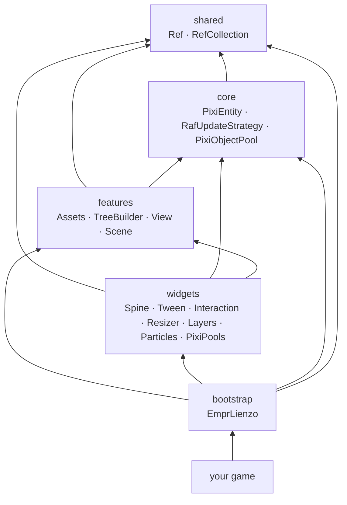

# es-lienzo

**A high-performance PixiJS renderer integration for `@empr/es` — pair it with [@empr/es-sistema](../es-sistema/) (default ECS pipelines) or [@empr/es-componente](../es-componente/) (component-driven orchestration).**

---

## What is es-lienzo?

`es-lienzo` is the official rendering backend for `empr.es`, built on top of **PixiJS**. It bridges the gap between the pure data-oriented ECS world and the visual scene graph.

It provides a complete stack for building 2D games:

- **ECS-driven Rendering**: Entities are mapped to PixiJS Containers via `PixiEntity`.
- **Declarative UI**: A fluent `TreeBuilder` API for constructing complex view hierarchies from data.
- **Asset Management**: Integrated loading pipeline for Textures, Spines, and Spritesheets.
- **Animation System**: Centralized control for GSAP (`TweenService`) and Spine (`SpineService`), synchronized with the ECS game loop.
- **Responsive Layout**: `ResizerService` for handling multi-resolution support and mobile adaptation.
- **Object Pooling**: `PixiObjectPool` and `PixiPools` registry for GC-friendly reuse of `PixiEntity` instances, with scene-graph detachment and ECS re-registration handled automatically on every acquire/release cycle.

---

## Architecture

`es-lienzo` follows the same 5-layer architecture as `empr.es`, extending each layer with rendering-specific capabilities.



| Layer       | Responsibility                                                                                                              |
| ----------- | --------------------------------------------------------------------------------------------------------------------------- |
| `shared`    | Framework-agnostic utilities: `Ref` for decoupling view creation from logic.                                                |
| `core`      | Rendering kernel: `PixiEntity` (ECS <-> Pixi bridge), `RafUpdateStrategy` (browser loop), `PixiObjectPool` (pool primitive). |
| `features`  | Engine machinery: Asset loading, Scene management, View construction (`TreeBuilder`).                                       |
| `widgets`   | High-level services: Animation (Spine, Tween), Input, Particles, Layout, `PixiPools` (pool registry).                      |
| `bootstrap` | Entry point: `EmprLienzo` wires the ECS loop to the PixiJS renderer and registers all services, including `PixiPools`.     |

---

## Execution registry (pipelines & input)

`InteractionService` (and the `SignalService` / `FSMService` contracts from `@empr/es`) depend on an `ExecutionRegistry` implementation supplied by **your app** after bootstrap:

- **ECS:** `useECSBackend(empr)` from `@empr/es-sistema`, then `inject(InteractionService).setExecutionRegistry(inject(Executor))` — see `apps/slot-client/src/app/bootstrap/empr.game.ts`.
- **Component-driven:** `useCDBackend(empr, scene)` from `@empr/es-componente`, then `setExecutionRegistry(inject(ExecutorOrchestratorRegistry))` — see `apps/slot-cd-client/src/app/bootstrap/empr.game.ts`.

Without this wiring, interaction and FSM/signal flows cannot run pipelines.

---

## Quick Start

### 1. Setup

```typescript
import { Application } from 'pixi.js';
import gsap from 'gsap';
import { EmprLienzo } from '@empr/es-lienzo';

// 1. Create Pixi Application
const app = new Application({
    width: 1920,
    height: 1080,
    backgroundColor: 0x1099bb,
});

// 2. Bootstrap the framework
const container = document.getElementById('game-container') as HTMLDivElement;
const empr = new EmprLienzo(app, container, gsap);

// 3. Initialize and Start
empr.init();
empr.start();
```

### 2. Creating a View

Use the fluent `View` builder to define your entity hierarchy.

```typescript
import { View } from '@empr/es-lienzo';
import { Container, Sprite } from 'pixi.js';

export const PlayerView = (view: View) => {
    view.ofType(Container)
        .name('player-root')
        .addChild((body) => {
            body.ofType(Sprite).texture('hero_idle').anchor(0.5, 0.5).refById('hero-sprite'); // Register reference for Systems
        });
};
```

### 3. Instantiating in a Scene

```typescript
import { Scene } from '@empr/es-lienzo';
import { Dependency } from '@empr/es';

const scene = Dependency.instance.inject(Scene);
scene.setView(PlayerView);
```

### 4. Controlling Animations

`es-lienzo` decouples GSAP and Spine from the browser's `requestAnimationFrame` and drives them via the ECS `UpdateLoop`. This ensures deterministic playback and global speed control.

```typescript
import { TweenService, SpineService } from '@empr/es-lienzo';

// GSAP (auto-killed when entity is destroyed)
tweenService.timeline(
    (tl) => {
        tl.to(sprite, { x: 100, duration: 1 });
    },
    { owner: myEntity },
);

// Spine — fluent builder API with per-step configuration
const chain = spineService.create('attack', myEntity);
chain
    .add(spineInstance, 'windup', (step) => {
        step.timeScale(1.2).onComplete(() => console.log('windup done'));
    })
    .add(spineInstance, 'slash')
    .onChainComplete(() => console.log('attack sequence finished'))
    .play();
```

---

## Key Features

### `PixiEntity`

A wrapper around `PIXI.Container` that makes it a first-class citizen in the ECS world. It synchronizes lifecycle (destroying the entity destroys the Pixi node) and visibility (`entity.active` <-> `container.visible`). `addChild` and `removeChild` mirror every ECS hierarchy change into the PixiJS scene graph, keeping both trees permanently in sync.

### `TreeBuilder`

A factory service that turns declarative `TreeNode` configurations into actual PixiJS objects registered as `PixiEntity` proxies in `EntityStorage`. It handles component attachment, event listener binding, and layout properties (position, scale, anchor). Two PixiJS lifecycle hooks are wired automatically: `destroy` permanently removes the entity from the ECS world; `removed` non-destructively releases it (invisible to queries, instance preserved) — enabling transparent integration with `PixiObjectPool` without any explicit pool code in the builder.

### `InteractionService`

Maps native PixiJS pointer events (`pointerdown`, `pointerup`) directly to ECS Pipelines. It manages listener lifecycle automatically, preventing memory leaks when components are added or removed.

### `ResizerService`

Handles the complexity of multi-resolution support. It observes the parent DOM element and scales the PixiJS Stage to fit, maintaining aspect ratio and respecting safe areas.

### `PixiObjectPool` / `PixiPools`

A two-tier object pooling system designed for GC-pressure-free reuse of `PixiEntity` instances in high-frequency scenarios (spinning reels, particles, projectiles).

- **`PixiObjectPool`** (`core`) — extends the framework-agnostic `ObjectPool<T>` with two PixiJS-aware lifecycle hooks: removes the entity from its parent `Container` on `release` (zero draw calls while idle) and re-registers it in `EntityStorage` on `acquire` (immediately visible to ECS queries).
- **`PixiPools`** (`widgets`) — a DI-injectable registry that stores named `PixiObjectPool` instances. Bootstrap systems pre-populate it; consuming systems retrieve pools by key without holding direct references.

```typescript
// Bootstrap system — pre-warm a pool for each symbol type
const pixiPools = inject(PixiPools);
pixiPools.createPool(SymbolId.Wild, {
    factory:     () => instantiate(symbolView, { id: SymbolId.Wild, type: 'wild' }),
    reset:       (entity) => entity.node.position.set(0, 0),
    initialSize: 10,
});

// Consuming system — acquire and release without managing pool references
const symbol = pixiPools.getPool(SymbolId.Wild).acquire();
reelContainer.addChild(symbol);
// ...
pixiPools.getPool(SymbolId.Wild).release(symbol);
```

---

## Comparison

How does `es-lienzo` stack up against other popular JS game development tools?

| Feature               | **empr.es + es-lienzo**           | **Phaser**                          | **Kaboom.js**                | **Raw PixiJS**          |
| --------------------- | --------------------------------- | ----------------------------------- | ---------------------------- | ----------------------- |
| **Architecture**      | **Strict ECS** (Enterprise-grade) | OOP / Component-mix                 | Component-based (functional) | None (Scene Graph only) |
| **Rendering**         | PixiJS (Decoupled)                | Custom WebGL/Canvas                 | Custom WebGL                 | PixiJS                  |
| **State Management**  | **Reactive Store** (Redux-like)   | Event Emitter / mutable props       | Mutable state                | Mutable state           |
| **Determinism**       | **100%** (DVR, Replay support)    | Partial (depends on implementation) | Low                          | Low (RAF dependent)     |
| **Memory Management** | **Automatic** (LifecycleTracker)  | Manual (destroy() calls)            | Automatic (GC heavy)         | Manual                  |
| **UI Development**    | **Declarative** (TreeBuilder)     | Imperative                          | Imperative                   | Imperative              |
| **Learning Curve**    | High (Requires Arch knowledge)    | Medium                              | Low                          | Medium                  |
| **Best For**          | **Complex, scalable apps/games**  | General 2D games                    | Prototyping / Jams           | Rendering heavy apps    |

### Why choose es-lienzo?

1.  **The "Adult" Approach**: Unlike Phaser or Kaboom, which prioritize getting something on screen quickly at the cost of structure, `es-lienzo` enforces a separation of concerns that scales to 100k+ lines of code without becoming spaghetti.
2.  **Time Travel**: By decoupling logic from the browser's `requestAnimationFrame`, you get frame-perfect replays and debugging tools (DVR) out of the box.
3.  **Modern DX**: Writing UI with `TreeBuilder` feels like writing React/Vue, but with the performance of WebGL.

---

## License

Proprietary. All rights reserved.
`@empr/es-lienzo` is a restricted package. See the license terms for permitted use.

