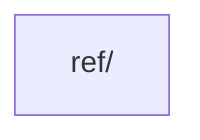

# Layer: `shared`

## Purpose

The `shared` layer contains framework-agnostic utilities and primitives that are reusable across the entire renderer project.

Everything placed here is **infrastructure** — it carries no knowledge of ECS concepts (entities, components, systems), PixiJS, or specific game logic. It provides the low-level building blocks for the renderer's architecture.

---

## Dependency Rules

| Direction | Allowed |
|---|---|
| `shared` → layers above | **Forbidden** |
| Any layer → `shared` | Allowed |
| `shared` module → `shared` module | Allowed, but discouraged |

**Cross-module imports within `shared` are permitted but should be avoided.** They increase coupling and make modules harder to extract or test independently.

---

## What Belongs Here

- **Global registries** — mechanisms for indirect object access (`Ref`, `RefCollection`)
- **Pure utility functions** — stateless helpers
- **Primitive data structures** — general-purpose abstractions
- **Shared TypeScript types** — generic contracts reusable across the project

---

## What Does NOT Belong Here

- ECS primitives: `Entity`, `Component`, `System`
- PixiJS objects or specific renderer logic
- Game-domain types or constants
- Anything that imports from `core`, `features`, `widgets`, or `bootstrap`

---

## Module Dependency Graph



## Current Modules

### `ref/`
Global registry for named object references.

- `Ref<T>` — A static registry that allows registering and retrieving a single object by a string name.
- `RefCollection<T>` — Similar to `Ref`, but manages a list of items under a single name.

**Primary Use Case:** Decoupling the *creation* of a View/Entity from its *consumption*.
In the `TreeBuilder` workflow, a view hierarchy is defined declaratively. `Ref` allows a specific node (e.g., a "submit-button" or "hero-sprite") to be extracted during the build process and made available to game systems, without the systems needing to traverse the scene graph or know about the layout structure.

Example:
```typescript
// Layout definition
view.ofType(Container).refById('main-menu');

// System usage
const menu = Ref.get<PixiEntity>('main-menu');
```

