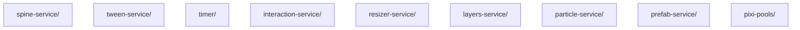

# Layer: `widgets`

## Purpose

The `widgets` layer contains concrete services and utilities that simplify common game development tasks. These modules are built on top of `core` and `features` but provide higher-level, developer-friendly APIs.

Widgets are "sugar" — they make it easier to work with animations, timers, input, and layout without dealing with low-level implementation details. They are designed to be used directly by game logic (in `app` layer) or by other features.

---

## Dependency Rules

| Direction | Allowed |
|---|---|
| `widgets` → `shared` | Allowed |
| `widgets` → `core` | Allowed |
| `widgets` → `features` | Allowed |
| `widgets` → layers above (`bootstrap`) | **Forbidden** |
| Any layer above → `widgets` | Allowed |
| `widgets` module → `widgets` module | Allowed |

---

## What Belongs Here

- **Animation Services** — `SpineService`, `TweenService`
- **Time Management** — `TimerService` (game-loop synchronized)
- **Input Handling** — `InteractionService` (pointer events)
- **Layout & Rendering Utilities** — `ResizerService`, `LayersService`
- **Particle Systems** — `ParticleService`
- **Prefab Management** — `PrefabService`

---

## What Does NOT Belong Here

- **Core ECS Logic** — `Entity`, `System` (belong in `core`)
- **Asset Loading** — `AssetsLoader` (belongs in `features`)
- **Scene Management** — `Scene` (belongs in `features`)
- **Specific Game Gameplay** — Player controller, Level logic (belong in `app`)

---

## Module Dependency Graph

## Current Modules

### `spine-service/`
Centralized control for Spine animations via a fluent builder API.
- `SpineChain` sequences animations with a two-phase API (build → runtime).
- Per-step configuration via `StepBuilder` callback: timeScale, loop count, event listeners, skin application.
- Two-level event subscriptions: per-step (`StepBuilder.on*()`) and per-chain (`SpineChain.onChainComplete()`).
- Hybrid unsubscribe: automatic cleanup on finalize + manual via `Ref<Disposable>`.
- `SpineChainListener` (internal) extracts `IAnimationStateListener` routing from the chain runner.
- Supports global time scaling (slow motion) and pausing.
- Integrates with `LifecycleTracker` to auto-dispose animations when their owner entity is destroyed.

### `tween-service/`
GSAP integration wrapper.
- Decouples GSAP from the browser's `requestAnimationFrame` and synchronizes it with the game's `UpdateLoop`.
- Provides `timeline()` creation with automatic lifecycle tracking (auto-kill on entity destruction).
- Supports global time scaling and pausing.

### `timer/`
Game-loop synchronized timing.
- `setTimeout` / `setInterval` replacements that run on `deltaTime` instead of system time.
- Ensures timers pause when the game pauses and stay in sync with slow motion.
- `sleep()` for async/await delays in Systems.
- Auto-cleanup via `LifecycleTracker`.

### `interaction-service/`
Pointer event handling for ECS entities.
- Maps PixiJS events (`pointerdown`, `pointerup`, etc.) to ECS Pipelines.
- Automatically manages event listeners on Pixi Containers based on Component presence.
- Prevents memory leaks by cleaning up listeners when components are removed.

### `resizer-service/`
Responsive layout management.
- Observes DOM element resizing and scales the PixiJS Stage.
- Dispatches `OnResizeSignal` with layout data (mobile/desktop, portrait/landscape, safe areas).
- Handles mobile emulation for debugging.

### `layers-service/`
Z-sorting and display groups.
- Wraps `@pixi/layers` to provide named display groups (e.g., "Background", "Game", "UI").
- Allows entities to be assigned to layers logically, independent of their scene graph parentage.

### `particle-service/`
Particle emitter management.
- Wraps `pixi-particles` emitters.
- Synchronizes particle updates with the game loop `deltaTime`.

### `prefab-service/`
Dependency Injection for UI prefabs.
- Allows registering and retrieving `ViewFactory` functions by `InjectionToken`.
- Enables decoupling of UI modules (e.g., a HUD system can request a "HealthBar" prefab without knowing its concrete implementation).

### `pixi-pools/`
Centralized registry for `PixiEntity` object pools.
- PixiJS-aware counterpart of the framework-agnostic `Pools` widget from `@empr/es`.
- Stores and distributes `PixiObjectPool` instances keyed by `PoolKey` (`string | number | symbol`).
- On `acquire`, re-registers the entity in `EntityStorage` so ECS queries can observe it; on `release`, detaches it from the PixiJS scene graph to eliminate draw calls while idle.
- Accessed via DI — bootstrap systems pre-populate pools; consuming systems retrieve them without holding direct references.

