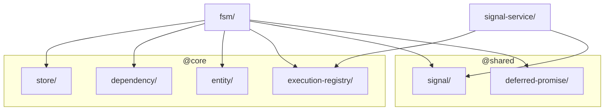

# Layer: `features`

## Purpose

The `features` layer in `@empr/es` contains **renderer-agnostic orchestration helpers** that sit above `widgets` and `core`: today that is the **finite state machine** (`fsm`) and the **signal → execution bridge** (`signal-service`). Both depend on the abstract `ExecutionRegistry` from `core` / `execution-registry`; a **concrete** registry is registered at bootstrap from `@empr/es-sistema` (`ExecutorComposerRegistry`) or `@empr/es-componente` (`ExecutorOrchestratorRegistry`).

Pipeline composition, `Executor`, `Pipeline`, and `System` typings are **not** in this folder — they live in `@empr/es-sistema` (ECS) or `@empr/es-componente` (component-driven).

---

## Dependency Rules

| Direction | Allowed |
|---|---|
| `features` → `shared` | Allowed |
| `features` → `core` | Allowed |
| `features` → `widgets` | Allowed |
| `features` → layers above (`app`) | **Forbidden** |
| Any layer above → `features` | Allowed |
| `features` module → `features` module | Allowed (keep acyclic) |

---

## Internal Sub-Ordering

Only two modules exist; keep imports acyclic:

```
signal-service    ← core (ExecutionRegistry types), shared
fsm               ← core (Store, ExecutionRegistry, dependency, signals), shared
```

`fsm` must not import implementation details from `signal-service` unless there is a deliberate shared utility (today there is no such coupling).

---

## What Belongs Here

- **FSM** — `FSM`, `FSMBuilder`, `FSMService`, transition types, store-driven evaluation.
- **Signal execution bridge** — `SignalService` / `AbstractSignalService`, binding `ISignal` instances to flows resolved through `ExecutionRegistry`.

---

## What Does NOT Belong Here

- **Pipeline composer / executor** — `@empr/es-sistema` or `@empr/es-componente`.
- ECS primitives — `core`.
- Generic runtime services (`EntityStorage`, `LifecycleTracker`, …) — `widgets`.
- Game-domain logic — `app`.

---

## Module Dependency Graph



## Current Modules

### `signal-service/`

Bridges standalone `ISignal` instances to execution flows. `SignalService.setExecutionRegistry` must be called after the app wires `ExecutorComposerRegistry` or `ExecutorOrchestratorRegistry` (see `@empr/es` README **Execution stacks** and reference apps under `apps/slot-client` / `apps/slot-cd-client`).

Depends on: `@core/execution-registry`, `@shared/signal`.

### `fsm/`

Data-driven finite state machines: `FSMService.createFSM` builds from a factory; `FSMBuilder` receives the same `ExecutionRegistry` used by signals so enter/exit chains share one execution model.

Depends on: `@core/store`, `@core/dependency`, `@core/entity`, `@core/execution-registry`, `@shared/signal`, `@shared/deferred-promise`.

