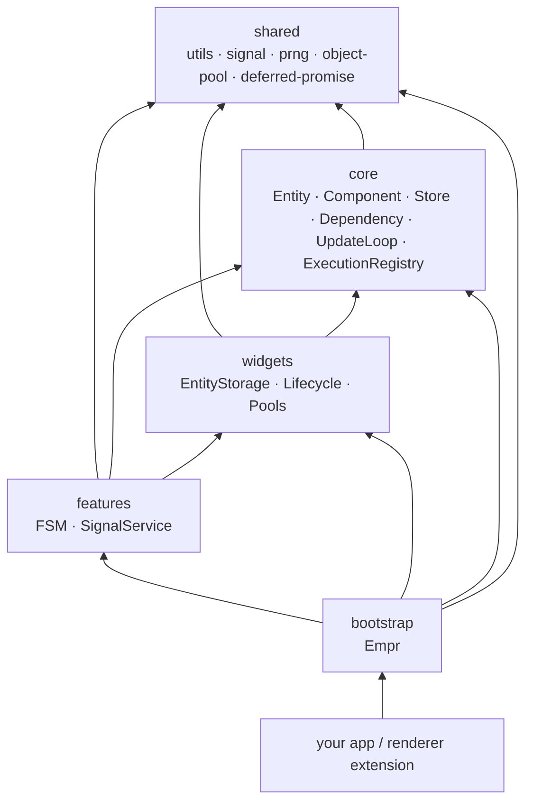

# empr.es


**A TypeScript ECS framework for high-performance, modular game architecture.**

---

## What is empr.es?

`empr.es` is a TypeScript framework built around the Entity-Component-System pattern. It gives you a structured, type-safe foundation for building games and simulations — without dictating how you render, physics, or audio are handled. The framework has zero runtime dependencies on any rendering library.

The core idea is clean separation: **data lives in Components**, **logic lives in Systems**, and **Systems run inside Pipelines**. Entities are composed at runtime from any combination of Components, and Systems query only the entities they care about — by component presence or absence.

Beyond the ECS kernel, this package ships a reactive `Store`, a data-driven Finite State Machine (`FSM` / `FSMService`), signal-to-execution bridging (`SignalService`), object pooling, and automatic lifecycle management for subscriptions. **Pipeline composition, the `Executor`, and ECS `System` typings live in [`@empr/es-sistema`](#execution-stacks)** — install it alongside `@empr/es` for the default ECS execution stack, or swap in [`@empr/es-componente`](#execution-stacks) for a component-driven orchestration mode.

---

## Why empr.es?

| Problem                                                   | Solution                                                                                                                                |
| --------------------------------------------------------- | --------------------------------------------------------------------------------------------------------------------------------------- |
| Game logic becomes spaghetti as the project grows         | ECS enforces a strict separation of data and behavior — components hold state, systems hold logic, entities hold nothing                |
| Hard to switch or test rendering independently            | Renderer-agnostic core — the framework has no knowledge of PixiJS, Three.js, or any display library                                     |
| Game state is hard to inspect and debug                   | Reactive `Store` + FSM-driven flows; pipeline lifecycle signals (`@empr/es-sistema`) let you attach custom tracing or tooling |
| Complex game state transitions require custom boilerplate | Built-in FSM with pipeline-backed states, transition guards, and enter/exit hooks                                                       |
| Short-lived objects (bullets, particles) pressure the GC  | `ObjectPool<T>` for reusable allocation, driven by a frame-synchronized game loop                                                       |
| Event listeners accumulate and cause memory leaks         | `LifecycleTracker` and `TrackedSignal` auto-dispose subscriptions when their owning entity or context is destroyed                      |
| Time-based logic breaks when the tab is hidden            | `UpdateLoop` clamps delta time against hard caps — no physics jumps on tab restore                                                      |

---

## Architecture

`empr.es` is organized into five strict dependency layers. Every import arrow points downward only — a module may depend on layers below it, never on layers above.



| Layer       | Responsibility                                                                                             |
| ----------- | ---------------------------------------------------------------------------------------------------------- |
| `shared`    | Framework-agnostic utilities: signals, PRNG, object pool, deferred promises, id generation, value clamping |
| `core`      | ECS kernel: Entity, Component, filtered queries, DI container, reactive Store, UpdateLoop, `ExecutionRegistry` typing |
| `widgets`   | Concrete runtime services: EntityStorage, LifecycleTracker, Pools                                          |
| `features`  | FSM runtime and `SignalService` (both require an `ExecutionRegistry` from your chosen execution stack)    |
| `bootstrap` | Framework entry point: `Empr` wires all services into the DI container and starts the loop                 |

---

## Installation

```bash
npm install @empr/es
# Default ECS pipelines + Executor (see "Execution stacks"):
npm install @empr/es-sistema
```

**Requirements:** TypeScript `~5.6+`. Strict mode is recommended.

```json
{
    "compilerOptions": {
        "strict": true,
        "target": "ES2020",
        "module": "ESNext",
        "moduleResolution": "bundler"
    }
}
```

---

## Execution stacks

`@empr/es` owns the **simulation kernel** (entities, components, storage, reactive store, update loop, DI, FSM, signals). It does **not** ship the ECS pipeline runner: that lives in a small satellite package you choose at app level.

| Package | Role |
| --- | --- |
| [@empr/es-sistema](./es-sistema/) | **Default ECS stack** — `PipelineComposer`, `Executor`, `PipelineFactory`, `System` / `SystemProps`, and `useECSBackend(app)` to wire `Executor` + `ExecutorComposerRegistry` into `Empr` / `EmprLienzo` together with `FSMService`, `SignalService`, and `UpdateLoop` pause/resume. |
| [@empr/es-componente](./es-componente/) | **Component-driven alternative** — replace `es-sistema` (not stack both): `useCDBackend(app, sceneRootSource)` registers `ComponentDrivenExecutor` and `ExecutorOrchestratorRegistry` so the same `FSMService` / `SignalService` contracts use your CD registry. |

Boundary rules for these packages are documented in `docs/plans/2026-04-28-empr-es-sistema-es-componente-design.md` (internal monorepo design doc). **`@empr/es` and `@empr/es-lienzo` do not depend on them** — your application adds exactly one execution stack.

### Reference implementations (this monorepo)

- **ECS + `@empr/es-sistema`:** `apps/slot-client/src/app/bootstrap/empr.game.ts` — `useECSBackend`, then `InteractionService.setExecutionRegistry` with `Executor` from DI. Types: `apps/slot-client/src/app/types/empr-es.d.ts`.
- **Component-driven + `@empr/es-componente`:** `apps/slot-cd-client/src/app/bootstrap/empr.game.ts` — `useCDBackend(app, scene)`, `ExecutorOrchestratorRegistry` for interaction wiring. Types: `empr-es.componente.d.ts`, `empr-es.d.ts`, `empr-es.lienzo.d.ts`.

### Minimal wiring — ECS (`@empr/es-sistema`)

```typescript
import { Empr, Entity, EntityStorage, OnUpdateSignal, IUpdateTicker } from '@empr/es';
import { Executor, useECSBackend, type PipelineFactory, type System, type SystemProps } from '@empr/es-sistema';

const moveSystem: System = ({ filter }: SystemProps) => {
    filter({ includes: [Position, Velocity] }).forEach((entity) => {
        const pos = entity.getComponent(Position);
        const vel = entity.getComponent(Velocity);
        pos.x += vel.vx;
        pos.y += vel.vy;
    });
};

const empr = new Empr();
empr.init();
useECSBackend(empr);

const storage = empr.dependency.inject(EntityStorage);
const executor = empr.dependency.inject(Executor);

const player = new Entity('player');
player.addComponent(new Position());
player.addComponent(new Velocity());
storage.addEntity(player);

const movementFactory: PipelineFactory<void> = ({ pipeline }) => {
    pipeline.use(moveSystem);
};

OnUpdateSignal.listen(async () => {
    const id = await executor.create(movementFactory, {}, 'OnUpdate', 'movement');
    await executor.run(id);
});

const ticker: IUpdateTicker = {
    start: (onTick) => {
        /* plug your scheduler */
    },
    stop: () => {},
};
empr.start(ticker);
```

### Minimal wiring — component-driven (`@empr/es-componente`)

```typescript
import { FSMService } from '@empr/es';
import { ExecutorOrchestratorRegistry, useCDBackend } from '@empr/es-componente';
import { EmprLienzo, InteractionService, Scene } from '@empr/es-lienzo';
// After empr.init():
// const scene = empr.dependency.inject(Scene);
// useCDBackend(empr, scene);
// const registry = empr.dependency.inject(ExecutorOrchestratorRegistry);
// empr.dependency.inject(InteractionService).setExecutionRegistry(registry);
```

See the `slot-cd-client` files linked above for full typing augmentations.

---

## Quick Start

Use **[Execution stacks](#execution-stacks)** above for a complete, up-to-date snippet (`npm install @empr/es @empr/es-sistema`, then `useECSBackend` + `Executor.create` / `run`). The ECS kernel usage below is unchanged — only pipeline execution moved to `@empr/es-sistema`.

```bash
npm install @empr/es @empr/es-sistema
```

---

## External Ticker Injection

`Empr` accepts a ticker instance in `start(ticker)`. This keeps `UpdateLoop` platform-agnostic and lets your app choose the scheduling strategy at runtime.

```typescript
import { Empr, IUpdateTicker } from '@empr/es';

const empr = new Empr();
empr.init();

const ticker: IUpdateTicker = createTickerForRuntime();
empr.start(ticker);
```

You can also provide your own strategy implementation:

```typescript
import { Empr, IUpdateTick, IUpdateTicker } from '@empr/es';

class ManualTicker implements IUpdateTicker {
    private _onTick: ((tick: IUpdateTick) => void) | null = null;

    public start(onTick: (tick: IUpdateTick) => void): void {
        this._onTick = onTick;
    }

    public stop(): void {
        this._onTick = null;
    }

    public push(deltaMs: number, elapsedMs: number): void {
        this._onTick?.({ deltaMs, elapsedMs });
    }
}

const empr = new Empr();
empr.init();

const ticker = new ManualTicker();
empr.start(ticker);

// Later (tests, server loop, custom driver):
ticker.push(16, 16);
```

---

## Core Concepts

### Entity · Component · System

**Components** are plain TypeScript classes that hold data only — no logic, no methods. They describe a single aspect of an entity's state.

```typescript
class HealthComponent {
    current = 100;
    max = 100;
}

class ArmorComponent {
    value = 25;
}
```

**Entities** are runtime containers for components. You add, remove, enable, and disable components on them. The entity itself carries no game logic.

```typescript
const enemy = new Entity('enemy');
enemy.addComponent(new HealthComponent());
enemy.addComponent(new ArmorComponent());

const health = enemy.getComponent(HealthComponent); // EntityComponent<HealthComponent, Entity>
enemy.removeComponent(ArmorComponent);
enemy.active = false; // exclude from all filters until re-enabled
```

**Systems** are plain functions that receive `SystemProps` — a toolkit providing `filter()` for querying entities and `inject()` for resolving services from the DI container. The `System` / `SystemProps` types and the runtime that invokes them are provided by [`@empr/es-sistema`](#execution-stacks).

```typescript
import type { System, SystemProps } from '@empr/es-sistema';
const damageSystem: System<{ damage: number }> = ({ filter, inject, damage }) => {
    const entities = filter({
        includes: [HealthComponent],
        excludes: [ArmorComponent],
    });

    entities.forEach((entity) => {
        const health = entity.getComponent(HealthComponent);
        health.current -= damage;
    });
};
```

---

### Signal

`Signal<T>` is a typed, GC-friendly publish-subscribe primitive. It supports both synchronous and asynchronous listeners. `dispatch()` returns a `Promise` that resolves only after all async listeners have completed.

```typescript
import { Signal } from '@empr/es';

const onPlayerDied = new Signal<{ id: number }>('PlayerDied');

// Subscribe
const disposable = onPlayerDied.listen(async ({ id }) => {
    await saveScore(id);
});

// Dispatch — waits for all async listeners
await onPlayerDied.dispatch({ id: 42 });

// Unsubscribe
disposable.dispose();
```

The framework provides built-in signals: `OnUpdateSignal` (fires every frame with `IUpdateLoopData`), and per-entity signals for component changes and destruction.

---

### Pipeline execution (`@empr/es-sistema`)

A **Pipeline** is an ordered sequence of systems executed through an `Executor`. You describe work in a **`PipelineFactory`** callback that receives a `PipelineComposer` and registers systems with `.use()`. The executor creates an isolated `Pipeline` per `create()` / `run()` cycle and emits lifecycle signals (`OnPipelineExecutionStartSignal`, `OnPipelineExecutionEndSignal` from `@empr/es-sistema`).

```typescript
import { Executor, type PipelineFactory, type System } from '@empr/es-sistema';

declare const executor: Executor;

const gameLoop: PipelineFactory<void> = ({ pipeline }) => {
    pipeline.use(inputSystem).use(physicsSystem).use(renderSystem);
};

const id = await executor.create(gameLoop, {}, 'Flow', 'game-loop');
await executor.run(id);
```

See **[Execution stacks](#execution-stacks)** for wiring `Executor` into `Empr` via `useECSBackend`.

---

## Features

### Entity Storage & Live Queries

`EntityStorage` is the runtime container for all entities. It provides an indexed `filter()` that uses component-type indexes for O(n_smallest_component_set) lookups instead of scanning all entities.

```typescript
const storage = inject(EntityStorage);

// Static snapshot — evaluated once
const activeEnemies = storage.filter({
    includes: [EnemyTag, Position],
    excludes: [DeadTag],
});

activeEnemies.forEach((entity) => {
    /* ... */
});
await activeEnemies.sequential(async (entity) => {
    /* async, one at a time */
});
await activeEnemies.parallel(async (entity) => {
    /* async, all at once */
});
```

**`EntityQuery`** is a live reactive variant that automatically maintains its entity list as components are added, removed, or as `active` state changes — no re-querying needed. It is also pool-aware: entities returned to an object pool (`OnEntityReleasedSignal`) are removed from the query automatically, and entities retrieved from a pool (`OnEntityAcquiredSignal`) are re-evaluated and re-added if they match the filter.

```typescript
// Pass an executionContext to get a cached, reactive EntityQuery
const query = storage.filter({ includes: [Position] }, false, 'movement-pipeline');
// query.items is always up to date
```

**Pool lifecycle** — `EntityStorage` provides two methods for non-destructive entity pooling:

```typescript
// Return a pooled entity to an ObjectPool without destroying it:
storage.releaseEntity(entity); // de-indexed, invisible to queries, instance preserved

// Retrieve it back from the pool:
storage.acquireEntity(entity); // re-indexed, immediately visible to all live queries
```

These methods are used internally by `PixiObjectPool` in `@empr/es-lienzo`, but are available for any custom pool implementation.

---

### Reactive Store

`Store<T>` is a type-safe reactive state container with batched microtask notifications. Updates are validated before being applied.

```typescript
interface GameState {
    score: number;
    level: number;
    isPaused: boolean;
}

const gameStore = new Store<GameState>({ score: 0, level: 1, isPaused: false });

// Subscribe to changes
gameStore.subscribe((state, prev) => {
    if (state.score !== prev.score) updateScoreUI(state.score);
});

// Update state
gameStore.update((state) => ({ score: state.score + 100 }));

// Computed value — auto-recalculates when dependencies change
const totalScore = gameStore.createComputed((state) => state.score * state.level);
console.log(totalScore.value); // always up to date
totalScore.dispose();

// Async computed with retry and timeout
const leaderboard = gameStore.createAsyncComputed(
    async (state, { signal }) => fetchLeaderboard(state.level, { signal }),
    { retryCount: 3, timeout: 5000 },
);
```

`StoreMixer` links multiple stores together, propagating changes bidirectionally via configurable `mapFrom` / `mapTo` functions.

---

### Finite State Machine (FSM)

`FSMService` creates machines from a **factory callback** (`FSMFactorys`) that receives a fluent `FSMBuilder`. The builder is constructed with an `ExecutionRegistry` resolved at runtime — after you call `useECSBackend` or `useCDBackend`, that registry is the same object wired into `SignalService` and (for Pixi games) `InteractionService.setExecutionRegistry`.

For a complete, typed example, follow `apps/slot-client/src/app/bootstrap/empr.game.ts` (ECS) or `apps/slot-cd-client/.../empr.game.ts` (component-driven) together with the corresponding `empr-es*.d.ts` augmentations.

---

### Object Pooling

`ObjectPool<T>` eliminates GC pressure from high-frequency allocations. Objects are reset and returned to the pool instead of being garbage-collected.

```typescript
import { ObjectPool, Pools } from '@empr/es';

// Standalone pool
const bulletPool = new ObjectPool<Bullet>({
    factory: () => new Bullet(),
    reset: (b) => b.reset(),
    initialSize: 50,
    maxSize: 200,
});

const bullet = bulletPool.acquire();
// ... use bullet ...
bulletPool.release(bullet);

// Named registry — access from anywhere
const pools = inject(Pools);
pools.createPool('bullets', { factory: () => new Bullet(), initialSize: 50 });

// Later, in a System:
const bulletPool = pools.getPool<Bullet>('bullets');
```

---

### Lifecycle Tracking

`LifecycleTracker` solves the dangling-listener problem: any subscription registered through it is automatically disposed when the associated entity or context is destroyed.

```typescript
const tracker = inject(LifecycleTracker);

// All listeners registered via tracker are auto-disposed on entity.destroy()
tracker.track(
    entity,
    onUpdateSignal.listen((data) => {
        move(entity, data.deltaTime);
    }),
);
```

`TrackedSignal` wraps a `Signal` so that every subscriber is bound to a context's lifetime — no manual cleanup required.

```typescript
class PlayerController {
    private _onShoot = new TrackedSignal<void>(this);

    shoot() {
        this._onShoot.dispatch();
    }

    dispose() {
        // all _onShoot listeners are automatically removed
        this._onShoot.dispose();
    }
}
```

---

### Pipeline observability

`@empr/es-sistema` dispatches `OnPipelineExecutionStartSignal` and `OnPipelineExecutionEndSignal` around each system invocation. You can subscribe from application code to build custom traces, metrics, or replay tooling — those services are **not** bundled inside `@empr/es` in this repository layout.

---

### DI Container

The `Dependency` container supports class-based and factory-based providers, scoped globally or per module. Inside any System, services are resolved via `inject()`.

```typescript
import { Dependency, InjectionToken } from '@empr/es';

// Token for a non-class value
const API_URL = new InjectionToken<string>('API_URL');

// Global registration
Dependency.instance.registerGlobal({
    provide: API_URL,
    useFactory: () => 'https://api.example.com',
});
Dependency.instance.registerGlobal({ provide: ScoreService, useClass: ScoreService });

// Module-scoped override (e.g. for a specific pipeline)
Dependency.instance.register('battle-pipeline', {
    provide: ScoreService,
    useClass: BattleScoreService,
});

// Inside a system (types from @empr/es-sistema)
import type { System } from '@empr/es-sistema';

const scoreSystem: System = ({ inject }) => {
    const scoreService = inject(ScoreService);
    const apiUrl = inject(API_URL);
};
```

---

### PRNG

`PRNG` provides deterministic pseudo-random operations using FNV-1a hashing. The same seed always produces the same output across any platform or execution order — making it suitable for reproducible procedural generation, replays, and deterministic tests.

```typescript
import { PRNG } from '@empr/es';

const prng = new PRNG();

// Deterministic hash — same input, same uint32 output
prng.hash('world-seed-42'); // always 2847392910

// Shuffle an array deterministically
const deck = ['A', 'B', 'C', 'D', 'E'];
const shuffled = prng.shuffle(deck, 'round-1'); // always the same order for 'round-1'
```

---

## Comparison

How does `empr.es` compare to other TypeScript ECS libraries?

| Feature              | **empr.es**                                   | **bitECS**                          | **ECSY / Miniplex**          |
| -------------------- | --------------------------------------------- | ----------------------------------- | ---------------------------- |
| **Philosophy**       | **Enterprise Framework** (Batteries included) | **Raw Performance** (Data-Oriented) | **Simplicity** (DX-first)    |
| **Data Storage**     | Hybrid (Classes + Pools)                      | SoA (TypedArrays)                   | Objects / Classes            |
| **Tooling**          | Pipeline lifecycle signals (via `@empr/es-sistema`) for custom tooling | None                                | Basic (DevTools)             |
| **Architecture**     | **Strict 5-Layer + DI Container**             | Flat / Manual                       | Flat                         |
| **State Management** | **Reactive Store** (Built-in)                 | External                            | External                     |
| **Determinism**      | **High** (Fixed Step Loop)                    | Manual                              | Manual                       |
| **Performance**      | High (Optimized for JS engines)               | **Extreme** (C++ style memory)      | Moderate                     |
| **Best For**         | **Long-lived, complex games/apps**            | Simulations with 100k+ entities     | Prototypes, Jams, React apps |

### Why choose empr.es?

1.  **More Than Just ECS**: While libraries like `bitECS` focus solely on iterating arrays of numbers as fast as possible, `empr.es` plus `@empr/es-sistema` (or `@empr/es-componente`) provides the infrastructure for a _complete application_: Dependency Injection, data-driven FSMs, signal buses, reactive stores, and typed pipeline execution.
2.  **Debuggability**: Deterministic `UpdateLoop`, typed signals, and pipeline lifecycle hooks from `@empr/es-sistema` give you a stable foundation for custom replay or inspection tools.
3.  **Maintainability**: The strict layered architecture prevents the "spaghetti code" problem common in game development, making it suitable for large teams and multi-year projects.

---

## Renderer Agnosticism & Extension

The base `Empr` class has zero dependency on any rendering library. To integrate a renderer, extend `Empr` and override `registerServices()`:

```typescript
import { Empr } from '@empr/es';
import { Application } from 'pixi.js';

class EmprPixi extends Empr {
    protected registerServices(): void {
        super.registerServices(); // preserve all core registrations

        const app = new Application();
        this._dependency.registerGlobal({
            provide: Application,
            useFactory: () => app,
        });

        // register additional renderer-specific services...
    }
}

const empr = new EmprPixi();
empr.init();
const ticker = createTickerForRuntime();
empr.start(ticker);
```

For renderer integration, `empr.es` provides `INodeEntity<T>` and `NodeEntity<T>` — an entity variant that holds a reference to a renderer node (e.g. a `PIXI.Container` or `THREE.Object3D`) and supports scene-tree traversal: `addChild`, `removeChild`, `setParent`, `getChild`, `getComponentInChildren`. `addChild` automatically re-parents a node that already belongs to another entity. `setParent(null)` detaches a node cleanly without destroying it — used internally by `removeChild` and by object-pool release hooks.

**Physics, audio, and animation are intentionally out of scope.** These are delivered as separate libraries that extend the framework rather than being bundled into it.

---

## Isomorphism

`empr.es` is designed to run identically in both browser and server (Node.js) environments. The ECS kernel, store, FSM, signal bus, and DI container have no environment-specific dependencies. **`@empr/es-sistema` / `@empr/es-componente`** follow the same rule as long as you do not import browser-only peers in server bundles.

`UpdateLoop` is platform-agnostic and receives an external ticker via `start(ticker)`. Browser, server, and manual drivers are passed from the application level, so the base framework remains fully isomorphic and renderer-agnostic.

---

## Changelog

### 0.9.4

#### Removed: `PipelineProps.insert`

`insert` (added in 0.9.1) has been deprecated and removed. Pipeline composition is achieved by calling child pipeline factories directly and forwarding the parent's props — a simpler pattern that was already the standard across the codebase.

Before (0.9.1–0.9.3):

```typescript
async function buildPipeline({ pipeline, insert }: FSMPipelineProps<GlobalStore>) {
    await insert(slotBuildPipeline);
    pipeline.use(sceneSetViewSystem);
}
```

After (0.9.4+):

```typescript
function buildPipeline(props: FSMPipelineProps<GlobalStore>) {
    slotBuildPipeline({ ...props, strips, config });
    props.pipeline.use(sceneSetViewSystem);
}
```

Removed artifacts: `InsertArgs<T>` type, `insert` field on `PipelineProps`, `insert` closure in `Executor.create`.

### 0.9.3

#### Pipeline System Repetition via `.times()`

`PipelineComposer` now supports a `.times(count)` method that specifies how many times the last added system should execute. The composer eagerly expands the system into `count` flat providers at composition time — no changes to the executor or pipeline runner.

```typescript
pipeline
  .use(showWinSystem, { winLines })
  .when(() => hasWin)
  .times(3);
// Equivalent to calling .use(showWinSystem, { winLines }).when(() => hasWin) three times
```

Clones share the same system reference, data, and when-predicate. Each clone receives an auto-generated debug hook (`HOOK_DESCRIPTION_1`, `HOOK_DESCRIPTION_2`, …). Repeat groups are treated as atomic units — `remove()` and `replace()` on the original hook cascade to all clones.

Edge cases:
- `times(0)` — removes the system from the pipeline (with a console warning)
- `times(1)` — no-op (system already added once)
- Negative or non-integer values throw an error

### 0.9.2

#### `NodeEntity` — `removeChild` and `setParent(null)`

`INodeEntity<T>` now declares `removeChild(node)` as a first-class contract. `NodeEntity.removeChild` removes the child from the internal array, calls `setParent(null)` on the detached node, and dispatches `OnEntityRemoveChildSignal` on the next frame. `addChild` calls `removeChild` on the previous parent automatically when re-parenting a node that already belongs to another entity.

`setParent` now accepts `null` in addition to `INodeEntity<T>`, allowing a node to be cleanly detached from its parent without being destroyed — a requirement for object-pool release semantics.

#### Entity pool lifecycle signals

Two new signals support object-pool integration without requiring polling:

- **`OnEntityReleasedSignal`** — dispatched when an entity is de-registered from `EntityStorage` (i.e. returned to a pool). After this signal fires, the entity is invisible to all ECS queries and systems.
- **`OnEntityAcquiredSignal`** — dispatched when an entity is re-registered in `EntityStorage` (i.e. retrieved from a pool). After this signal fires, the entity is fully observable by live queries and systems.

#### `EntityStorage` — `releaseEntity` and `acquireEntity`

Two new methods implement non-destructive pool lifecycle management directly on the storage layer:

- **`releaseEntity(entity)`** — removes the entity from the internal map, unindexes all of its components from `EntityIndexator`, and dispatches `OnEntityReleasedSignal`. The entity instance is fully preserved and may be re-registered later. Semantically distinct from `removeEntity` / `destroyEntity`, which permanently invalidate the entity.
- **`acquireEntity(entity)`** — re-registers a previously released entity: adds it back to the map, re-indexes all components, and dispatches `OnEntityAcquiredSignal`. If the entity is already registered under the same id the call is a no-op; if a different entity exists under the same id an error is thrown.

#### Pool-aware `EntityQuery`

`EntityQuery` now subscribes to `OnEntityReleasedSignal` and `OnEntityAcquiredSignal` in addition to the existing component-change and destroy signals:

- On `released` — the entity is removed from the query's internal list immediately (treated like destroy), so no system can iterate over an idle pooled entity.
- On `acquired` — the entity is re-evaluated against the filter; if it matches, it is re-added to the list automatically.

### 0.9.1

#### ~~Pipeline Composition via `insert`~~ (deprecated, removed in 0.9.4)

_This feature was removed in 0.9.4. See the 0.9.4 changelog entry for the migration path._

#### `clamp` utility

Added a `clamp(value, min, max)` utility to `@shared/utils`. Clamps a numeric value within the `[min, max]` range using a single `Math.max` / `Math.min` expression.

```typescript
import { clamp } from '@empr/es';

clamp(10, 0, 5); // 5
clamp(-5, 0, 5); // 0
clamp(3, 0, 5); // 3
```

---

## License

Proprietary. All rights reserved.

`@empr/es` is a restricted package. See the license terms for permitted use.

