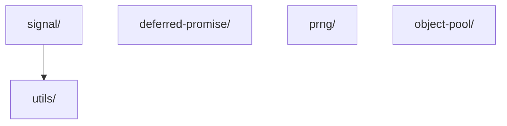

# Layer: `shared`

## Purpose

The `shared` layer is the foundation of the framework. It provides low-level, framework-agnostic utilities, primitives, and data structures that are reusable across all layers of the project.

Everything placed here is **pure infrastructure** — it carries no knowledge of ECS concepts (entities, components, systems, worlds) and no knowledge of any domain-specific game logic.

---

## Dependency Rules

| Direction                         | Allowed                  |
| --------------------------------- | ------------------------ |
| `shared` → layers above           | **Forbidden**            |
| Any layer → `shared`              | Allowed                  |
| `shared` module → `shared` module | Allowed, but discouraged |

**Cross-module imports within `shared` are permitted but should be avoided.** They increase coupling, make modules harder to extract or test independently, and can introduce subtle initialization order issues.

> If two `shared` modules need to be composed together, prefer creating a dedicated adapter, bridge, or mediator module at a higher layer rather than adding a dependency inside `shared`.

The one accepted exception visible in the current codebase: `Signal` depends on `utils/nextId` and `utils/waitNextFrame` — both are pure, stateless utilities with no risk of circular dependency or hidden coupling.

---

## What Belongs Here

- **Pure utility functions** — stateless, side-effect-free helpers (`nextId`, `debounce`, `waitNextFrame`)
- **Primitive data structures** — general-purpose abstractions not tied to ECS (`DeferredPromise`, `Signal`)
- **Algorithms** — deterministic, mathematically self-contained logic (`PRNG`)
- **Generic performance patterns** — reusable object lifecycle management (`ObjectPool`)
- **Shared TypeScript types and interfaces** — generic contracts reusable across the entire project

---

## What Does NOT Belong Here

- ECS primitives: `Entity`, `Component`, `System`, `World`
- Game-domain types or constants
- Anything that imports from `core`, `engine`, `game`, or any layer above `shared`
- Stateful singletons with lifecycle tied to a game session

---

## Module Dependency Graph

## Current Modules

### `utils/`

Stateless helper functions safe to call in hot paths.

- `nextId()` — GC-free monotonically increasing numeric ID generator. Zero-allocation alternative to string UUIDs. Safe in update loops and entity creation.
- `debounce()` — Delays function execution until after a quiet period. Standard debounce with cleanup.
- `waitNextFrame()` — Promisified `requestAnimationFrame` wrapper. Defers async execution to the next visual frame.
- `clamp()` — Constrains a numeric value within a `[min, max]` range. Zero-allocation, branch-free via `Math.max`/`Math.min`. Safe in hot paths.

### `signal/`

Typed synchronous/asynchronous publish-subscribe primitive.

`Signal<T>` supports both sync and async listeners, guarantees completion of all async operations before the dispatching `Promise` resolves, and isolates listener errors to prevent cascade failures. GC-friendly: avoids temporary array allocation when no async listeners are registered.

### `deferred-promise/`

Externally-controlled `Promise` wrapper.

`DeferredPromise<T>` separates `Promise` creation from its resolution or rejection. Useful for coordinating async handshakes across module boundaries without callback nesting.

### `prng/`

Deterministic pseudo-random number generator.

`PRNG` uses FNV-1a hashing and Fisher-Yates shuffling. Same seed always produces the same output regardless of platform or execution order — suitable for reproducible procedural generation, replays, and seeded simulations.

### `object-pool/`

Generic object pool for GC pressure reduction.

`ObjectPool<T>` manages `acquire`/`release` lifecycle with configurable `factory`, `reset`, `initialSize`, `maxSize`, and `autoGrow`. Completely framework-agnostic — no knowledge of ECS concepts. Recommended for high-frequency allocations: particles, projectiles, reusable component data, or any short-lived objects created at 60 fps.

