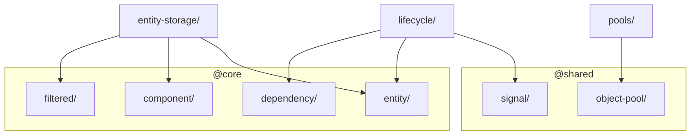

# Layer: `widgets`

## Purpose

The `widgets` layer contains concrete implementations and higher-order compositions built on top of `shared` and `core` primitives. Widgets are reusable, self-contained building blocks that carry enough semantic weight to be useful on their own, but are not heavy enough — or not domain-specific enough — to belong on the `features` layer.

A widget is something a feature or an orchestrator can pick up and use directly, without knowing how it works internally. It encapsulates a specific runtime concern: storing entities, tracking object lifecycles, or organizing object pools.

---

## Dependency Rules

| Direction | Allowed |
|---|---|
| `widgets` → `shared` | Allowed |
| `widgets` → `core` | Allowed |
| `widgets` → layers above (`features`, `app`) | **Forbidden** |
| Any layer above → `widgets` | Allowed |
| `widgets` module → `widgets` module | Allowed, but discouraged |

**Cross-module imports within `widgets` should be avoided** by the same reasoning as in `shared` and `core`: tight coupling between widgets makes them harder to test, extract, or reuse independently. If two widgets need to collaborate, the composition should happen at the `features` layer or above.

---

## Internal Sub-Ordering

Within `widgets`, modules have no mandatory dependency chain on each other. Each module is independently rooted in `shared` or `core`:

```
pools            ← @shared/object-pool
lifecycle        ← @shared/signal, @core/entity, @core/dependency
entity-storage   ← @core/entity, @core/component, @core/filtered
```

---

## What Belongs Here

- **Concrete runtime services** — stateful implementations of framework-level concerns (entity storage, lifecycle, pool registry)
- **Lifecycle management utilities** — helpers for tracking and cleaning up resources tied to entity or context lifetimes
- **Pool registries** — managed collections of `ObjectPool` instances keyed by identifier
- **Higher-order compositions** — wrappers that combine `shared`/`core` primitives into a coherent API, when the result does not belong to any specific game feature

---

## What Does NOT Belong Here

- Game-domain logic: scene management, player controllers, AI, UI flows
- ECS kernel primitives — those belong to `core`
- Anything that imports from `features` or `app`
- Modules that are tightly coupled to a specific game context or configuration

---

## Module Dependency Graph



## Current Modules

### `entity-storage/`
Concrete implementation of the entity storage contract. Stores all `IEntity` instances, enforces UUID uniqueness, and provides component-based filtering via `EntityIndexator`-backed index lookups (fast path) and full-scan fallback (slow path). Supports live reactive queries (`EntityQuery`) cached by execution context, and disposes them on demand. Additionally provides pool-aware lifecycle methods: `releaseEntity` de-indexes an entity and dispatches `OnEntityReleasedSignal` without destroying it; `acquireEntity` re-indexes it and dispatches `OnEntityAcquiredSignal`, making it immediately observable by all live queries. The primary runtime container for entities in the ECS world.

Depends on: `@core/entity`, `@core/component`, `@core/filtered`.

### `lifecycle/`
Resource lifetime tracking tied to entity or context destruction. `LifecycleTracker` collects `Disposable` subscriptions and flushes them when the bound context emits its `onDestroy` signal — preventing memory leaks from dangling listeners. `TrackedSignal` wraps a `Signal` so that all its subscriptions are automatically disposed when the owning context is destroyed. `IContextDisposable` defines the minimal contract for any object that exposes a destroy signal.

Depends on: `@shared/signal`, `@core/entity`, `@core/dependency`.  
Internal: `TrackedSignal` → `LifecycleTracker`.

### `pools/`
Named registry for `ObjectPool` instances. `Pools` creates and stores pools under a typed key (`string | number | symbol`), allowing systems to acquire pools by name without holding direct references. A thin coordination layer over `@shared/object-pool`.

Depends on: `@shared/object-pool`.

